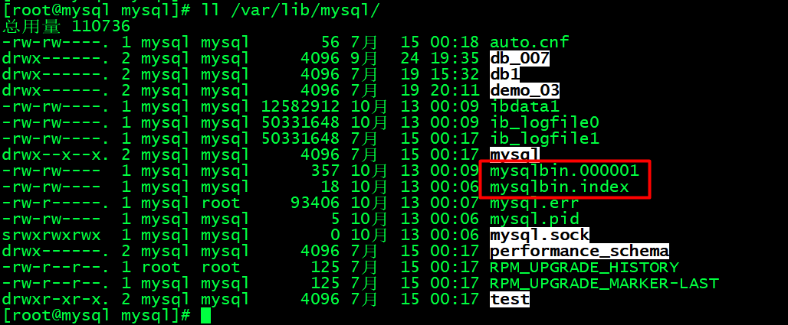
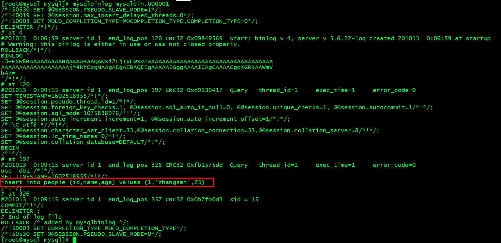
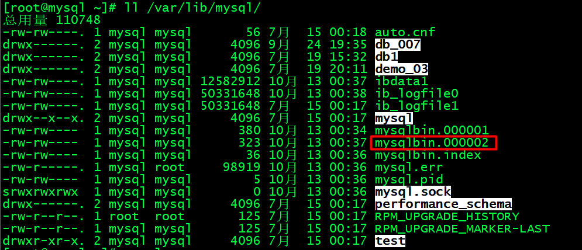
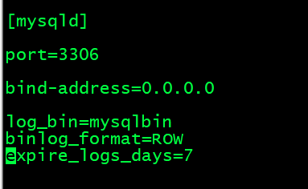
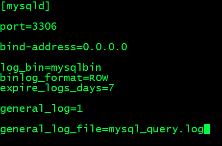
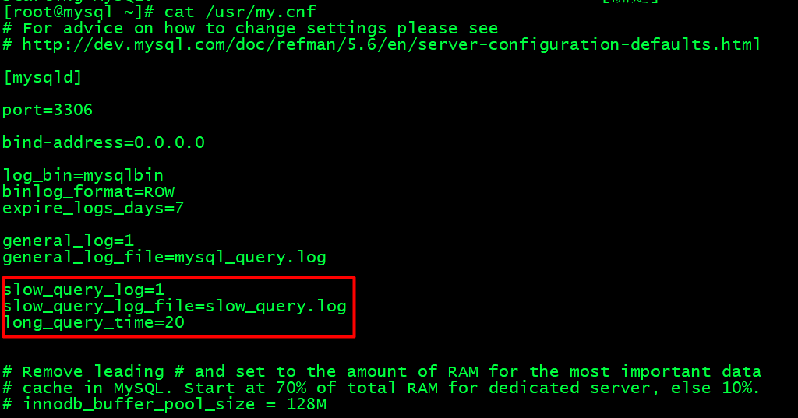
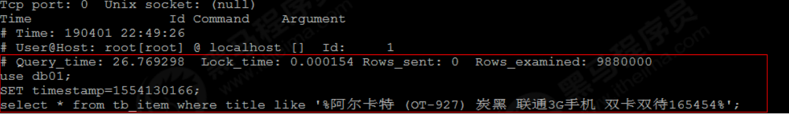
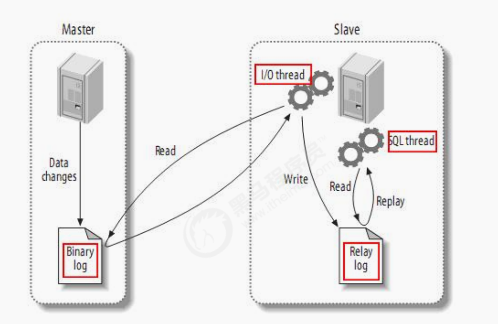
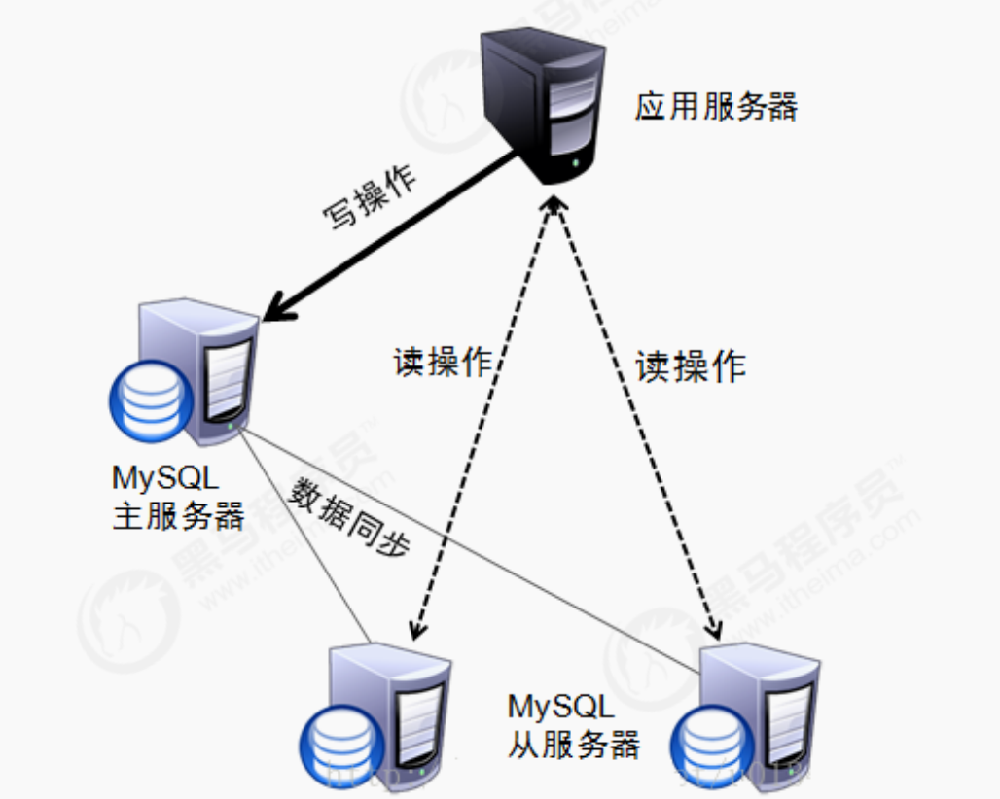

# 第一章	MySQL基础

## 一、SQL概述

### 1. 定义

​	SQL（Structured Query Language）:结构化查询语言，就是一种定义操作所有关系型数据库的规则。可以用来操作Mysql、Oracle、SqlServer等数据库。但每种数据库的操作方式会有些小区别，这种区别称之为‘方言’；

### 2、SQL的通用语法

- SQL语句可以单行或多行书写，以分号结尾
- 可使用空格和缩进来增强语句的可读性
- MYSQL数据库的SQL语句不区分大小写，关键字建议使用大写

```sql
SELECT * FROM `user`;
```

- 3种注释
  - 单行注释
    - '-- 注释内容'      注释符号和注释内容之间要有空格
    - ‘#  注释内容’（Mysql特有的）  注释符号和注释内容之间的空格可以省略
  - 多行注释
    - ’/* 注释内容*/‘

```sql
-- 查询数据
# 查询数据
SELECT * FROM `user`;
```


### 3、 SQL的分类

#### 3.1、DDL

​	数据库操作语句，用来操作数据库和表，关键字：create,drop,alter等

#### 3.2、DML

​	用来操作数据表的数据，包括增删改。关键字:instert，delete、update等

#### 3.3、DQL

​	数据表查询语句，用于查询数据表的数据，关键字：select

#### 3.4、DCL

​	数据控制语句，用来定义数据库的访问权限和安全级别，及创建用户。关键字GRANT、REVOKE等。


### 4、DDL(操作数据库)

​	**操作数据库：CRUD，指的是增删改查，具体C：Create（创建）R:Retrieve(查询),U:Update（修改)，D:Delete(删除)**

#### 4.1 查询数据库的名称（Retrive）

```mysql
SHOW DATABASES;
```


#### 4.2、查询某个数据库的建库语句

```mysql
SHOW CREATE DATABASE mysql;
```


查询结果信息中包含了建库时的字符集


#### 4.3、创建数据库语句(Create)

语法：

> ​	create database 数据库名称

**注意：数据库名称不能重复，如果数据库名称已存在，再执行命令，会显示执行失败！**

语法2：判断如果该数据名称数据库中不存在，则创建，否则不创建。

> create database if not exists 数据库名称

语法3：创建数据库，同时指定数据库的字符集，若不指定字符集，默认是utf8

> create database 数据库名称 character set gbk;

语法4：创建数据库，判断如果不存在才去创建，同时设置字符集是gbk

> create database if not exists 数据库名称 character set gbk;


测试：

```mysql
CREATE DATABASE if NOT EXISTS db1 CHARACTER SET gbk;
```

```mysql
SHOW CREATE DATABASE db1;
```


#### 4.4 、 修改数据库(Update)

- ​	修改数据库的字符集

  - > 语法：alter database 数据库名称 character set 字符集名称

  ```mysql
  ALTER database db1 CHARACTER set utf8;
  ```

  ​	测试：

  ```mysql
  SHOW  CREATE DATABASE db1;
  ```

  


#### 4.5 、删除数据库(Delete)

> ​	语法：drop database 数据库名称

```mysql
DROP DATABASE db1;

```

> ​	语法2：drop database if exists 数据库名称

```mysql
DROP DATABASE if EXISTS db1;

```

​	语法2表示数据库如果存在，就删除


#### 4.6 、使用数据库

##### 4.6.1  查询正在使用的数据库

> ​	语法：select  database();


```mysql
SELECT DATABASE();

```


##### 4.6.2 、使用某个数据库

> ​	语法：use 数据库名称;

```mysql
USE fhm;

```


### 5、DDL(操作表)

#### 5.1、查询（Retrive）

##### 5.1.1、查询某个数据库中所有的表

> ​		语法：show tables;

​		

```mysql
SHOW TABLES;

```

​		

​	

##### 5.1.2、查询某个表的表结构

> ​	语法：desc 表名称；

​	

```mysql
DESC people;

```


#### 5.2、创建表（Create）

##### 5.2.1、语法

> ​	**create table(**
>
> ​		**列名称1  数据类型1,**
>
> ​		**列名称2  数据类型2,**
>
> ​		**......**
>
> ​		**列名称n  数据类型n**
>
> ​	**);**

​	

##### 5.2.2、mysql的常用的数据类型

- ​	int :整数类型
  - age  int
- double:小数类型
  - score double
- date：日期类型，只包含年月日，yyyy-MM-dd
- datetime:日期类型，包含年月日时分秒，yyyy-MM-dd HH:mm:ss
- timestamp:时间戳类型，包含年月日时分秒，yyyy-MM-dd HH:mm:ss
  - 如果将来不给这个字段赋值，或赋值为null，则默认使用当前的系统时间来自动赋值
- varchar：字符串类型
  - name varchar(20)：表示名字最大20个字符。


```mysql
CREATE TABLE ipad(

	id int,
	
	name VARCHAR(20),
	
	size DOUBLE(4,1),
	
	buy_time datetime

);


SHOW TABLES;

```


### 6、 删除表（Delete）

> 语法：drop table 表名
>
> 语法2：drop table if exists 表名

```mysql
DROP TABLE  IF  EXISTS ipad;

```


### 7、复制表

> 语法：create table  stu like student;

```mysql
CREATE TABLE stu LIKE student;

```

但是这样只是复制了表结构，没有复制数据


### 8、表的修改（Update）

#### 8.1、修改表的名称

​	语法：

> ​	alter table 表名 rename to 新的表名

​	·

测试：

​	

```mysql
ALTER TABLE stu RENAME to studen
> OK
> 时间: 0.019s

```


#### 8.2、修改表的字符集

##### 8.2.1 查看表的字符集

​	语法：

> ​	show create table 表名称

测试：

```mysql
SHOW CREATE TABLE studen;

CREATE TABLE `studen` (
  `id` int(11) NOT NULL AUTO_INCREMENT,
  `name` varchar(255) COLLATE utf8_bin DEFAULT NULL,
  `age` int(11) DEFAULT NULL,
  `school` varchar(255) COLLATE utf8_bin DEFAULT NULL,
  `teacher_id` int(11) DEFAULT NULL,
  PRIMARY KEY (`id`),
  KEY `t_key` (`teacher_id`) USING BTREE
) ENGINE=InnoDB DEFAULT CHARSET=utf8 COLLATE=utf8_bin

```

##### 8.2.2、修改表的字符集

​	语法：

> alter table 表名称 character set utf8;

#### 8.3、表中添加一列

​	语法：

> ​	alter table 表名 add 列名 数据类型；

​	

```mysql
ALTER TABLE student add score DOUBLE(4,1);

DESC student;

```


#### 8.4、修改列的名称和类型

​		语法：既改名称也改类型

> ​	alter table 表名称 change 旧列名  新列名 新数据类型

​	

```mysql
alter TABLE student CHANGE score grade int;
-- 查看修改的结果
DESC student;

```


语法2：只修改列的数据类型‘

> alter table 表名称  modify 列名称 新的数据类型；


#### 8.5、删除列

语法：

> alter table 表名称 drop 列名;

```mysql
alter TABLE student drop grade;

-- 查看修改的结果
DESC student;

```


## 二、DML语句	

### 1、添加数据

​	语法1：选择性插入，没有添加的列默认为null

> insert into 表名 （列名1,列名2,......列名n）values(值1,值2,.....值n);

```mysql
INSERT INTO student ( NAME, age, school )VALUES( '小米', 10, '武汉大学' )；

SELECT * from student;

```


语法2：给所有的列添加数据

> inster into 表名  values (值1,值2,值3,......值n);


```mysql
INSERT into student VALUES(null,'大米',10,'清华大学',null);

SELECT * from student;

```


### 2、删除数据

​	语法

> delete from 表名 [where 条件];


```mysql
delete from student where id=1;

SELECT * from student;

```


如果不加where条件，将删除表中的所有数据。


**注意：**

> delete from 表名   表中有几条记录就删除几次的，即使要删除全表数据，也不建议使用这种方式。
>
> TRUNCATE TABLE 表名称;  -- 删除表，然后再创建一个一模一样的表。


### 3、修改数据

​	语法：

> update 表名 set 列名1=值1,列名2=值2,......[where 条件]


```mysql
UPDATE student set `name`='小米',age=11 where school='清华大学';

```


## 三、DQL语句

### 3.1、完整查询语法

> ​	select 
>
> ​		字段列表 
>
> ​	from 
>
> ​		表名列表  
>
> ​	where  
>
> ​		条件列表 
>
> ​	group by 
>
> ​		分组字段  
>
> ​	having 
>
> ​		分组后的条件  
>
> ​	order by 排序 
>
> ​	 limit 分页限定


### 3.2、基础查询

#### 3.2.1、无条件查询

> ​	SELECT 列名1,列名2,......列名n from teacher;

```mysql
SELECT tName,age from teacher;

```


**注意查询所有字段可以使用 ‘*’**

例如：查询teacher表中的所有数据

```mysql
select * from teacher;

```


#### 3.2.2、去重查询

语法：

> select distinct 字段1,字段2,...字段n  from  表名;


**注意：**

distinct字段后面跟的是需要去重的字段，其后面跟的字段的多少直接影响查到的数据个数。

​	例如：假如表中有5条记录，其中两条记录的m字段是重复的，但他们的n字段不同，使用select distinct  m from表名;可以查出来4条记录，而select distinct m,n from 表名；可以查出来5条记录。


测试：

```mysql
SELECT * from teacher where tName='毕向东';

```

​	

```mysql
SELECT DISTINCT tName from teacher where tName='毕向东';

```


```mysql
SELECT DISTINCT tName,age from teacher where tName='毕向东';

```


```mysql
SELECT DISTINCT tName,age,className from teacher where tName='毕向东';

```


#### 3.2.3、列的相加查询

​	语法：

> select  列1+列2 from 表名;


**注意:**

列1和列2需要是数值类型，且假如列1和列2有一列有null值，则加出的结果也是null；

```mysql
SELECT heigh,weight,heigh + weight total from teacher;

```


 如何解决有null参与列运算时，结果为null的问题？

​	使用  ifnull(expr1,expr2)函数：表示如果expr1为null，则使用expr2来代替。

```mysql
SELECT heigh,weight,heigh + IFNULL(weight,0) total from teacher;

```


> ​     在查询字段时，为字段起别名
>
> ​	语法1： select  字段 as  别名 from 表名
>
> ​	语法2：select  字段   别名  from 表名

  

### 3.3、条件查询

#### 3.3.1、条件语句中的运算符

​	

|         符号         |                    含义                     |
| :------------------: | :-----------------------------------------: |
|          >           |                    大于                     |
|          <           |                    小于                     |
|          >=          |                  大于等于                   |
|          <=          |                  小于等于                   |
|          =           |                    等于                     |
|       <> 或 !=       |                   不等于                    |
|    between...and     |                在......之间                 |
|          in          |                 在（...）里                 |
|         like         |                  模糊查询                   |
| is null/is not null  | 数据为空，null比较特殊，不能使用=或!=来判断 |
| and (推荐使用)或 &&  |                     和                      |
| or (推荐使用)或 \|\| |                     或                      |
| not(推荐使用) 或 ！  |                     非                      |


测试

```mysql
SELECT tName from teacher where phoneNum>75;


SELECT tName from teacher where idCard <> 80;


SELECT tName from teacher where tName like '张%';


SELECT tName,idCard from teacher where idCard BETWEEN 75 and 80;

SELECT tName,idCard from teacher where idCard in (75,80);

```


### 3.4、模糊查询

#### 3.4.1、like的占位符

- ​	_：表示匹配单个任意字符
- %：表示匹配多个任意字符


```mysql
SELECT * from teacher where tName like '毕_';

```


```mysql
SELECT * from teacher where tName like '毕%';

```


> 查询名字是三个字的老师

```mysql
SELECT * from teacher where tName like '___';

```


### 3.5、排序查询

​		语法

> select  *  from 表名  order by  排序字段1 排序方式，排序字段2  排序方式2，......

 **注意：排序方式**

​	ASC: 升序排列，默认方式，即如果不写排序方式则默认是升序排列

​	DESC:降序排列


测试：

```mysql
SELECT * from teacher ORDER BY phoneNum;-- 默认升序


```


```mysql
SELECT * from teacher ORDER BY phoneNum ASC;-- 升序排列

```


```mysql
SELECT * from teacher ORDER BY phoneNum DESC;-- 降序排列

```


**多字段的排序**

> 需求：先按照phoneNum升序排列，phoneNum相等的，再按照idCard降序排列


```mysql
SELECT * from teacher ORDER BY phoneNum ASC ,idCard DESC;

```


**注意：**

> ​	**如果有多个排序字段需要排序，则只有当前面的字段的值一样时，后面的排序才会被启用**


### 3.6、聚合查询

​	定义：

​		将一列数据作为一个整体，进行纵向计算。

- count():计算个数

  语法：统计表中某个字段的数据的个数

  > select count(字段名) from 表名

​	

**注意,聚合函数的计算会排除null值，不将null统计在内**

解决方案：

```
1. 使用不包含null的列进行统计，如使用主键，或使用count(*)

```

2. 使用ifnull()函数


```mysql
SELECT COUNT(id) from teacher

```


- max():统计最大值

  > select max(字段名) from 表名

​	

```mysql
SELECT MAX(phoneNum) from teacher;

```


- min():统计最小值

  > select min(字段名) from 表名


```mysql
SELECT MIN(phoneNum) from teacher;

```


- sum():求和

> select sum(字段名) from 表名

```mysql
SELECT SUM(phoneNum) from teacher;

```


- avg():求平均值

> select avg(字段名) from 表名

```mysql
SELECT AVG(phoneNum) from teacher;

```


### 3.7、分组查询

​	语法：根据分组字段，将分组字段相同的数据分为一组，通常和聚合函数一起使用

> group by 分组字段


注意：

1. ​	分组之后查询的字段：分组的字段，聚合函数。加其他的查询字段，查出来的数据没有任何意义。
2. where和having的区别？
   1. where 用在分组语句之前，表示对分组之前的数据进行限定，如果不满足条件，则不参与分组，having对分组之后的数据进行限定，如果不满足数据，则不会被查询出来。
   2. where后不可以跟聚合函数，而having可以进行聚合函数的判定。


```mysql
SELECT className,MAX(phoneNum) from teacher   GROUP BY className;

```


```mysql
SELECT className,MAX(phoneNum) FROM teacher where idCard>70 GROUP BY className;

```


```mysql
SELECT className,MAX(phoneNum) FROM teacher where idCard>70 GROUP BY className HAVING className <> '复旦班';

```


### 3.8、分页查询

​	语法：

> limit 开始的索引,每页查询的条数


```mysql
SELECT * from  teacher LIMIT 0,3;

```


查询开始的索引=（当前页码-1）*每页显示的条数


如：第一页，每页显示3条，limirt 0,3,第二页就是 limit 3,3

```mysql
SELECT * from  teacher LIMIT 3,3;

```


**注意：分页操作是一个方言**

不同的数据库对分页有不同的实现，limit只能用在mysql中


## 四、约束

### 4.1、概念

​	**约束**就是对表中的数据进行限定，保证数据的正确性、有效性和完整性。

### 4.2、分类

- 主键约束：primary key
- 非空约束：not null
- 唯一约束：unique
- 外键约束：foreign key


### 4.3、非空约束

#### 4.3.1、添加非空约束

​	**含义：某一列的值不能为null**

- 在创建表时添加

  ```mysql
  CREATE TABLE role (
  id INT,
  -- 对名字添加非空约束
  NAME VARCHAR(50) NOT NULL
  
  );
  
  ```

  查看表结构

```mysql
  DESC role;

```

  


​	

- 修改表结构时添加

  ```mysql
  ALTER TABLE role MODIFY NAME VARCHAR(50) NOT NULL;
  
  ```

  


#### 4.3.2、测试非空约束

向role表中添加数据

​	

```mysql
INSERT INTO role ( id, NAME )
VALUES
	( 1, NULL );

```


Column 'NAME' cannot be null;


### 4.4、唯一约束

#### 4.4.1、添加唯一约束

​	唯一约束是指某一列的值不能重复

删除之前的表

```mysql
DROP TABLE role;

```


创建带唯一约束的表

```mysql
CREATE TABLE role(

id INT,

NAME VARCHAR(20) UNIQUE  -- 对name字段设置唯一约束


);


```


查看表的结构

```mysql
DESC role;

```


如何删除唯一约束，唯一约束的删除和非空约束有点不一样。

```mysql
ALTER TABLE role DROP INDEX NAME;

```


再查看表结构

```mysql
DESC role;

```


通过修改结构，增加唯一约束

```mysql
ALTER TABLE role MODIFY name VARCHAR(60) UNIQUE;

```


查看表结构

```mysql
DESC role;

```


### 4.5、主键约束

- ​	含义：非空且唯一
- 一张表只能有一个字段为主键
- 主键就是表中记录的唯一标识

#### 4.5.1、在创建表时，添加主键约束

语法：

> ​	create  table  role(
>
> ​	id int primary key,
>
> ​	name varchar(50)
>
> )


```mysql
CREATE TABLE role (
	id INT PRIMARY KEY,
NAME VARCHAR ( 50 ));

```


查看表结构

```mysql
DESC role;

```


#### 4.5.2、删除主键

​	语法：

> ALTER TABLE role DROP PRIMARY KEY;


```mysql
ALTER TABLE role DROP PRIMARY KEY;

```


查看表结构：

```mysql
DESC role;

```


#### 4.5.3、创建完表后添加主键

语法：

> ALTER TABLE role  MODIFY id INT PRIMARY KEY;


#### 4.5.4、自动增长

​	**概念：如果一列是数值类型的，可以使用auto_increment来完成自动增长，通常和数值类型的主键一起使用。**

​	

   **在创建表时，设置id作为主键，同时设置自动增长**

​	

```mysql
CREATE TABLE role(

id INT PRIMARY KEY auto_increment,

NAME VARCHAR(50)

)

```


查看表结构

```mysql
DESC role

```


**注意：**

1. 设置了主键的自增长，也可以手动插入id，
2. 假如手动输入的id和原来的id不是连续的，那么下一次自动插入的数据的id只跟上一条记录的id有关，即id等于上一条记录的id加1；


**删除自动增长**

​	

```mysql
ALTER TABLE role MODIFY id INT;

```


**添加自动增长**

```mysql
ALTER TABLE role MODIFY id INT auto_increment;

```


### 4.6、外键约束

#### 4.6.1、在创建表时创建外键

​		语法：

> create table 表名(
>
> ​	......
>
> ​	外键列名称    外键列类型,
>
> ​	constranint 外键名称 forrign key  (外键列名称) references 主表名称(主表列名称)
>
> );


```mysql
CREATE TABLE plane_type ( id INT PRIMARY KEY, type_name VARCHAR ( 20 ) NOT NULL, createDate datetime );

CREATE TABLE plane_number (
	id INT PRIMARY KEY,
	number_name VARCHAR ( 30 ) NOT NULL,
	planeType_id INT,
CONSTRAINT type_key FOREIGN KEY ( planeType_id ) REFERENCES plane_type ( id ) 
);

```


查看表结构

```mysql
DESC plane_type;

```


```mysql
DESC plane_number;

```


当删除主表时，如果有从表还关联了该主表，则会提示无法删除。


#### 4.6.2、如何删除外键

​	语法：

> ​	ALTER TABLE 表名 DROP FOREIGN KEY 外键名称;


#### 4.6.3、创建表后如何添加外键

语法：

> ALTER TABLE plane_number ADD CONSTRAINT fk FOREIGN KEY ( planeType_id ) REFERENCES plane_type ( id );


### 4.7、级联操作

#### 4.7.1、级联更新

​	在一般情况下，当从表中有数据关联了主表的id，如果要修改主表的id，会直接报错，会提示有外键关联其他的表。报错如下图：


​	

**所以在一般情况下，主表在有从表跟其关联的情况下，是不能修改id的，除非从表设置了级联修改**

​	

**设置级联修改**

```mysql
-- 给plane_number设置外键。并设置级联修改
ALTER TABLE plane_number ADD CONSTRAINT fk FOREIGN KEY(planeType_id) REFERENCES plane_type(id) ON UPDATE CASCADE;

```


**之后再去修改主表的id，从表的外键id也会跟着修改。**


#### 4.7.2、级联删除

​	同样也可以设置删除主表记录，从表相应记录也会删除


```mysql
-- 给plane_number设置外键。并设置级联修改
ALTER TABLE plane_number ADD CONSTRAINT fk FOREIGN KEY(planeType_id) REFERENCES plane_type(id) ON UPDATE CASCADE ON DELETE CASCADE;

```


 **这样删除主表记录，从表与之关联的数据也会删除**


## 五、数据库设计

### 5.1、多表之间的关系

#### 5.1.1、一对一关系

- 如人和身份证的关系
  - 分析：如一个人只有一个身份证，而一个身份证也只对应一个身份证

#### 5.1.2、一对多（多对一）关系

- 如部门和员工
  - 分析：一个部门有多个员工，但一个员工只能属于一个部门

#### 5.1.3、多对多的关系

- ​	如学生和课程
  - 分析：一个学生可以选择多个课程，一个课程也可以被多个学生选择。

### 5.2、一对多（多对一）关系实现

​	如图，部门和员工是一对多的关系，即一个部门对应着多个员工，但一个员工只属于一个部门


因此，在多的一方的表中建立一个外键，指向少的一方的id，这样就可以表示一对多的关系了。


### 5.3、多对多关系实现

​	正如学生和课程，一个学生可以选择多个课程，一个课程也可以被多个学生选择，可以在学生表和课程表之间建立一个中间表，通过记录学会表id和课程表id来记录学生和课程的多对多关系。

​	


注意对于中间表的记录，不应该出现两条相同的记录，可以通过联合主键来实现。


### 5.4、一对一关系实现

​	如人和身份证的关系，一个人只有一个身份证，一个身份证也只属于一个人，可以在任意一张表，人员表或身份证表添加主键列，记录另一张表的id，但是，因为是一对一的关系，所以外键的数据就不应该重复，否则就不是一对一的关系了，因此，外键列应该加上唯一约束。


## 六、数据库设计范式

### 6.1、概念

​	设计关系型数据库时，需要遵循不同的规范要求，设计出合理的关系数据库，这些不同的规范要求称之为不同的范式，各种范式呈递次规范，要遵守后边的范式要求，必须先遵守前边的所有范式的要求，越高的范式数据库冗余越小，目前关系数据库有六种范式：第一范式（1NF），第二范式（2NF）,第三范式（3NF）,巴斯-科德范式（BCNF）,第四范式（4NF），第五范式（5NF）。


### 6.2、第一范式

**定义**

​	每一列都是不可分割的原子数据项，即数据表的每一列都应该是不可再拆分的，都是原子性的，如下图的系，包含了两个子列，这是违反数据库设计的第一范式的


​	


修改后使其遵守第一范式，结果如下：


> 存在的问题：
>
> ```
> 1. 上表中存在较为严重的数据冗余（重复）：如姓名、系名，系主任
> 
> ```
>
> 2. 数据添加时存在问题，如添加一个系，尚未招生，则姓名，课程，分数都是空的
> 3. 数据删除也存在问题：假如学生毕业了，需要删除数据，那也会将系的信息也给删除了


### 6.3、第二范式

在第一范式的基础上，非码属性必须完全依赖于码（**在1NF的基础上消除非主属性对主码的部分函数依赖**），这句话可以这样理解，假如码是一个属性组，则一个码必须能够唯一的确定一个非码属性。

几个概念

> 1. 函数依赖：A-->B,如果通过A属性（属性组）的值，可以确定唯一B属性的值，则称B依赖于A
>    1. 例如, 学号--->姓名      （学号，课程名称） --> 分数    学号和课程可以成为一个属性组
> 2. 完全函数依赖：A--->B ,如果A是一个属性组，则B属性值的确定需要依赖于A属性组中所有的属性值
>    1. 例如， （学号，课程名称）--->分数
> 3. 部分函数依赖：A--->B，如果A是一个属性组，则B属性的确定只需要依赖于A属性组中某一个值即可
>    1. 例如,     （学号，课程名称）--->姓名，  其实姓名的确定只需要学号即可。
> 4. 传递函数依赖：A--->B，B--->C，如果通过A属性（属性组）可以确定唯一的属性B,再通过B属性。可以确定唯一属性C,则称C为传递依赖于A。
>    1. 例如：学号--->系名，系名--->系主任。
> 5. 码：如果在一张表中，一个属性或属性组，被其他所有属性所完全依赖，则称这个属性（属性值）为该表的码。即一张表中，存在一个属性或属性组，可以确定其他所有属性的唯一一个属性值。
>    1. 例如，在这张表中的码是一个属性组，学号+课程名称
> 6. 主属性：码属性组中的所有属性
> 7. 非主属性：除去码属性组的属性


第二范式的目的就是在第一范式的基础上消除非主属性对主码的部分依赖。


> 以上面的表为例：
>
> ​	上面的表中。主属性是学号和课程名称，通过主码，可以唯一确定一个其他属性的值，其中，姓名，系名，系主任对于主码来说是部分依赖，使用学号一个属性就可以唯一确定它们的值，所以，要符合第二范式，要将它们抽离出来，如下图所示，分离后仍然存在如下问题。


### 6.4、第三范式

​		**概念**

​		在2NF的基础上，任何非主属性不依赖于其他非主属性，（在2NF的基础上消除传递依赖）


> 以上面的表为例：
>
> ​	在学生表中，学生和系名和函数依赖，系名和系主任是函数依赖，但学生和系主任是传递依赖，应该消除
>
> 将系名和系主任提出来。如下


## 七、数据库的备份和还原


### 7.1、命令行方式

备份语法


> mysqldump -u用户名 -p密码  数据库名称 > 保存的路径

还原语法

> 1. 登录数据库
> 2. 创建数据库
> 3. 使用数据库
> 4. 执行文件。source 文件路径


### 7.2、图形化界面方式

备份方式：

​	如下，右键选择转储SQL文件，选择结构和数据，或者仅结构

​	


还原：

首先创建数据库，然后选择数据库，右键，选择运行SQL文件。


## 八、多表查询

​	

### 8.1、笛卡尔积

​	语法：

> SELECT  *  from  A,B

当使用这样的查询语句时，查询出的结果称为两张表的笛卡尔积，相当于将两张表的记录做了排列组合，查询结果的记录数等于两个表的记录数的乘积。


  测试：建表语句如下

```mysql
CREATE TABLE teacher ( id INT PRIMARY KEY auto_increment, NAME VARCHAR ( 50 ), age INT ( 11 ) );
CREATE TABLE student (
	id INT PRIMARY KEY auto_increment,
	NAME VARCHAR ( 50 ) UNIQUE,
	age INT,
	teacher_id INT,
	CONSTRAINT teah_key FOREIGN KEY ( teacher_id ) REFERENCES teacher ( id ) 
);
INSERT INTO teacher ( `NAME`, age )
VALUES
	( '张三丰', 100 ),(
		'洪七公',
		95 
	) INSERT INTO student ( `NAME`, age, teacher_id )
VALUES
	( '张无忌', 21, 1 ),(
		'杨过',
		25,
	2 
	)

```


  测试笛卡尔积

```mysql
	SELECT * from teacher,student;

```


在表关系中，张无忌只是张三丰的徒弟，但查询出的结果发现张无忌和洪七公也做了关联，所以这种查询方式是有问题的，

> ​	要消除无用的笛卡尔积，可以使用：
>
> ​	内连接查询
>
> ​	外连接查询
>
> ​	子查询


### 8.2、内连接查询

#### 8.2.1、隐式内连接

​	语法：

> select A.列名 ...,B.列名... from A,B  where  A.外键=B.主键

​	

```mysql
SELECT
	s.id,
	s.`name`,
	t.NAME teacherName
FROM
	student s,
	teacher t 
WHERE
	s.teacher_id = t.id;

```


#### 8.2.1、显示内连接

语法1

> select  字段列表  from A  inner join B  on 条件


```mysql
SELECT
	s.id,
	s.`name`,
	t.NAME teacherName
FROM
	student s
	INNER JOIN teacher t ON s.teacher_id = t.id;

```


**语法2：inner关键字可以省略**

> select 字段列表 from A  join B on 条件


```mysql
SELECT
	s.id,
	s.`name`,
	t.NAME teacherName
FROM
	student s
  JOIN teacher t ON s.teacher_id = t.id;
	

```


### 8.3、外连接查询

#### 8.3.1、左外连接

​			语法：

> ​		select  字段列表 from  A  left  (outer) join B on 条件

​			

​		

```mysql
-- 查询所有的学生信息，如果学生有教师信息，将老师的名称查出来

SELECT
	s.*,
	t.`name` 
FROM
	student s
	LEFT JOIN teacher t ON s.teacher_id = t.id;

```


查询结果如下：


**注意：**

> 左外连接查询的是sql语句中，左边表的全部内容和右边表中和左表有关联的数据。


#### 8.3.2、右外连接

​	语法：

> select  字段列表 from  A  right(outer) join B on 条件


```mysql
SELECT
	s.*,
	t.`NAME` 
FROM
	teacher t
	RIGHT JOIN student s ON t.id = s.teacher_id;

```


注意：

> 右外连接查询的是sql语句中，右边表的全部内容和左边表中和右表有关联的数据。所以当将左外连接的两张表调换位置，并将左外连接sql修改为右外连接，查询出来的结果就是一样的。


### 8.4、子查询

​	概念：指的是查询中嵌套查询，称嵌套的查询为子查询


​	测试：

​	

```mysql
CREATE TABLE emp(

	id INT PRIMARY KEY  auto_increment,
	
	NAME VARCHAR(50),
	
	age INT,
	
	salary INT
);


INSERT INTO emp (`NAME`,age,salary) VALUES ('张三',23,6000),('李四',24,8000),('赵柳',28,12000),('王五',25,9000);

```


 需求：

​		查询工资最高的员工信息  子查询演示。

```mysql
SELECT * FROM emp WHERE emp.salary =( SELECT MAX( emp.salary ) FROM emp );

```

 


#### 8.4.1、子查询的不同情况

- 子查询的结果是单行单列

  > SELECT * FROM emp WHERE emp.salary =( SELECT MAX( emp.salary ) FROM emp );

- 子查询的结果是多行单列

  > SELECT * from student where student.teacher_id in (SELECT id FROM teacher where `NAME`='张三丰' or `NAME`='黄飞鸿');

- 子查询的结果是多行多列，子查询的结果可以作为一张虚拟表，继续参与查询，使用普通的内连接查询也可以实现

  > SELECT s.id,s.name sName,s.age sAge,t.`NAME` from student s,(SELECT * FROM teacher) t WHERE s.teacher_id=t.id and s.age<30;


## 九、事务

### 9.1、事务的基本介绍

#### 9.1.1、概念

​			如果一个包含多个步骤的业务操作，被事物管理，那么这些操作要么同时成功，要么同时失败。

​		如下图所示：


当事务开启后，1，2，3个步骤是一致的，要是中间发生异常，事务会回滚到未操作之前的状态


#### 9.1.2、事务对应的操作

- 开启事务：start transaction
- 回滚事务：rollback
- 提交事务：commit


#### 9.1.3、案例

​		模式张三和李四之间的转账，建表语句如下：

​	

```mysql
CREATE TABLE account(

	id INT PRIMARY KEY auto_increment,
	
	NAME VARCHAR(20),
	
	account DOUBLE
);


INSERT INTO account (`NAME`,account) VALUES('张三',1000.0),('李四',1000.0);

```

​	

**在不使用事务的前提下，模拟转账**

```mysql
-- 模拟转账

UPDATE account SET account = account-500 WHERE `NAME`='张三';

updatew

UPDATE account SET account = account+500 WHERE `NAME`='李四';

```


两个sql之间有一个异常字段，会导致异常，第二条sql就执行不到了，这时查看数据

```mysql
SELECT * FROM account;

```


发现张三的账户钱少了，而李四的账户钱却没有增加。


```mysql
UPDATE account SET account =1000; -- 恢复数据

```


以事务的形式模拟转账

```mysql
-- 开启事务
START TRANSACTION;

-- 模拟转账

UPDATE account SET account = account-500 WHERE `NAME`='张三';

...

UPDATE account SET account = account+500 WHERE `NAME`='李四';

```


 中间发现执行出错，这时查看表中数据：


发现跟原来不使用事务是一样的，但再新建一个数据库连接，再次查询，发现数据如下：


所以该表的数据只是临时的改变，在事务没有提交者之前并不会真正的修改表，现在执行事务回滚：

```mysql
ROLLBACK;

```


再次查询，发现两个连接查出来的数据是一样的。


#### 9.1.4、注意：

​	MYSQL数据库中，事务是默认自动提交的，一条DML(增删改)语句会自动提交一次事务。

​	**事务提交的两种方式：**

- 自动提交：
  - ​	mysql的事务就是自动提交的
- 手动提交：
  - mysql需要事先开启事务，然后再提交事务
  - oracle数据库是默认手动提交的。


**查看事务的默认提交方式：**

```mysql
SELECT @@autocommit; -- 0表示手动提交，1表示自动提交

```

​	


修改mysql事务的默认提交方式：

```mysql
SET @@autocommit = 0;

```


当修改之后，所有的DML语句执行完后都要手动提交事务。


### 9.2、事务的四大特征

1. 原子性：事务是不可分割的最小操作单位，要么同时成功，要么同时失败
2. 持久性：当事务提交后或回滚后，数据库会持久化的保存数据
3. 隔离性：多个事务之间是相互独立的，但这种独立是相对的，会有事务的隔离级别
4. 一致性：事务操作前后，数据的总量是不变的，


### 9.3、事务的隔离级别

#### 9.3.1、概念

​		多个事务之间的隔离是相互独立的，但是如果多个事务操作同一批数据，则会引发一些问题，设置不同的隔离级别就可以解决这些问题。


#### 9.3.2、存在的问题

- 脏读：一个事务读到了另一个事务中没有提交的数据
- 不可重复读(虚读)：在同一个事务中，两次读到的数据不一样
- 幻读：一个事务操作（DML）数据表中的所有记录，另一个事务添加了一条数据，则第一个事务查询不到自己的修改。

#### 9.3.3、 事务的隔离级别

1. read uncommited: 读未提交，即一个事务可以读到另一个事务未提交的饿数据
   1. 产生的问题：脏读，不可重复读，幻读
2. read commited（oracle）：读已提交，可以读到另一个事务已经提交的数据
   1. 产生的问题：不可重复读，幻读
3. repeatable  read(Mysql):可重复读，
   1. 产生的问题：幻读
4. serialiable：串行化
   1. 可以解决所有问题


​	注意：从未提交读到串行化，事务的隔离级别越来越高，但是效率越来越低


#### 9.3.4、数据库设置隔离级别

​	查询隔离级别

> ​	select @@tx_isolation;

​	设置隔离级别

> set global transaction isolation level  级别字符串;


演示：

```mysql
	select @@tx_isolation;

```


```mysql
SET GLOBAL TRANSACTION ISOLATION LEVEL READ COMMITTED;

```

断开数据库连接后，重新查询


## 十、DCL

​	

### 10.1、概念

​	DCL主要用于管理用户和授权

### 10.2、用户管理

#### 10.2.1、查询用户

​		步骤：

> 1. 切换数据库为mysql
>    2. select * from user;


​		

```mysql
USE mysql;

SELECT * from USER;

```


​	其中localhost表示可在本机登录，%表示可以在任意主机登录


#### 10.2.2、创建用户

​	语法：

> CREATE USER '用户名'@'主机名' IDENTIFIED by '密码';


```mysql
CREATE USER 'admin'@'localhost' IDENTIFIED by 'root'; -- 创建一个用户，只能在本机登录

SELECT * from USER;

```


```mysql
CREATE USER 'myadmin'@'%' IDENTIFIED by 'root';-- 创建一个用户，可以在任意主机登录

SELECT * from USER;

```


#### 10.2.3、删除用户

> ​	DROP USER '用户名'@'主机名';


演示：

```mysql
DROP USER 'admin'@'localhost';


SELECT * from USER;

```


#### 10.2.4、修改mysql用户的密码

​	语法1：

> UPDATE USER u  set u.authentication_string=PASSWORD('123') WHERE u.User='myadmin';


语法2：

> set password for 'root'@'localhost'=password('cy7m0ypu8CpLFperzI45');

修改Root用户的密码时，for 'root@localhost'可以省略

当忘记root用户的密码，如何修改密码？

​	步骤：

> 1. cmd  -->输入：net stop mysql   停止mysql服务
>    1. 需要以管理员身份运行cmd
> 2. 使用无验证方式启动mysql服务：mysqld  --skip-grant-tables
> 3. 新启动一个cmd窗口，直接输入mysql，回车，就可以无验证登录mysql，然后执行修改密码的操作即可。
> 4. 关闭窗口后，打开任务管理器，关闭mysqld进程
> 5. 再次打开cmd，输入：net start mysql,启动mysql，重新登录


### 10.3、权限管理

#### 10.3.1、查询权限

​		语法：

> SHOW GRANTS FOR '用户名@'主机名';


```mysql
SHOW GRANTS FOR 'myadmin'@'%';

```


 其中：usage  表示可以登录，这里发现myadmin用户只有一个权限，就是登录，其他什么操作都做不了。


查询root用户的权限：

```mysql
SHOW GRANTS FOR 'root'@'%';

```


root用户的权限是ALL，表示所有权限。


#### 10.3.2、授予权限

​	语法：

> ​	GRANT 权限列表 ON 数据库名.表名 TO '用户名'@'主机名';


```mysql
GRANT SELECT ON boot.emp TO 'admin'@'localhost';

```

​	给admin用户boot数据库查询emp表的权限

​	使用admin新创建一个连接，发现其职能看到boot数据库中的一张表


查询emp表：

```mysql
SELECT * FROM emp;

```


向表中插入数据：

```mysql
INSERT INTO emp (`NAME`,age,salary) VALUES('张三',23,1000.0);

```


给admin用户设置对所有的数据库中所有的表拥有所有的权限

```mysql
GRANT ALL ON *.* TO 'admin'@'localhost'; 

```


#### 10.3.3、撤销权限

​	语法：

> REVOKE 权限列表 ON 数据库名.表名 from '用户名'@'主机名';


取消admin对所有数据库所有表的权限

```mysql
REVOKE  ALL ON *.* from 'admin'@'localhost'; 

```


注意：这里取消的权限必须是用户拥有的权限，不能是某个权限的子权限：

​	比如：假如使用 **'GRANT ALL ON *.* TO 'admin'@'localhost'; '** 语句赋予了admin用户的所有权限。然后想取消该用户对boot数据库的表的操作权限，

​		使用：

```mysql
REVOKE  ALL ON boot.* from 'admin'@'localhost'; 

```

​	来取消是不可以的，只能取消该用户的所有权限，


也就是说这个权限如果之前没有使用Grant语法创建过，就没办法使用Revoke语句取消。或者说使用权限查询语句能查询到的权限都是可以取消的。


# 								第二章	MySQL高级

## 一、在Linux中安装MySQL

### 	1.1、版本介绍

> ​	Linux版本为Centos7
>
> ​	Mysql版本为Mysql5.7.9 ，安装包下载路径：https://pan.baidu.com/s/1VZZuzwhk0SgFg-NsXA7f8Q 提取码：pdv8	

###    1.2、将Linux设置为静态IP

#### 		1.2.1、Linux安装成功后自动获取一个ip	

```linux
dhclient
```


​		

#### 	1.2.2、查询虚拟机网关

- 点开虚拟机工具栏编辑选项，选择虚拟网络编辑器

  

​	

-    选择net模式，点击Net设置

  

​	

- 网关ip如下


#### 1.2.3、编辑配置文件

```
vim /etc/sysconfig/network-scripts/ifcfg-eth0 
```

最后的ifcfg-eth0是网卡的配置文件的名字，名字可能不一样，使用 ip addr 命令可以查看ip和网卡的名字

​	

```
ip addr
```


我这的网卡名字是eth0  ip是192.168.245.141


需要修改的内容：

> 	1. 将ONBOOT=no 修改为 ONBOOT=yes   这个表示网卡随着系统一起启动
>  	2. 将BOOTPROTO=dhcp  修改为  BOOTPROTO=dhcp ，dhcp表示自动获取ip地址，static表示手动设置ip地址
>  	3. 添加：
>       	1. IPADDR=之前自动获取的ip地址
>       	2. NETMASK=255.255.255.0   子网掩码
>       	3. GATEWAY=之前查看的子网网关
>       	4. DNS1=119.29.29.29 指定上网用的DNS ip地址


重启系统：

```
init 6
```


### 1.3、安装MySQL

- ​	上传mysql安装包到linux虚拟机

  ```linux
  D:\mysql-5.7.9-linux-glibc2.5-x86_64.tar.gz
  ```

- 解压压缩包

```
 tar -zxvf mysql-5.7.9-linux-glibc2.5-x86_64.tar.gz 
```

- 将解压后的文件移动到/usr/local/mysql

```
mv mysql-5.7.9-linux-glibc2.5-x86_64 /usr/local/mysql
```

- ​	添加mysql的linux用户，指定其shell是nologin,意思是不能用于登录

```
useradd -s /sbin/nologin mysql
```

- 创建/data/mysql    -p表示级联创建文件

```
mkdir -p /data/mysql
```

- ​	赋予/data/mysql目录的拥有者为mysql用户

  ```
  chown -R mysql:mysql /data/mysql
  ```

- 初始化mysql

```
./bin/mysqld --initialize --user=mysql --basedir=/usr/local/mysql --datadir=/data/mysql
```

这时会报一个错：

```
/usr/local/mysql/bin/mysqld: error while loading shared libraries: libaio.so.1: cannot open shared object file: No such file or directory
```

错误提示中表示缺少libaio.so.1的包，只需安装它即可

```
yum -y install libaio.so.1
```

重新执行一次

发现还是一样的错误，发现是安装的libaio不对，将安装的卸掉，使用下面的命令安装

```
yum -y install libaio*
```

然后再重新执行就可以了。

此时会生成一个临时密码，一般在最后一行

```
2020-10-15T20:47:51.355902Z 1 [Note] A temporary password is generated for root@localhost: 3fHRnXe9d?Wd
```

3fHRnXe9d?Wd就是临时密码

- 拷贝support-files/my-default.cnf 到/etc下

  ```linux
  mv support-files/my-default.cnf /etc/my.cnf
  ```

- 拷贝support-files下的mysql.server到/etc/init.d中

```
mv support-files/mysql.server /etc/init.d/mysqld
```

- 给/etc/init.d/mysqld赋予权限

```
chmod 755 /etc/init.d/mysqld
```

- 编辑/etc/init.d/mysqld文件，将datadir的值修改为/data/mysql。其实前面初始化数据库时定义的数据目录。

  ```
  vim /etc/init.d/mysqld
  ```

- 把启动脚本加入到系统服务项，设定开机启动并启动MySQL

```
[root@localhost mysql]# chkconfig --add mysqld
[root@localhost mysql]# chkconfig mysqld on
```

- 启动MySQL

  ```
  service mysqld start
  ```

  

### 1.4、启动mysql

> service mysql start 
>
> service mysql stop 
>
> service mysql status 
>
> service mysql restart 


### 1.5、登录mysql

```
[root@localhost ~]# /usr/local/mysql/bin/mysql -uroot -p
Enter password: 
```

Mysql5.7之前安装是没有密码的，5.7之后就有了，


### 1.6、设置环境变量

```
PATH=$PATH:/usr/local/mysql/bin
```

将环境变量写入到/etc/profile中，

```
[root@localhost mysql]# echo "PATH=$PATH:/usr/local/mysql/bin" >> /etc/profile
[root@localhost mysql]# source /etc/profile
```


## 二、索引

### 	2.1、概述	

索引的官方定义为：是帮助MySQL高效获取数据的数据结构**，在数据之外，数据库系统还维护着特定的查找算法的数据结构，这些数据结构以某种方式引用，或者称为指向数据，这样MySQL就可以依靠这些数据结构实现高效的查询算法。而这种数据结构就称之为索引**。

​		如下图所示：


​	简而言之，索引是MySQL实现高效查询的一种数据结构。

### 		2.2、索引的作用

- 假如在没有索引的情况下，如下图，当查询的数据为表的最后一条记录时，就只能全表扫描，速度会非常慢，需要查


- 在创建索引的前提下，查询数据，假如索引的数据结构是二叉树，对于二叉树而言，其左边的子节点小于当前节点，右边的子节点大于当前节点，如下图所示，查询同样的数据，只需3次就可以查到


在索引中数据结构中的元素指向了数据表的元素，或者也许可以理解为数据结构中保存了数据表记录中的地址。


### 2.3、索引的优缺点

#### 	2.3.1、索引的优势

1. 类似于数据的目录，索引可以提高检索的效率，降低数据库的IO成本。
2. 通过索引列对数据进行排序，降低了数据排序的成本，降低CPU的消耗。

#### 2.3.2、索引的劣势

1. 实际上索引也是一张表，该表保存了主键和索引字段，并指向实体的记录，因此，索引也是要占用磁盘空间
2. 索引能够提高查询的效率，但会降低增加，修改和删除的效率。因为当表更新时，MySQL不仅要更改表，还需要更新索引数据结构，会调整因为更新数据而带来的索引信息的改变。

### 2.4、索引的分类

​	索引是MySQL在存储引擎层实现的，而不是在服务器实现的，所以不同的存储引擎所支持的索引类型也是不一样的，也不是所有的存储引擎都支持所有的索引。

​		MySQL目前支持4中索引：

> 		1. BTREE索引：最常见的索引类型，大部分存储引擎都支持BTREE索引
>   2. HASH索引：只有Memory引擎支持，使用场景简单
>   3. R-tree索引(空间索引)：空间索引是MyISAM引擎的一个特殊的索引类型，主要用于地理空间数据类型，通常使用较少
>   4. Full-text(全文索引):全文索引也是MyISAM引擎的一个特殊的索引类型，主要用户全文检索，InnoDB从5.6版本开始支持全文检索。


以下是三种存储引擎对个中各种索引类型的支持情况


平常所属所说的索引如果没有特殊说明，通常指的是B+树结构的索引，其中，聚合索引，复合索引，前缀索引、唯一索引默认都是使用B+树索引，统称为索引。


### 2.5、B-Tree数据结构

#### 	2.5.1、BTree的特性

​	BTree树又叫多路平衡查找树，它的特性如下：

​	对于一个m叉的Btree树：

- 树中每一个节点最多有m个孩子
- 除根节点外和叶子节点外，每一个节点至少有ceil(m/2)个孩子（Ceil指的是向上取整）
- 若根节点不是叶子节点，则至少有两个孩子，因为根节点只要不是一个的话，那它肯定是向上抽取而来的。
- 所有的叶子节点都在同一层
- 每个非叶子节点可以存储n个key，可以有n+1个指针，其中ceil(m/2)-1<=n<=m-1，指针和key的定义如下


#### 2.5.2、BTree树的数据存储过程

​	以5叉的BTree树为例，可以存储key的数量为 ceil(m/2)-1<= n <= m-1 ,即2<=n <=4, 所以，该数据结构，每个非叶子节点最多存储4个数据，最少存储两个数据，当n>4时，中间的节点会分裂到父节点中，同时该节点原来两边的数据也会分列成两个节点。

​	以插入 C N G A H E K Q M F W L T Z D P R X Y S 数据为例。

- 插入前4个字母：CNGA ,插入时，它们会按照从小到大的顺序。

  

  ****

- 接着插入H，由于该节点已经等于4了，在加入数据，需要将中间节点分离成它们的父节点，同时该节点也将分裂成两个节点


​	

- 接着插入E,K,Q，它们先和G比较，比G小的向左走，比G大的向右走，然后再和其他元素比较，找到自己合适的位置，此时元素个数都不超过4，不需要分裂


- 接着插入M,M会插入到K和N之间，同时右子节点超过4个，需要将中间元素分离到父节点中，同时右子节点分裂成两个


- 插入F、W、L、T跟之前的规则一样不需要分裂，小于G走左子节点，在G和M之间走中间节点，大于M走右子节点。


- 插入Z，Z会插入到右子节点的最后，右子节点超过4个，中间元素T分裂到父节点中


- 插入D，D会插入到左子节点中，左子节点满足大于4的条件，中间元素D分裂到父节点中，


- 插入最后一个元素S,S会插入到NPQR的节点中，同时该节点大于4，中间元素Q向上分裂，


总结：

> BTree树和二叉树相比，查询数据的效率更高，因为对于相同数据量来说，BTree的层级结构比二叉树小，即树的树高比二叉树小，检索次数更少。


### 2.6、B+Tree

​	B+Tree树是BTree树的变种，它们之间的区别为：

1. n叉的B+Tree最多有n个key，n叉的BTree树最多可存储n-1个key
2. B+Tree树的叶子节点会存储所有的key信息，key会从小到大排列，而BTree只在每一个节点存储key
3. B+Tree树的非叶子节点可以看做是key的索引部分。需要查询任何的key都必须从父节点走到叶子节点，所以B+Tree树的查询效率更加稳定。而BTree是每一个节点存储key数据，查询的效率会根据数据的不同而不同。


### 2.7、MySQL中的B+Tree树

​	MySQL中使用的B+Tree的数据结构跟原有的B+Tree树略有不同，在原B+Tree树的基础上，增加了一个指向相邻叶子节点的链表，形成了带有顺序指针的B+Tree树，目的是为了加快区间查询的效率。


### 2.8、索引的分类

- 单值索引：一个索引只包含单个列，一个表可以有多个单列索引
- 唯一索引：索引列的值必须唯一，但允许有多个空值
- 复合索引：即一个索引包含多个列


### 2.8、索引语法

#### 	2.8.1、创建索引

​	语法：

> CREATE [索引的类型（单值类型|唯一类型|复合类型）] 
>
> INDEX 索引名称
>
>  [ USING 索引的数据结构（BTree索引|HASH索引|R-Tree索引|Full-text）] 
>
> ON 表名称(字段列表 );
>
> 
>
> CREATE [ UNIQUE | FULLTEXT | SPATIAL ] INDEX cname [ USING indexType ] ON emp ( NAME );


对于一张表的主键，其实就已经有了一个索引了，称为主键索引


测试：

```mysql
CREATE INDEX emp_name ON emp ( NAME );
```


#### 2.8.1、查看索引

​	语法：

> show index from 表名;


测试：

```mysql
SHOW INDEX FROM emp;
```


在创建索引时，不指定索引的类型，默认使用BTREE索引。


#### 2.8.2、删除索引

​	语法:

> drop index 索引名 on 表名；

测试：

```mysql
DROP index emp_name on emp;
```


#### 2.8.3、使用Alter命令修改索引

- 给某张表添加一个主键

```mysql
ALTER TABLE tmp ADD PRIMARY key(id);
```

- 给一张表的一个字段添加唯一索引

  ```mysql
  ALTER TABLE tmp ADD UNIQUE index_age(age);
  ```

- 给一张表的一个字段添加一个普通

```mysql
ALTER TABLE tmp ADD INDEX  index_sex(sex);
```

- 给一张表添加一个FullText类型的索引

```sql
ALTER TABLE tmp ADD FULLTEXT  index_address(address);
```


查看创建的索引：

```mysql
SHOW INDEX FROM tmp;
```


### 2.9、索引的设计原则

1. 对查询频次高，且数据量比较大的表建立索引
2. 对于索引字段的选择，最佳候选列应当是从where子句的条件中提取，如果where子句中的组合比较多，那么应该挑选最常用、过滤效果较好的组合。
3. 尽量使用唯一索引，区分度越高，使用索引的效率越高
4. 索引可以有效的提升查询数据的效率，但索引数量不是多多益善，索引越多，维护索引的代价自然也就水涨
   船高，对于插入、更新、删除等DML操作比较频繁的表来说，索引过多，会引入相当高的维护代价，降低
   DML操作的效率，增加相应操作的时间消耗。另外索引过多的话，MySQL也会犯选择困难病，虽然最终仍然
   会找到一个可用的索引，但无疑提高了选择的代价。
5. 使用短索引，索引创建之后也是使用硬盘来存储的，因此提升索引访问的I/O效率，也可以提升总体的访问效
   率。假如构成索引的字段总长度比较短，那么在给定大小的存储块内可以存储更多的索引值，相应的可以有
   效的提升MySQL访问索引的I/O效率。
6. 利用最左前缀，N个列组合而成的组合索引，那么相当于是创建了N个索引，如果查询时where子句中使用了
   组成该索引的前几个字段，那么这条查询SQL可以利用组合索引来提升查询效率

> 创建复合索引: 
>
> CREATE INDEX idx_name_email_status ON tb_seller(NAME,email,STATUS); 
>
> 就相当于
>
> 对name 创建索引 ; 
>
> 对name , email 创建了索引 ; 
>
> 对name , email, status 创建了索引 ; 


## 三、视图

### 3.1、概述

视图（View）是一种虚拟存在的表，视图并不在数据库中真实存在，行和列数据来自于自定义视图对查询中使用的表，并且在使用视图时，动态生成的数据。通俗的讲，视图就是一条SELECT语句执行后返回的结果集。


### 3.2、视图的优势

- 简单：使用视图的用户完全不需要关心后面对应的表结构，关联条件和筛选条件，对用户来说已经是过滤好的符合条件的结果集。
- 安全：对表的权限管理无法经精细到列，而使用视图可以让用户只能访问被允许查询的结果
- 数据独立：一旦视图的结构确定了，就可以屏蔽表结构变化对用户的影响，原表增加列对使用视图的用户没有影响，原表修改了列名，只需要修改视图即可，不会对使用视图的人产生影响。


### 3.3、视图语法

#### 	3.3.1、创建视图

语法：

> create  [or replace]  view   视图名称  As   查询语句；


测试：查询所有的学生信息，如果该学生有老师，将老师的信息也查询出来

```sql
CREATE VIEW studentInfo AS SELECT
s.*,
t.`NAME` tName 
FROM
	student s
	LEFT JOIN teacher t ON s.teacher_id = t.id 
WHERE
	s.id > 3;
```


#### 3.2.2、根据视图查询数据

​	查询上面创建的视图：

```sql
SELECT * FROM studentInfo;
```


#### 3.2.3、更新视图的查询条件

​	语法：

> alter view 视图名称 as  查询语句;


测试：

```mysql
ALTER VIEW studentInfo AS SELECT * from student;
```


查询视图：

```sql
SELECT * FROM studentInfo;
```


#### 3.2.4、查看视图

​	从MySQL5.1版本开始，使用 show tables命令的时候不仅可以显示表的名称，同时也会 显示视图的名字，不存在单独显示视图的 show views。

​	测试：

```mysql
SHOW TABLES;
```


#### 3.2.5、查看创建视图的sql语句

语法：

> ​	show create view  视图名称;

测试：

```mysql
SHOW CREATE VIEW studentInfo;
```


#### 3.2.6、删除视图

​	语法：

> drop  view  [if exists]  视图名称;


测试：

```mysql
DROP VIEW IF EXISTS studentINfo;
```


## 四、存储过程和存储函数

### 	4.1、概述

​	 存储过程和函数是事先经过编译并存储在数据库中的一段SQL语句的集合，调用存储过程和函数可以简化应用开发人员的很多工作，减少数据在数据库和应用服务器之间的传输次数，有利于提升数据处理的效率。

### 	4.2、存储过程和存储函数的区别

​	函数是一个有返回值的过程

​	过程是一个没有返回值的函数。

​	

### 	4.3、创建存储过程

​		语法：

> ​	create procedure 存储过程名(所需参数)
>
> ​	begin
>
> ​	-- SQL语句
>
> ​	end;


  测试：创建一个简单的Hello World的存储过程

​	

```mysql
CREATE PROCEDURE pro_hello()
BEGIN

SELECT 'Hello World!';

END;
```


​	**注意**

> ​	如果是在命令行中编写存储过程，在BEGIN后写完sql语句后加上分号 ';'，回车会立即执行语句，由于还没来得及写end；就会直接报错，导致存储过程创建失败。而在Navicat中创建则不会报错，如何解决？
>
> ​	答案：使用 delimiter 自定义sql的结束标识符
>
> ​	delimiter $ 
>
> ​	create procedure pro_test1() 
>
> ​	begin
>
> ​	select 'Hello Mysql' ; 
>
> ​	end$ 


### 4.4、调用存储过程

​	语法：

> call  procedure_name();


测试：

```mysql
CALL pro_hello();
```


### 4.5、查看存储过程

#### 	4.5.1、查询某个数据库中的存储过程信息

> ​	语法：select name from mysql.proc where db=数据库名称;


测试：

```sql
SELECT `NAME` FROM mysql.proc where db='boot';
```


#### 	4.5.2、查询存储过程的状态信息

​	语法：

> show procedure status;


 测试：

```mysql
SHOW PROCEDURE STATUS;
```


#### 4.5.3、查看某个存储过程的定义

​	语法：

> ​	show create procedure 数据库名.存储过程;


测试：

```sql
SHOW CREATE PROCEDURE boot.pro1;
```


总结：

​	查看存储过程其实可以通过Navicat或者SQLyog进行图形化的查看，更加方便。


### 4.6、删除存储过程

​	语法：

> ​	drop  procedure  [if exists] 存储过程名;

​	


### 4.7、存储过程的语法结构

​	存储过程是可以编程的，意味着可以使用变量、表达式、控制语句等来完成比较复杂的功能。

#### 4.7.1、变量

- ​	declare 关键字，用来声明变量	

  通过declare可以定义一个局部变量，该变量的作用范围只能在Begin和end之间。

  语法：

  > declare  变量名1,变量名2,...  变量类型  [默认值]


​	测试：

​	

```mysql
CREATE PROCEDURE  printStr()
BEGIN

-- 定义一个变量
	DECLARE  num  int DEFAULT 1314;
	
	SELECT CONCAT('我爱你',num) 誓言;

END;
```


调用：

```mysql
call printStr();
```


- 使用SET关键字给变量赋值

   

   语法：

> ​	set  变量名称 =  表达式 [, 变量名2=表达式2,......];


测试：

```mysql
CREATE PROCEDURE pro_test()
BEGIN

-- 定义一个变量
declare  num int ;

-- 给变量赋值

SET num = 5;

SELECT CONCAT('一共有：',num,'个学生');


END;

```


- 使用select  ... into  关键字给变量赋值

语法：

> select  count(1) into 变量名  from 表;


测试：

```mysql
CREATE DEFINER=`root`@`%` PROCEDURE `pro_test`()
BEGIN

DECLARE max_age int DEFAULT 0;

SELECT MAX(age) INTO  max_age  FROM student;

SELECT CONCAT('学生的最大年龄为：',max_age);

END；
```


```mysql
call pro_test();
```


#### 4.7.2、if条件判断

​	语法：

> if  条件判断 then
>
> ​		sql
>
> [elseif  条件判断 then   sql]
>
> [else sql]
>
> end if;


测试：

> 根据定义的身高变量，判定当前身高的所属的身材类型 
>
> 180 及以上 ----------> 身材高挑 
>
> 170 - 180 ---------> 标准身材 
>
> 170 以下 ----------> 一般身材 


```mysql
create  procedure  pro_test2()
begin

-- 定义一个身高
  declare height int default 180;

-- 定义一个变量用于显示身材信息
 declare description varchar(20);

if height >= 180 then
	set description='身材高挑';
elseif height >=170 and height <180 then
	set description='标准身材';
else
	set description='一般身材';
	
end if;


SELECT CONCAT('这位女士的身材是：',height,'是',description);


end;
```


```mysql
CALL pro_test2();
```


#### 4.7.3、输入参数

​	语法：

> ​	create procedure  过程名(in|out|inout 参数名  参数类型)
>
> ​	begin
>
>   ...
>
> ​	end;
>
> in: 该参数可以作为输入参数，如果不指定，表示默认
>
> out：该参数作为输出，也就是该参数可以作为返回值
>
> inout: 既可以作为输入参数，也可以作为输出参数


测试：


```mysql
create procedure pro_test3(in height INT)
begin

declare descri VARCHAR(20);

if height >= 180 then
	set descri = '身材高挑';

elseif height >= 170 and height <180 then
	set descri = '标准身材';

else
	set descri = '一般身材';
	
end if;

SELECT CONCAT('身材是',descri);

end;
```


```mysql
CALL pro_test3(178);
```


#### 4.7.4、定义输出参数

​	需求：

> ​	根据传入的身高变量，获取当前身高的所属的身材类型


​	

```mysql
create procedure pro_test6(in height INT, out descri varchar(20))
begin

if height >= 180 then
	set descri = '身材高挑';

elseif height >= 170 and height <180 then
	set descri = '标准身材';

else
	set descri = '一般身材';
	
end if;

end;


CALL pro_test6(178,@descri);


SELECT @descri;
```


**知识点：**

> @descri：这种在变量名称前加@的变量叫做用户会话变量，代表整合会话过程都是有作用的，类似于全局变量一样，这种变量只在当前创建的连接中有效，新建一个连接是查不到这个变量的。
>
> @@global.sort_buffer_size:这种在变量面前加两个@符号，叫做系统变量。


#### 4.7.5、case结构

​	语法：

> ​	语法1
>
> case  值
>
> ​	when  值1  then  逻辑
>
> ​	when  值2  then  逻辑
>
> ​	...
>
> ​	else   逻辑
>
> end case;
>
> 语法2：
>
> case
>
> ​	when  条件表达式   then   逻辑代码
>
> ​	when  条件表达式2   then  逻辑代码
>
> ​	...
>
> ​	else    逻辑代码
>
> end case  


案例：传入一个月份，输出所属的季度信息


```mysql
CREATE PROCEDURE pro_test66 ( IN mon INT ) BEGIN-- 定义个记录季度的变量
	DECLARE
		res VARCHAR ( 10 );
	CASE
			
			WHEN mon >= 1 AND mon <= 3 THEN 
				SET res = '第一季度'; 
			WHEN mon >= 4 AND mon <= 6 THEN
					SET res = '第二季度'; 
			WHEN mon >= 7 AND mon <= 9 THEN
					SET res = '第三季度';
			ELSE 
					SET res = '第四季度';
					
	END CASE;
	SELECT concat( '输入的月份是', mon, '对应的季度是', res ) as info;
END;

```


#### 4.7.6、while循环

​	语法：表示满足条件时进入循环

> while  条件表达式  do
>
> ​	逻辑代码
>
> end while;


案例：计算1到n的值

```mysql
CREATE PROCEDURE pro_t ( IN n INT ) BEGIN
	DECLARE
		total INT DEFAULT 0;
	DECLARE
		num INT DEFAULT 1;
	WHILE
			num <= n DO
			
			SET total = total + num;
		
		SET num = num + 1;
		
	END WHILE;
	SELECT
	total;
END;
```


#### 4.7.7、repeat结构

​	有条件的循环语句，当满足条件时推出循环，而while循环是满足条件才进入循环。

​	语法：

> repeat
>
> ​	逻辑代码
>
> until  条件表达式
>
> end	repeat;


案例：计算1到n的和

```mysql
CREATE PROCEDURE pro_tt ( IN n INT ) 
BEGIN
	DECLARE
		total INT DEFAULT 0;
	DECLARE
		num INT DEFAULT 1;
	REPEAT			
		SET total = total + num;
		SET num = num + 1;
		UNTIL num > n 
	END REPEAT;
	
	SELECT total;
	
END;
```


#### 4.7.8、loop循环

​	loop可以实现简单的循环，推出循环的条件需要使用其他的语句定义，通常可以使用LEAVE语句来实现，

​	语法：

> ​	[label:]loop
>
> ​		逻辑代码
>
> ​	end loop[label];

如果不在逻辑代码中增加推出循环的语句，那么loop语句可以用来实现简单的死循环。loop的循环的语法中没有退出循环的代码，所以要结束循环需要和leave一起使用,其中label可有可无，可以理解为lopp循环的别名


案例: 计算1到n的和

```mysql
CREATE PROCEDURE pro_ttt ( IN n INT ) 
BEGIN
	DECLARE
		total INT DEFAULT 0;
	c :LOOP
		SET total = total + n;
		SET n = n - 1;
		IF n <= 0 THEN
				LEAVE c;
		END IF;
		
	END LOOP c;
	
	SELECT total;
	
	
END;
```


#### 4.7.9、游标

​	游标是用来存储查询结果集的数据类型，在存储过程和存储函数中可以使用光标对结果集进行循环的处理，其使用包括：游标的声明，OPEN、FETCH和CLOSE，可以把游标理解为Java中的数组或集合，是用来存储查询的结果集的，便于在存储过程中对查询的结果进行逻辑处理。

​	语法：

> 1. 声明游标
>    1. Declare   cursorName  cursor  for   查询语句   -- 作用是将查询的结果封装到了游标中
> 2. OPEN游标
>    1. open  cursorName;   -- 打开游标，打开游标后就可以从游标中获取数据了。
> 3. FETCH游标
>    1. fetch  cursorName into  var_name [,var_name,......]  -- 从游标中获取数据
> 4. CLOSE游标
>    1. close  cursorName;  -- 关闭游标


案例：使用游标和循环结构，循环打印一张表中的数据

```mysql
CREATE PROCEDURE pro_ts ()
BEGIN
-- 定义用于接收数据的变量
	DECLARE
		cur_id INT ( 11 );
	DECLARE
		cur_name VARCHAR ( 50 );
	DECLARE
		cur_age INT ( 11 );
	DECLARE
		cur_salary INT ( 11 );
	DECLARE
		flag INT DEFAULT 1;
		-- 定义游标
	DECLARE emp_record CURSOR FOR SELECT *  FROM  emp;
	-- 定义当游标内没有数据时将flag置为0
	DECLARE EXIT HANDLER FOR NOT FOUND  SET flag = 0;
	-- 打开游标
	OPEN emp_record;
	WHILE flag = 1 DO
			FETCH emp_record INTO cur_id,cur_name,cur_age,cur_salary;
		select CONCAT('id为',cur_id,'	name为',cur_name,'	age为',cur_age,'	salary为',cur_salary) info;
	END WHILE;
END;
```


### 4.8、存储函数

​	与存储过程相比，存储函数是有返回值的，但是存储过程的参数列表中是有out类型的参数的，所以存储函数能做的事情，存储过程也可以。

> 语法：
>
> create	function	funName([param type ...])
>
> returns	type
>
> begin
>
> end;


案例：使用存储函数查询emp表中salary大于一个指定工资的人数

```mysql
CREATE FUNCTION fun_t ( moneny INT ) 
RETURNS INT
BEGIN
	DECLARE num INT DEFAULT 0;
	SELECT COUNT( 1 ) INTO num FROM emp  WHERE salary > moneny;
RETURN num;
END;
```


存储函数的调用：

```mysql
select  fun_t(5000);
```


存储函数的删除

```mysql
DROP FUNCTION fun_t;
```


## 五、触发器

### 	5.1、	介绍

​	触发器是指在inset/update/delete 之前或之后、触发并执行触发器中定义的SQL语句集合。这种特性可以协助应用在数据库端确保数据的完整性，日期记录、数据校验等操作。

​	使用别名OLD和NEW来表示触发器中发生变化的记录内容，但现在触发器还只支持行级触发，不支持语句触发。


### 5.2、触发器的创建

​	语法：

> create	trigger   trigger_name
>
> before/after	insert/update/delete
>
> on	table_name
>
> [for	each	row] --	因为mysql只支持行级触发器，所以这里需要加上for	each	row ，而oracle既支持行级触发器，也支持语句级的触发器
>
> begin
>
> ​	trigger_stmt;
>
> end;


案例：定义一个日志表，记录当数据库emp表的数据增加，修改，删除后的日志信息


```mysql
CREATE TABLE log(
	id INT ( 11 ) PRIMARY KEY auto_increment,
	operate_time datetime NOT NULL,
	operate_user VARCHAR ( 20 ),
	operate_type VARCHAR ( 20 ),
operate_table VARCHAR ( 20 ) 
);
```


创建新增的触发器

```mysql
-- 给teacher表创建新增的触发器
CREATE TRIGGER  tri_teacher
AFTER INSERT
ON teacher
FOR EACH ROW

BEGIN

INSERT INTO log (operate_time,operate_user,operate_type,operate_table) VALUES(NOW(),NEW.update_user,'插入','teacher');


END;
```


测试：

```mysql
INSERT INTO teacher VALUES(null,'夫子',200,'admin');

SELECT * FROM log;
```


创建修改的触发器

```mysql
CREATE TRIGGER tri_teacher_update 
AFTER UPDATE 
ON teacher 
FOR EACH ROW
BEGIN
		INSERT INTO log ( operate_time, operate_user, operate_type, operate_table )
	VALUES
		( NOW(), NEW.update_user, '修改', 'teacher' );
END;
```


测试：

```mysql
UPDATE teacher set age=300  WHERE `NAME`='夫子';
SELECT * FROM log;
```


创建删除的触发器

```mysql
CREATE TRIGGER tri_teacher_delete
AFTER DELETE 
ON teacher 
FOR EACH ROW
BEGIN
		INSERT INTO log VALUES ( NULL, NOW(), OLD.update_user, '删除', 'teacher' );
	
END;
```


测试：

```mysql
DELETE FROM	teacher WHERE `NAME`='夫子';
SELECT * FROM log;
```


### 5.3、删除触发器

语法：

> drop	trigger	trigger_name;


### 5.4、查看触发器

​	语法：

> show	triggers;


```mysql
SHOW TRIGGERS;

DROP TRIGGER  tri_teacher;
```


## 六、MySQL的体系结构概览


​	整个MySQL Server由以下几个部分组成

- Connection  Pool:连接池组件
- Management Services&Utilities:管理服务和工具组件
- SQL Interface:SQL接口组件  
- Parser:查询分析组件
- Optimizer:优化器组件
- Caches&Buffers:缓冲池组件
- Pluggable Storage Engines:存储引擎
- File System：文件系统


## 七、存储引擎

### 	7.1、概述

​		和大多数的数据库不同，MySQL中有一个存储引擎的概念，针对不同的存储需求可以选择最优的引擎。存储引擎可以理解为存储数据、建立索引、更新查询数据等技术的实现方式，不同的存储引擎这些实现的方式是不同的。

​	其次，存储引擎是基于表的，而不是基于数据库，不同的表在创建时可以选择不同的存储引擎，MySQL的存储引擎是插件式的可以根据需要使用相应的存储引擎，而Oralce、sqlServer等数据库只有一种存储引擎。

### 	7.2、MySQL的存储引擎

​				MYSQL5.0支持的存储引擎包括：InnoDB、MyISAM、BDB、MEMORY、MERGE、EXAMPLE，NDB Cluster、ARCHIVE、CSV、BLACKHOLE、FEDERATED等，

​	**查看MySQL支持的存储引擎：**

```mysql
SHOW ENGINES;
```


Mysql默认使用的存储引擎是InnoDB。

 

如何直接查看Mysql默认的存储引擎：

```mysql
show variables  like '%storage_engine%';
```


### 7.3、存储引擎的特性

​	常用的存储引擎之间的区别如下：


总结如下：

- **InnoDB:支持事务、支持行级锁（适合高并发）、支持外键（MySQL的存储引擎中唯一支持外键的）、支持B树索引**
- MyISAM:不支持事务、锁是表锁、不支持外键，支持B树索引
- MEMORY：不支持事务、表锁、支持Hash索引


### 7.2、InnoDB的特性

​	InnoDB是Mysql默认的存储引擎，它提供了提交、回滚、崩溃恢复能力的事务安全，但是和MyISAM存储引擎相比，InnoDB的写入效率会低一些，并且会占用更多的磁盘空间以保留数据和索引。


#### 	7.2.1、事务控制

​	建表语句：

```mysql
CREATE TABLE tbl_game(
	id INT PRIMARY KEY auto_increment,
	
	gameName VARCHAR(50) NOT null

)ENGINE=INNODB DEFAULT CHARSET=utf8;
```

​		开启事务向表中插入一条记录

```mysql
START TRANSACTION;

INSERT INTO tbl_game(id,gameName) VALUES(3,'CFHD');
```


​	查询表中的数据

```mysql
SELECT * from tbl_game;
```


新建立一个连接，再次查询tbl_game

```mysql
SELECT * from tbl_game;
```


在之前的连接中执行commit

```mysql
COMMIT;
```


再次用另一个连接查询

```mysql
SELECT * from tbl_game;
```


**为什么会出现这种情况？**

> 之前说过：Mysql的是有事务隔离级别的，Mysql的默认事务隔离级别是可重复读，可以避免脏读和虚读的，而上面的情况正好是脏读。Mysql可以有效的避免


#### 7.2.2、外键支持

​	MySQL中支持外键的存储引擎只有InnoDB，在创建外建时，要求父表必须有对应的索引，子表在创建外键的时候，也会自动的创建对应的索引。

​	下面以以下两个表进行测试：

```mysql
CREATE TABLE country_innodb ( 
    country_id INT NOT NULL AUTO_INCREMENT, 
    country_name VARCHAR ( 100 ) NOT NULL, 
    PRIMARY KEY ( country_id )
) ENGINE = INNODB DEFAULT CHARSET = utf8;

CREATE TABLE city_innodb (
	city_id INT NOT NULL AUTO_INCREMENT,
	city_name VARCHAR ( 50 ) NOT NULL,
	country_id INT NOT NULL,
	PRIMARY KEY ( city_id ),
	KEY idx_fk_country_id ( country_id ),
CONSTRAINT `fk_city_country` FOREIGN KEY ( country_id ) REFERENCES country_innodb ( country_id ) ON DELETE RESTRICT ON UPDATE CASCADE 
) ENGINE = INNODB DEFAULT CHARSET = utf8;


insert into country_innodb values(null,'China'),(null,'America'),(null,'Japan'); 

insert into city_innodb values(null,'Xian',1),(null,'NewYork',2), (null,'BeiJing',1);


```


当删除主表时：

```mysql
DELETE FROM country_innodb WHERE country_id=1;
```

> DELETE FROM country_innodb WHERE country_id=1
>
> 1451 - Cannot delete or update a parent row: a foreign key constraint fails (`boot`.`city_innodb`, CONSTRAINT `fk_city_country` FOREIGN KEY (`country_id`) REFERENCES `country_innodb` (`country_id`) ON UPDATE CASCADE)
> 时间: 0.013s


当修改主表时

```mysql
update	country_innodb set country_id=100 where country_id=1;
```


字表也会跟着修改


在创建外键时，可以指定在删除、更新父表时。对字表进行的相应操作，包括：restrict  、cascade  、set null、no  action。

RESTRICT和NO ACTION一样，指的是限制在子表有关联记录的情况下，父表不能更新

CASCADE表示在更新或者删除时，更新或删除子表对应的记录

SET NULL则表示父表在更新或者删除时，子表对应的字段设置为NULL

针对上面两张表，子表的外键指定的是ON DELETE  RESTRICT  ON  UPDATE CASCADE，在主表删除时，如果子表有记录。则无法删除，在主表修改时，子表对应的记录也会修改。


### 7.3、MyISAM特性

​		MyISAM不支持事务、不支持外键。它的优势是访问快，对于事务的完整性要求不高或者以查询和插入为主的应用都可以使用这个存储引擎来建表。


#### 7.3.1、事务测试

创建一个表，指定存储引擎为MyISAM

```mysql
CREATE TABLE  tbl_temp(

	id INT PRIMARY KEY  auto_increment,
	
	name VARCHAR(20)


)ENGINE=MyISAM;


START TRANSACTION;

INSERT INTO tbl_temp (id,name) VALUES(1,'张三');
```


在本连接中查询

```mysql
SELECT * FROM tbl_temp;
```


新建连接查询：

```mysql
SELECT * FROM tbl_temp;
```

 


因此，发现事务没有提交，另一个事务也能读到数据，数据脏读，而已知MySQL的默认事务隔离级别是可重复读，是不会出现脏读的，所以可以验证MyISAM是不支持事务的。


#### 7.3.2、文件存储方式

​	每个MyISAM在磁盘上存储成三个文件，其文件名都和表名相同，后缀分别是：

.frm:存储表的定义信息

.MYD:即MYData,存储数据

.MYI:即MYIndex,存储索引信息。


### 7.4、MEMORY存储引擎特性

​	Memory意思是内存的意思，所以MEMORY引擎将数据存储在内存中，每一个MEMORY类型的表实际对应一个磁盘文件，格式是.frm,该文件中存储了表的结构信息，而数据文件都存储在内存中，这样有利于数据的快速处理，提高整个表的效率，MEMORY表的访问速度非常的快，因为他的数据是存放在内存中的，并且默认使用HASH索引，一旦服务关闭，表中的数据就会丢失。


### 7.5、MERGE引擎

​	MERGE存储引擎是一组MyISAM表的集合，而且这些MyISAM表的结果必须相同，而且MERGE类型的表本身并不存储数据，对MERGE表的增删改查实际是对内部的MyISAM表进行的操作。

#### 		7.5.1、MERGE引擎的表的插入数据

​		通过创建MERGE类型的表时定义INSERT_METHOD的值，可以设置插入数据时插入到哪一张表中，INSERT_METHOD可以有三个值，FIRST或LAST会使得插入的数据放在第一个或最后一个表中，定义成NO或者不定义INSERT_METHOD则无法对该表进行插入操作。

#### 		7.5.2、MERGE引擎表的删除

​	可以使用drop对MERGE类型的表进行删除，但这个操作只是删除了MERGE表的定义，对内部的MyISAM的表不会产生任何影响。

	

#### 7.5.3、验证

​	创建三张表：两张MYISAM的表，一张MERGE的表

```mysql
CREATE TABLE order_1991 ( order_id INT, order_money DOUBLE ( 10, 2 ), order_address VARCHAR ( 50 ), PRIMARY KEY ( order_id ) ) ENGINE = myisam DEFAULT charset = utf8;


CREATE TABLE order_1990 ( order_id INT, order_money DOUBLE ( 10, 2 ), order_address VARCHAR ( 50 ), PRIMARY KEY ( order_id ) ) ENGINE = myisam DEFAULT charset = utf8;


CREATE TABLE order_all ( order_id INT, order_money DOUBLE ( 10, 2 ), order_address VARCHAR ( 50 ), PRIMARY KEY ( order_id ) ) ENGINE = MERGE UNION
= ( order_1990, order_1991 ) INSERT_METHOD = LAST DEFAULT charset = utf8;
```


向两张表中插入数据

```mysql
insert into order_1990 values(1,100.0,'北京'); insert into order_1990 values(2,100.0,'上海'); insert into order_1991 values(10,200.0,'北京'); insert into order_1991 values(11,200.0,'上海');
```


分别查看三张表的数据

```mysql
SELECT * from order_all;
```


```mysql
SELECT * from order_1990;
```


```mysql
SELECT * from order_1991;
```


向order_all中插入一条数据，

```mysql
insert into order_all values(100,10000.0,'西安')；

SELECT * from order_1991;
```


order_1991会多一条记录，因为创建order_all表的时候，指定了INSERT_METHOD=LAST，所以会向 UNION
= ( order_1990, order_1991 )中最后一个表中插入一条记录。


### 7.6、存储引擎的选择

​	存储引擎的选择应该根据应用的特点选择合适的存储引擎，对于复杂的应用系统还可以根据实际情况选择多种存储引擎的集合，

- InnoDB：是MySQL默认的存储引擎，用于事务处理，支持外键。
- MyISAM：如果应用是以读操作和插入操作为主，只有很少的更新操作，并且对事务的完整性和并发性要求不高的时候可以选择
- MEMORY：将所有的存储引擎保存在RAM中，访问速度较快，缺陷是对表的大小有限制，数据太大则无法缓存在内存中。
- MERGE：用于将一系列等同的MyISAM表以逻辑方式组合在一起，并作为一个对象引用它们，MERGE表优点是可以突破单个MyISAM表的大小限制，并且通过将不同的表分布在不同的磁盘上，可以有效的改善MERGE表的访问效率。


## 八、优化SQL步骤

### 	8.1、概述

​	为什么要进行SQL优化？在应用的开发过程中，由于初期数据量小，开发人员写的SQL语句更加重视功能上的实现，但是当系统正式上线时，随着数据量的急剧增长，很多sql开始逐渐暴露性能问题，对生产环境的影响越来越大，所以，有必要对这些sql进行优化。

### 	 8.2、查看SQL的执行频率

​		mysql客户端连接成功后，可以通过 **show global | session  status**  命令查看服务器的状态信息，其中global和session可写可不写，不写默认是session级别，session表示当前连接，而global表示自数据库上次启动至今。一般加上global比较有参考性。

#### 		8.2.1、查看MYSQL中各类语句的执行次数

​			语法：

> ​	show   global   status  like  'com_______';

​		com后面跟6个_，表示模糊匹配com后有6个字符的数据

​	

测试：

```mysql
SHOW GLOBAL STATUS LIKE 'com_______';
```


发现insert语句执行了5次，select执行了44次。手动提交事务0次


#### 8.2.2、查看InnoDB存储引擎的表增删改查影响的行数

​	语法：

> show	global 	status	like	'InnoDB_rows_%';


测试：

```mysql
SHOW GLOBAL STATUS LIKE 'InnoDB_rows_%';
```


通常使用show status命令，需要关注以下几个参数：


### 8.3、定位低效率执行的SQL

​	定位执行效率低的SQL主要有两种方式：

- 慢查询日志：通过慢查询日志定位那些执行效率较低的SQL，后面会详细介绍。
- show processlist：慢查询日志是需要查询结束后才会记录查询信息，因此在应用显示出执行效率问题的时候并不能马上定位到问题，而使用show  processlist可以实时的查看sql的执行情况，包括：线程状态、是否锁表等。


测试：

```mysql
SHOW PROCESSLIST;
```


其中id为14的连接是Navicat客户端的连接，另外一个是MYSQL自己的客户端


查询结果中各个列的含义：

> id列：用户登录mysql时，系统分配的“connection_id”，可以使用函数connection_id()函数查看
>
> user列：显示当前用户，如果不是root，这个命令就只显示用户权限范围内的sql语句
>
> host列：显示这个语句是从哪个ip和端口上发的，可以用来跟踪出现问题语句的用户
>
> db列：显示这个进程目前连接的是哪个数据库
>
> command列：显示当前连接的执行命令，一般取值为休眠（sleep），查询（query）、连接（connect）等
>
> time列：显示这个状态持续的时间，单位是秒
>
> state列：显示使用当前连接的sql语句的状态，很重要的列，state描述是语句执行的某一状态，一个sql语句，以查询为例，可能需要经过：copying to tmp table、sorting result、sending data等状态才可以完成查询
>
> info列：显示当前的sql语句，是判断问题语句的依据。


测试：

```mysql
-- 定义一个存储过程，循环多次，查看show	processlist的情况
CREATE PROCEDURE pro_loop () BEGIN
	DECLARE
		num INT DEFAULT 100000000;
	DECLARE
		n INT DEFAULT 0;
	c :
	LOOP
		SELECT
			n;
		SET	n = n + 1;
		IF
			n >= num THEN
				LEAVE c;
			
		END IF;
		
	END LOOP c;

END;


call pro_loop();
```


查看show processlist；

```mysql
SHOW PROCESSLIST;
```


多次执行show processlist，发现虽然command一直都是query状态，但time一直是0，可能time只是记录的sql语句的时间，而不是整个存储过程运行的时间。


### 8.4、使用explain分析执行计划

​	通过上面定位到效率低的SQL后，可以通过explain或者DESC命令获取MySQL如何执行SELECT语句的信息。

查询SQL语句的执行计划：

> explain SQL；


测试：

```mysql
EXPLAIN SELECT * FROM emp	WHERE id = 1;
```


```mysql
EXPLAIN SELECT * FROM emp;
```


#### 8.4.1、查询结果中，各个字段的含义

​	


#### 8.4.2、explain之id

​	


准备环境

```mysql
CREATE TABLE `t_role` (
	`id` VARCHAR ( 32 ) NOT NULL,
	`role_name` VARCHAR ( 255 ) DEFAULT NULL,
	`role_code` VARCHAR ( 255 ) DEFAULT NULL,
	`description` VARCHAR ( 255 ) DEFAULT NULL,
	PRIMARY KEY ( `id` ),
	UNIQUE KEY `unique_role_name` ( `role_name` ) 
) ENGINE = INNODB DEFAULT CHARSET = utf8;
CREATE TABLE `t_user` (
	`id` VARCHAR ( 32 ) NOT NULL,
	`username` VARCHAR ( 45 ) NOT NULL,
	`password` VARCHAR ( 96 ) NOT NULL,
	`name` VARCHAR ( 45 ) NOT NULL,
	PRIMARY KEY ( `id` ),
	UNIQUE KEY `unique_user_username` ( `username` ) 
) ENGINE = INNODB DEFAULT CHARSET = utf8;
CREATE TABLE `user_role` (
	`id` INT ( 11 ) NOT NULL auto_increment,
	`user_id` VARCHAR ( 32 ) DEFAULT NULL,
	`role_id` VARCHAR ( 32 ) DEFAULT NULL,
	PRIMARY KEY ( `id` ),
	KEY `fk_ur_user_id` ( `user_id` ),
	KEY `fk_ur_role_id` ( `role_id` ),
	CONSTRAINT `fk_ur_role_id` FOREIGN KEY ( `role_id` ) REFERENCES `t_role` ( `id` ) ON DELETE NO ACTION ON UPDATE NO ACTION,
	CONSTRAINT `fk_ur_user_id` FOREIGN KEY ( `user_id` ) REFERENCES `t_user` ( `id` ) ON DELETE NO ACTION ON UPDATE NO ACTION 
) ENGINE = INNODB DEFAULT CHARSET = utf8;
INSERT INTO `t_user` ( `id`, `username`, `password`, `name` )
VALUES
	( '1', 'super', '$2a$10$TJ4TmCdK.X4wv/tCqHW14.w70U3CC33CeVncD3SLmyMXMknstqKRe', ' 超级管理员' );
INSERT INTO `t_user` ( `id`, `username`, `password`, `name` )
VALUES
	( '2', 'admin', '$2a$10$TJ4TmCdK.X4wv/tCqHW14.w70U3CC33CeVncD3SLmyMXMknstqKRe', ' 系统管理员' );
INSERT INTO `t_user` ( `id`, `username`, `password`, `name` )
VALUES
	( '3', 'itcast', '$2a$10$8qmaHgUFUAmPR5pOuWhYWOr291WJYjHelUlYn07k5ELF8ZCrW0Cui', 'test02' );
INSERT INTO `t_user` ( `id`, `username`, `password`, `name` )
VALUES
	( '4', 'stu1', '$2a$10$pLtt2KDAFpwTWLjNsmTEi.oU1yOZyIn9XkziK/y/spH5rftCpUMZa', '学 生1' );
INSERT INTO `t_user` ( `id`, `username`, `password`, `name` )
VALUES
	( '5', 'stu2', '$2a$10$nxPKkYSez7uz2YQYUnwhR.z57km3yqKn3Hr/p1FR6ZKgc18u.Tvqm', '学 生2' );
INSERT INTO `t_user` ( `id`, `username`, `password`, `name` )
VALUES
	( '6', 't1', '$2a$10$TJ4TmCdK.X4wv/tCqHW14.w70U3CC33CeVncD3SLmyMXMknstqKRe', '老师 1' );
INSERT INTO `t_role` ( `id`, `role_name`, `role_code`, `description` )
VALUES
	( '5', '学 生', 'student', '学生' );
INSERT INTO `t_role` ( `id`, `role_name`, `role_code`, `description` )
VALUES
	( '7', '老 师', 'teacher', '老师' );
INSERT INTO `t_role` ( `id`, `role_name`, `role_code`, `description` )
VALUES
	( '8', '教 学管理员', 'teachmanager', '教学管理员' );
INSERT INTO `t_role` ( `id`, `role_name`, `role_code`, `description` )
VALUES
	( '9', '管 理员', 'admin', '管理员' );
INSERT INTO `t_role` ( `id`, `role_name`, `role_code`, `description` )
VALUES
	( '10', '超 级管理员', 'super', '超级管理员' );
INSERT INTO user_role ( id, user_id, role_id )
VALUES
	( NULL, '1', '5' ),(
		NULL,
		'1',
		'7' 
	),
	( NULL, '2', '8' ),(
		NULL,
		'3',
		'9' 
		),(
		NULL,
		'4',
		'8' 
		),(
		NULL,
		'5',
	'10' 
	);
```


id是select查询的序列号，是一组数字，表示的是查询中执行select子句或者是操作表的顺序，对于单表来说select的id肯定就是一个。而对于多表查询。id值也会有多个。


1. id相同表示加载表的顺序是从上到下，一般关联查询id是相同的，如内连接查询

   ```mysql
   EXPLAIN	SELECT * FROM t_user u,user_role ur,t_role r where u.id=ur.user_id AND ur.role_id=r.id;	
   ```

2. id值不同id值越大，执行的优先级越高，越先被执行。子查询通常的id是不一样的，且最外层的sql的id通常最小。

   ```mysql
   EXPLAIN	SELECT * FROM t_role where id=(select role_id from user_role where user_id=(SELECT id from t_user where username='admin'));
   ```

3. id有相同有不同，则id相同的为一组，从上到下顺序执行，在所有的组中，id值越大。优先级越高，id组越先执行。

   


#### 8.4.3、explain之select_type

​		其含义是select的类型，其常见的取值如下所示：

- simple：简单的select语句，查询中不包含子查询或者UNION
- primary：查询中若包含任何复杂的子查询，最外层查询标记为该标识。
- subquery:在select或者where列表中包含了子查询。则子查询语句的select_type的类型就是subquery。
- derived: 在from列表中包含了子查询，被标记为derived（衍生），Mysql会递归执行这些子查询，把结果放在临时表中。
- union：若第二个seelct出现在union之后，则被标记为union，若union包含在from子句的子查询中。外层select将被标记为dervied。
- union result：从union表中获取结果的select。


​	演示：

- ​	simple

  ```mysql
  explain SELECT * FROM student;
  ```

  


- primary和subquery的情况

```mysql
EXPLAIN SELECT * FROM t_user WHERE id=(SELECT user_id from user_role where role_id=5)；
```


- derived的情况

```mysql
EXPLAIN SELECT a.* FROM (SELECT * FROM t_user WHERE id IN ('1','2')) a;
```


这里并没有显示derived，与视频教程中的结果不同，推测可能是数据库的版本不同，后续解决。


- union和union result的情况

```mysql
EXPLAIN SELECT * FROM t_user where id=1 UNION SELECT * FROM t_user where id = 2;
```


#### 8.4.4、explain之table

​	表示这一行的数据是从哪一张表中来的。


#### 8.4.5、explain之type

​	type显示的是访问的类型，是较为重要的一个指标，可取值为：


**演示：**

- null:表示Mysql不访问任何表和索引，直接返回结果，效率是最高的。

  ```mysql
  EXPLAIN SELECT NOW();
  ```

  

- system：表只有一行记录，等于系统表，是const类型的特例，一般不会出现。只有在表中只有一条记录时才会显示system，

  ```mysql
  EXPLAIN SELECT * FROM (SELECT * FROM t_user WHERE id=1) a;
  ```

  

  这里的type是all，与视频教程的结果不同，后续解决

- const:表示只通过索引一次就找到了，而且只返回一条记录。通常在根据主键查询时会显示const

  ```mysql
  EXPLAIN SELECT * FROM t_user WHERE id=1；
  ```


- eq_ref:表示进行关联查询时，查询出来的记录只有一条时才会出现

  ```mysql
  EXPLAIN SELECT * FROM student s INNER JOIN teacher t on s.id=t.id;
  ```

  

  注意这里不能使用内连接查询使得学生表的teacherid=教师表的id，然后让stduent的id等于1，来控制查询出来的记录数为1，这样类型都是const。

  ```mysql
  EXPLAIN SELECT * FROM student s INNER JOIN teacher t on s.teacher_id=t.id and s.id=1;
  ```

  


- ref：表示使用非唯一索引查询返回所有的结果，这时type是ref。

  ```mysql
  -- 先给teacher_id创建一个非唯一索引
  CREATE INDEX teacher_index ON student(teacher_id);
  EXPLAIN SELECT * FROM student where teacher_id=1;
  ```

  


- range:当select语句中where后面出现了between、<、>、in等操作。

- index：index和all的区别是index类型只是遍历了索引树，通常比all快，All是遍历了整个数据文件。index通常在只查询索引字段且没有where条件的情况下出现。
- all：将遍历全表以找到匹配的行


type的这几个值中效率从null到all依次降低。


#### 8.4.6、explain之key


如图所示，key包含了possible_keys、key、key_len三种，它们的含义分别是：

possible_keys:显示可能应用在这张表的索引

key：表示实际使用的索引，如果为NULL，则没有使用索引

key_len：表示索引中使用的字节数，该值为索引子酸最大可能长度，并非实际长度，在不损失精确性的前提下，长度越短越好。


#### 8.4.7、explain之rows

​	rows指的是查询时扫描的行数，越小效率越高


演示：

```mysql
SELECT * FROM student where teacher_id=1;
```


```mysql
EXPLAIN SELECT * FROM student where teacher_id=1;
```


表示使用了teacher_id的索引，索引长度是5，查询扫描的行数是2.


#### 8.4.8、explain之extra

​	extra表示额外的执行计划信息，在前面字段没有展示到的信息会在extra里进行展示，它的一般有：

- ​	using  filesort ：mysql会对数据使用一个外部排序，而不是按照表内的索引顺序进行读取，称之为‘文件排序’，效率较低。
- using temporary ：使用了近视表保存中间结果，Mysql在对查询结果排序时使用了临时表，常见于order by和group by；效率低。
- using index：表示相应的select操作使用了覆盖索引，避免访问表的数据行。效率较好。


当出现了using filesort或者using temporary表示没有用到索引，意味着需要进行sql优化了。


演示：

- ​	using filesort的情况，一般是对一个非索引的字段进行了排序导致的。

```mysql
EXPLAIN SELECT * FROM student ORDER BY NAME;
```


如何避免出现using filesort呢? 可以对排序的字段加上索引

```mysql
CREATE INDEX ind_name on student(NAME);
```

再次使用explain语句，发现还是using filesort。


那是因为查询了所有字段，将查询的字段修改为只查询name

```mysql
EXPLAIN SELECT NAME FROM student ORDER BY NAME;
```


extra就变成了using index。

- using temporary的情况，当使用group by对非索引字段进行分组时，一般会出现using temporary

```mysql
EXPLAIN SELECT * FROM	teacher GROUP BY NAME;
```


将分组字段加上索引，并将查询的字段加上索引就可以变成using index。但应该该剧实际业务进行调整


### 8.5、show  profile分析SQL

​	MySQL从5.0.37版本开始增加了对show profiles和show profile语句的支持。show profiles能够在在SQL优化时帮助我们了解时间都消耗到哪里去了。

#### 8.5.1、查看当前MySQL是否支持profile

​	语法：通过have_profiling变量进行查看

> select  @@have_profiling;


演示：

```mysql
SELECT @@have_profiling;
```


#### 8.5.2、查看profiling的状态

​	语法： profiling默认是关闭的

> select @@profiling;


演示：

```mysql
SELECT @@profiling;
```


1表示打开状态，0表示关闭状态


#### 8.5.3、设置MySQL的profiling状态

​	语法：只在当前连接中打开

> set profiling=1；


#### 8.5.4、使用profiling查看各个操作的耗时

​	语法：

> show profiles;


演示：

先执行一些操作：

```mysql
EXPLAIN SELECT NAME FROM	 teacher GROUP BY NAME;

CREATE INDEX ind_name ON teacher(NAME);

SELECT @@have_profiling;


SELECT @@profiling;
```


然后再执行show profiles

```mysql
SHOW PROFILES;
```


其中Query_ID是每一个操作的id，而Duration是每一个操作的耗时，Query展示的是每一个操作的SQL语句。


使用 show profile查看每一个SQL语句中每一个步骤的耗时

​	语法：

> show profile for  query query_id；


演示：

```mysql
SHOW PROFILE FOR QUERY 106;
```


> 注意：
>
> ​	sending data 状态表示MySQL线程开始访问数据并把结果返回给客户端，而不仅仅是返回数据给客户端，由于在sending data状态下，MySQL线程往往需要做大量的磁盘读取操作，所以经常是整个查询中耗时最长的操作。


在获取到最消耗实现的线程状态后，MySQL支持进一步的选择，all，cpu，block io、context switch、page faults等明细类型来查看MySQL在使用什么资源上耗费了过高的时间。例如选择查看CPU的消耗时间。

```mysql
SHOW PROFILE cpu  FOR QUERY 106;
```


### 8.6、trace分析优化器执行计划

​	MySQL5.6提供了对SQL的跟踪trace，通过trace文件能够进一步了解SQL语句的执行过程，了解优化器为什么执行A计划，而不是B计划。

#### 	8.6.1、开启trace设置

​	打开trace，设置输出信息格式为JSON，并设置trace最大能够使用的内存大小，避免解析过程中因为默认内存过小而不能完整的展示，

> SET optimizer_trace="enabled=on",end_markers_in_json=on; 
>
> set optimizer_trace_max_mem_size=1000000; 


> select * from tb_item where id < 4; 


## 九、索引的使用

### 	9.1、环境准备

​	

```mysql
CREATE TABLE `tb_seller` (
	`sellerid` VARCHAR ( 100 ),
	`name` VARCHAR ( 100 ),
	`nickname` VARCHAR ( 50 ),
	`password` VARCHAR ( 60 ),
	`status` VARCHAR ( 1 ),
	`address` VARCHAR ( 100 ),
	`createtime` datetime,
PRIMARY KEY ( `sellerid` ) 
) ENGINE = INNODB DEFAULT charset = utf8mb4;


INSERT INTO `tb_seller` ( `sellerid`, `name`, `nickname`, `password`, `status`, `address`, `createtime` )
VALUES
	( 'alibaba', '阿里巴巴', '阿里小 店', 'e10adc3949ba59abbe56e057f20f883e', '1', '北京市', '2088-01-01 12:00:00' );
INSERT INTO `tb_seller` ( `sellerid`, `name`, `nickname`, `password`, `status`, `address`, `createtime` )
VALUES
	( 'baidu', '百度科技有限公司', '百度小 店', 'e10adc3949ba59abbe56e057f20f883e', '1', '北京市', '2088-01-01 12:00:00' );
INSERT INTO `tb_seller` ( `sellerid`, `name`, `nickname`, `password`, `status`, `address`, `createtime` )
VALUES
	( 'huawei', '华为科技有限公司', '华为小 店', 'e10adc3949ba59abbe56e057f20f883e', '0', '北京市', '2088-01-01 12:00:00' );
INSERT INTO `tb_seller` ( `sellerid`, `name`, `nickname`, `password`, `status`, `address`, `createtime` )
VALUES
	( 'itcast', '传智播客教育科技有限公司', '传智播 客', 'e10adc3949ba59abbe56e057f20f883e', '1', '北京市', '2088-01-01 12:00:00' );
INSERT INTO `tb_seller` ( `sellerid`, `name`, `nickname`, `password`, `status`, `address`, `createtime` )
VALUES
	( 'itheima', '黑马程序员', '黑马程序 员', 'e10adc3949ba59abbe56e057f20f883e', '0', '北京市', '2088-01-01 12:00:00' );
INSERT INTO `tb_seller` ( `sellerid`, `name`, `nickname`, `password`, `status`, `address`, `createtime` )
VALUES
	( 'luoji', '罗技科技有限公司', '罗技小 店', 'e10adc3949ba59abbe56e057f20f883e', '1', '北京市', '2088-01-01 12:00:00' );
INSERT INTO `tb_seller` ( `sellerid`, `name`, `nickname`, `password`, `status`, `address`, `createtime` )
VALUES
	( 'oppo', 'OPPO科技有限公司', 'OPPO官方旗舰 店', 'e10adc3949ba59abbe56e057f20f883e', '0', '北京市', '2088-01-01 12:00:00' );
INSERT INTO `tb_seller` ( `sellerid`, `name`, `nickname`, `password`, `status`, `address`, `createtime` )
VALUES
	( 'ourpalm', '掌趣科技股份有限公司', '掌趣小 店', 'e10adc3949ba59abbe56e057f20f883e', '1', '北京市', '2088-01-01 12:00:00' );
INSERT INTO `tb_seller` ( `sellerid`, `name`, `nickname`, `password`, `status`, `address`, `createtime` )
VALUES
	( 'qiandu', '千度科技', '千度小 店', 'e10adc3949ba59abbe56e057f20f883e', '2', '北京市', '2088-01-01 12:00:00' );
INSERT INTO `tb_seller` ( `sellerid`, `name`, `nickname`, `password`, `status`, `address`, `createtime` )
VALUES
	( 'sina', '新浪科技有限公司', '新浪官方旗舰 店', 'e10adc3949ba59abbe56e057f20f883e', '1', '北京市', '2088-01-01 12:00:00' );
INSERT INTO `tb_seller` ( `sellerid`, `name`, `nickname`, `password`, `status`, `address`, `createtime` )
VALUES
	( 'xiaomi', '小米科技', '小米官方旗舰 店', 'e10adc3949ba59abbe56e057f20f883e', '1', '西安市', '2088-01-01 12:00:00' );
INSERT INTO `tb_seller` ( `sellerid`, `name`, `nickname`, `password`, `status`, `address`, `createtime` )
VALUES
	( 'yijia', '宜家家居', '宜家家居旗舰 店', 'e10adc3949ba59abbe56e057f20f883e', '1', '北京市', '2088-01-01 12:00:00' );


-- 创建联合索引

create index idx_seller_name_sta_addr on tb_seller(name,status,address);


```


### 9.2、避免索引失效

#### 	9.2.1、全值匹配

​	全值匹配即对联合索引中每一个字段都指定具体的值

```mysql
EXPLAIN SELECT * FROM tb_seller WHERE `NAME`='阿里巴巴' AND STATUS=1 AND address='北京市'; 
```


可以看到在全值匹配的情况下，type是ref，表示使用非唯一索引查出的数据结果，使用的索引是idx_seller_name_sta_addr，即刚刚创建的联合索引。


#### 9.2.2、最左前缀法则

​	定义：如果创建了复合索引，需要遵循最左前缀法则，具体内容为，在where查询中，查询条件的字段必须是从联合索引的最左列开始，并且不能跳过复合索引中的列。这个顺序指的是复合索引创建时字段的顺序。

​	

- 情况1，全字段匹配即全值匹配，也符合最左前缀法则

```mysql
EXPLAIN SELECT * FROM tb_seller WHERE `NAME`='阿里巴巴' AND STATUS=1 AND address='北京市'; 
```


- 情况2，不查询adress

  ```mysql
  EXPLAIN SELECT * FROM tb_seller WHERE `NAME`='阿里巴巴' AND STATUS=1; 
  ```

  没有跳过中间字段，所以是复合最左前缀法则的。

  

- 情况3，跳过name的查询，

```mysql
EXPLAIN SELECT * FROM tb_seller WHERE  STATUS=1 AND address='北京市'; 
```


 

由于跳过了name字段的查询，违背了最左前缀法则，不走索引

- 情况4，只查询name

```mysql
EXPLAIN SELECT * FROM tb_seller WHERE `NAME`='阿里巴巴'; 
```


没有违背最左前缀法则，走了索引。

- 情况5，去掉中间的字段，再进行查询

  ```mysql
  EXPLAIN SELECT * FROM tb_seller WHERE `NAME`='阿里巴巴' AND address='北京市'; 
  ```

  

发现仍然是走了索引，其实这里走的是只有name的索引，没有走address，其实跟只查询name字段是一样的，但是在视频教程中，key_len是和全字段查询是不一样的，而这里是一样的，稍后解释。


> 解释：
>
> 为什么查询三个字段name、status、address和只查询name，查询name、status以及name、adress都走了索引？
>
> ​	因为虽然都走了索引，但是第一种的情况的索引是三个字段的索引，长度是813，第二个是走了一个字段的索引长度是403、第三个是走了两个字段的索引，索引长度是410，而第四个由于违背了最左前缀法则，实际只是走了name的索引，索引长度是403.
>
> 问题：上面的演示显示索引的长度都是403，并没有长度的变化，什么原因？
>
> ​	这是由于操作的失误，status字段的类型是varchar类型，我之前没有注意，查询使用了status=1，其实应该是status='1'，后面会讲到，当查询的字段是varchar类型，而没有加单引号会导致索引失效，我上面就是索引失效的案例，其实从头到尾都是name字段作为索引的。


```mysql
EXPLAIN SELECT * FROM tb_seller WHERE `NAME`='阿里巴巴' AND STATUS='1' AND address='北京市'; 
```


```mysql
EXPLAIN SELECT * FROM tb_seller WHERE `NAME`='阿里巴巴' AND STATUS='1'; 
```


```mysql
EXPLAIN SELECT * FROM tb_seller WHERE `NAME`='阿里巴巴'; 
```


```mysql
EXPLAIN SELECT * FROM tb_seller WHERE `NAME`='阿里巴巴' AND address='北京市'; 
```


### 9.3、索引失效的情况

#### 	9.3.1、范围查询右边的列，不能使用索引

```mysql
EXPLAIN SELECT * FROM tb_seller WHERE `NAME`='阿里巴巴' AND STATUS >'1'  AND address='北京市'; 
```


索引长度是410，并不是全值匹配时的索引长度，所以，name和status是走索引的，但是address没有走索引。去掉address的查询，发现索引的长度并没有发生变化，证明了address失效了。

```mysql
EXPLAIN SELECT * FROM tb_seller WHERE `NAME`='阿里巴巴' AND STATUS >'1'; 
```

​	


#### 9.3.2、在索引列上进行运算操作，索引将失效

​	案例：查询公司名字第三个和第四个字是科技的记录

```mysql
SELECT * FROM tb_seller where SUBSTRING(`name`,3,2)='科技';
```


查看这条SQL的执行计划

```mysql
EXPLAIN SELECT * FROM tb_seller where SUBSTRING(`name`,3,2)='科技';
```


发现确实没有走索引。


#### 9.3.3、查询时索引字段是字符串，不加单引号，索引失效。

​	之前已经出现过了，status没有加单引号导致了索引失效，

```mysql
EXPLAIN SELECT * FROM tb_seller WHERE `NAME`='阿里巴巴' AND STATUS =1  AND address='北京市'; 
```


索引长度是403，只走了name索引。


#### 9.3.4、在查询时尽量使用覆盖索引，避免使用select *

​	在查询字段时，select 后面尽量跟索引字段，避免使用select * 来查询索引字段，即索引列完全包含查询列。

如果使用了select * 即使走了索引，也会降低查询性能，因为要查询出非索引字段的值，需要进行回表查询，降低查询效率。

​	Extra可能出现的值：

> using index:使用覆盖索引的时候会出现
>
> using where：在查询时，使用到了非索引字段作为查询条件，则需要回表查询所需的数据
>
> using index condition ：查询时，where条件使用到了索引，查询字段包含了索引，但仍需要回表查询数据
>
> using index; using where:查询使用了索引。但是需要的数据都在索引中能找到，不需要回表查询。


#### 9.3.5、用or分割查询条件时，如果or后面的字段没有设置索引，则索引失效

​	在查询时，如果or前面有索引，or后面没有索引，那么整个SQL语句都不会根据索引查询，而同样情况下and不会出现这种问题，不仅如此，若使用的是复合索引，不管是否满足最左前缀法则，都不会走索引。

示例：

```mysql
explain SELECT * FROM  tb_seller where `name`='小米科技' or nickname='小米官方旗舰 店';
```


没有使用到索引


使用复合索引查询

```mysql
EXPLAIN SELECT * FROM tb_seller where name='小米科技' or `status`='1' or address='西安';
```


```mysql
-- 使用and则不会出现这个问题
explain SELECT * FROM  tb_seller where `name`='小米科技' and nickname='小米官方旗舰 店';
```


使用and则可以，


#### 9.3.6、以%开头的Like模糊查询，索引失效

​	示例：

```mysql
explain SELECT * FROM  tb_seller where `name` like '%科技';
```


字段后面使用%like则不受影响

```mysql
explain SELECT * FROM  tb_seller where `name` like '科技%';
```


前后都有%,也不走索引。

```mysql
explain SELECT * FROM  tb_seller where `name` like '%科技%';
```


如何解决？

通过覆盖索引可以解决

```mysql
explain SELECT name FROM  tb_seller where `name` like '%科技%';
```


即查询的字段都是索引字段。


#### 9.3.7、如果MySQL评估使用索引比全表扫描更慢，则不使用索引

当在查询时，若MySQL发现查询条件所匹配的数据记录非常多，即使查询条件使用了索引，MySQL也会走全表扫描。


演示：

```mysql
EXPLAIN SELECT * FROM tb_seller where address='北京市';
```


由于最小前缀法则，只查询address是不会走索引的。


现在针对address创建一个索引，

```mysql
CREATE INDEX tb_seller_adress on tb_seller(address);
```

查看是否创建成功

```mysql
SHOW	INDEX FROM tb_seller;
```

​	


再次执行刚刚的SQL

```mysql
EXPLAIN SELECT * FROM tb_seller where address='北京市';
```


将查询的条件改成查询西安市

```mysql
EXPLAIN SELECT * FROM tb_seller where address='西安市';
```


发现走了索引，为什么仅仅是修改了一个查询的值就会会有不同的结果呢？

​	原因就是tb_seller表中只有一个字段是西安市，其他都是北京市，索引查询北京市MySQL发现匹配的数据太多，走索引反而比全表扫描慢，于是就走了全表扫描。


#### 9.3.8、is NULL和is not NULL有时走索引，有时不走索引

​	这里跟上面那个原理是一样的，当查询字段是索引字段，使用isNULL匹配的数据量少就走索引，匹配的数据很多就走全表扫描，is NOT NULL也是一样的。


演示：

```mysql
EXPLAIN SELECT * FROM tb_seller where address IS NULL;
```


```mysql
EXPLAIN SELECT * FROM tb_seller where address IS NOT NULL;
```


原因是address都是非null，所以查询is null匹配的数据少，就走索引。


#### 9.3.9、in关键字走索引、not in 索引失效

​	演示：

```mysql
EXPLAIN SELECT *  FROM tb_seller where sellerid  in ('itcast','xiaomi','alibaba');
```


走的是id的主键索引。

```mysql
EXPLAIN SELECT *  FROM tb_seller where sellerid  NOT  in ('itcast','xiaomi','alibaba');
```


not in不走索引。

### 9.4、单列索引和复合索引的选择问题

​	结论：在使用多个字段进行查询时，优先使用复合索引，而尽量少使用单列索引。为什么？

 

 创建复合索引

> create index idx_name_sta_address on tb_seller(name, status, address); 
>
> 就相当于创建了三个索引 ： 
>
> name 
>
> name + status 
>
> name + status + address 


创建单列索引

> create index idx_seller_name on tb_seller(name); 
>
> create index idx_seller_status on tb_seller(status); 
>
> create index idx_seller_address on tb_seller(address);

当根据name、status、address三个字段进行查询时，使用复合索引的就会走复合索引，而使用单列索引的，数据库会从三个单列索引中选择一个最优的索引，即辨识度最高的、根据该索引匹配到的数据最少的来使用，并不会使用全部索引，在一定程度上效率并不高。


### 	9.5、查看索引的使用情况

​	语法：

> show status like 'Handler_read%';   //查看当前连接的索引使用情况
>
> show global status like 'Handler_read%';    //查看全局数据的使用情况


各个字段的含义：

> Handler_read_first：索引中第一条被读的次数。如果较高，表示服务器正执行大量全索引扫描（这个值越低 
>
> 越好）。 
>
> Handler_read_key：如果索引正在工作，这个值代表一个行被索引值读的次数，如果值越低，表示索引得到的 
>
> 性能改善不高，因为索引不经常使用（这个值越高越好）。 
>
> Handler_read_next ：按照键顺序读下一行的请求数。如果你用范围约束或如果执行索引扫描来查询索引列， 
>
> 该值增加。 
>
> Handler_read_prev：按照键顺序读前一行的请求数。该读方法主要用于优化ORDER BY ... DESC。 
>
> Handler_read_rnd ：根据固定位置读一行的请求数。如果你正执行大量查询并需要对结果进行排序该值较高。 
>
> 你可能使用了大量需要MySQL扫描整个表的查询或你的连接没有正确使用键。这个值较高，意味着运行效率低，应 
>
> 该建立索引来补救。 
>
> Handler_read_rnd_next：在数据文件中读下一行的请求数。如果你正进行大量的表扫描，该值较高。通常说 
>
> 明你的表索引不正确或写入的查询没有利用索引。 

了解即可。


## 十、SQL优化

### 10.1、大批量插入数据

​	环境准备

> CREATE TABLE `tb_user_1` (
> 	`id` INT ( 11 ) NOT NULL AUTO_INCREMENT,
> 	`username` VARCHAR ( 45 ) NOT NULL,
> 	`password` VARCHAR ( 96 ) NOT NULL,
> 	`name` VARCHAR ( 45 ) NOT NULL,
> 	`birthday` datetime DEFAULT NULL,
> 	`sex` CHAR ( 1 ) DEFAULT NULL,
> 	`email` VARCHAR ( 45 ) DEFAULT NULL,
> 	`phone` VARCHAR ( 45 ) DEFAULT NULL,
> 	`qq` VARCHAR ( 32 ) DEFAULT NULL,
> 	`status` VARCHAR ( 32 ) NOT NULL COMMENT '用户状态',
> 	`create_time` datetime NOT NULL,
> 	`update_time` datetime DEFAULT NULL,
> 	PRIMARY KEY ( `id` ),
> UNIQUE KEY `unique_user_username` ( `username` ) 
> ) ENGINE = INNODB DEFAULT CHARSET = utf8;
>
> CREATE TABLE `tb_user_2` (
> 	`id` INT ( 11 ) NOT NULL AUTO_INCREMENT,
> 	`username` VARCHAR ( 45 ) NOT NULL,
> 	`password` VARCHAR ( 96 ) NOT NULL,
> 	`name` VARCHAR ( 45 ) NOT NULL,
> 	`birthday` datetime DEFAULT NULL,
> 	`sex` CHAR ( 1 ) DEFAULT NULL,
> 	`email` VARCHAR ( 45 ) DEFAULT NULL,
> 	`phone` VARCHAR ( 45 ) DEFAULT NULL,
> 	`qq` VARCHAR ( 32 ) DEFAULT NULL,
> 	`status` VARCHAR ( 32 ) NOT NULL COMMENT '用户状态',
> 	`create_time` datetime NOT NULL,
> 	`update_time` datetime DEFAULT NULL,
> 	PRIMARY KEY ( `id` ),
> UNIQUE KEY `unique_user_username` ( `username` ) 
> ) ENGINE = INNODB DEFAULT CHARSET = utf8;


当使用load命令大批量导入数据时，适当的设置可以提高导入的效率。


对于InnoDB类型的表，有以下几种方式可以提高导入的效率。

- 主键顺序导入

  因为InnoDB类型的表是按照主键的顺序保存的，所以将导入的数据按照主键的顺序排列，可以有效的提高导入数据效率，如果InnoDB没有主键，那么MySQL会自动默认创建一个内部列作为主键，所以如果可以给表创建一个主键，可以利用这点来提高数据的效率。

  > 导入语法：
  >
  > load data local infile 'filepath' into table 'tableName'  fields terminated by ',' lines terminated by '\n';

   fields terminated:表示字段间是以什么符号间隔的

  lines terminated:表示每行是以什么符号间隔的


​	演示导入：

```mysql
LOAD DATA LOCAL INFILE 'D:\\log\\sql1.log' INTO TABLE tb_user_1 FIELDS TERMINATED by ',' lines TERMINATED by '\n';
```


```mysql
SELECT count(1) FROM tb_user_1;
```


可以看到在id有序的情况下，批量插入100万条数据用时11.709秒。


现在测试乱序插入100万条数据

```mysql
LOAD DATA LOCAL INFILE 'D:\\log\\sql2.log' INTO TABLE tb_user_2 FIELDS TERMINATED by ',' lines TERMINATED by '\n';
```


id乱序的情况下跑出了699.516秒的好成绩！


由此可见，在批量插入的情况下，如果id是有序的话可以大大加大输入导入的速度。


- 关闭唯一性校验

  在导入数据前执行set  UNIQUE_CHECKS=0,关闭唯一性校验，在导入结束后执行 set  UNIQUE_CHECKS=1开启唯一性校验，可以提高导入的效率。

- 手动提交事务

  如果在批量导入数据前使用set AUTOCOMMIT=0,关闭自动提交，可以提高导入的效率。


### 10.2、优化insert语句

​	当进行数据的插入时，为了提高插入的效率，可以采用以下几种优化方案。

- ​	如果需要同时对一张表插入很多行记录，应该使用批量插入的SQL语句，这种方式将大大的缩减客户端与数据库之间的连接，关闭等消耗。使得效率比分开执行单个insert语句快。

  原始方式为：

  ```mysql
  insert into tb_test values(1,'Tom'); 
  insert into tb_test values(2,'Cat'); 
  insert into tb_test values(3,'Jerry');
  ```

  优化后的方式为：

  ```mysql
  insert into tb_test values(1,'Tom'),(2,'Cat')，(3,'Jerry');
  ```

   

- 将事务的提交方式改为手动提交，即取消每执行一次SQL就提交一次事务，要在事务进行中进行数据的插入

```mysql
start transaction; 
insert into tb_test values(1,'Tom');
insert into tb_test values(2,'Cat'); 
insert into tb_test values(3,'Jerry');
commit;
```

- 数据的有序插入，主键有序

优化前

```mysql
insert into tb_test values(4,'Tim'); 
insert into tb_test values(1,'Tom');
insert into tb_test values(3,'Jerry'); 
insert into tb_test values(5,'Rose'); 
insert into tb_test values(2,'Cat');
```

优化后

```mysql
insert into tb_test values(1,'Tom'); 
insert into tb_test values(2,'Cat'); 
insert into tb_test values(3,'Jerry'); 
insert into tb_test values(4,'Tim'); 
insert into tb_test values(5,'Rose');
```


### 10.3、优化order by语句

#### 	10.3.1、环境准备

​	

```mysql
CREATE TABLE `emp` (
	`id` INT ( 11 ) NOT NULL AUTO_INCREMENT,
	`name` VARCHAR ( 100 ) NOT NULL,
	`age` INT ( 3 ) NOT NULL,
	`salary` INT ( 11 ) DEFAULT NULL,
	PRIMARY KEY ( `id` ) 
) ENGINE = INNODB DEFAULT CHARSET = utf8mb4;


INSERT INTO `emp` ( `id`, `name`, `age`, `salary` )
VALUES
	( '1', 'Tom', '25', '2300' );
INSERT INTO `emp` ( `id`, `name`, `age`, `salary` )
VALUES
	( '2', 'Jerry', '30', '3500' );
INSERT INTO `emp` ( `id`, `name`, `age`, `salary` )
VALUES
	( '3', 'Luci', '25', '2800' );
INSERT INTO `emp` ( `id`, `name`, `age`, `salary` )
VALUES
	( '4', 'Jay', '36', '3500' );
INSERT INTO `emp` ( `id`, `name`, `age`, `salary` )
VALUES
	( '5', 'Tom2', '21', '2200' );
INSERT INTO `emp` ( `id`, `name`, `age`, `salary` )
VALUES
	( '6', 'Jerry2', '31', '3300' );
INSERT INTO `emp` ( `id`, `name`, `age`, `salary` )
VALUES
	( '7', 'Luci2', '26', '2700' );
INSERT INTO `emp` ( `id`, `name`, `age`, `salary` )
VALUES
	( '8', 'Jay2', '33', '3500' );
INSERT INTO `emp` ( `id`, `name`, `age`, `salary` )
VALUES
	( '9', 'Tom3', '23', '2400' );
INSERT INTO `emp` ( `id`, `name`, `age`, `salary` )
VALUES
	( '10', 'Jerry3', '32', '3100' );
INSERT INTO `emp` ( `id`, `name`, `age`, `salary` )
VALUES
	( '11', 'Luci3', '26', '2900' );
INSERT INTO `emp` ( `id`, `name`, `age`, `salary` )
VALUES
	( '12', 'Jay3', '37', '4500' );
	
	
CREATE INDEX idx_emp_age_salary ON emp ( age, salary );
```

​	

#### 10.3.2、两种排序方式

​	order by 一般有两种排序方式，一种为filesort排序，一种是using index;

- 第一种是通过对返回的数据进行排序，也就是filesort排序，所有不是通过索引直接返回结果的排序都是filesort排序，它不仅仅是通过文件排序，也指通过临时表排序。

  什么情况下会是filesort排序？

  1、没有使用到索引字段进行排序

  ```mysql
  explain SELECT * FROM emp ORDER BY name;
  ```


​		 2、排序使用了索引，但是查询的字段包含了非索引字段，导致MYSQL放弃使用索引排序，进而使用filesort

```mysql
explain SELECT * FROM emp ORDER BY age,salary;
```


​		3、虽然查询的字段都是索引字段，排序的字段也都是索引字段，但是，在多字段排序时，同时出现了升序和降序，也会出现filesort。

```mysql
explain SELECT age,salary FROM emp ORDER BY age asc,salary desc;
```


​	4、虽然查询的字段都是索引字段，排序的字段也都是索引字段，但是order by的时候，多个索引字段的顺序和复合索引的字段顺序不一致时，也是会出现filesort。

```mysql
explain SELECT age,salary FROM emp ORDER BY salary,age;
```


从上面的索引创建语句中可知： 复合索引的创建顺序是 age, salary 

5、虽然查询的字段都是索引字段，排序的字段也都是索引字段，但是where条件用到的索引和order by用到的索引不一致。

```mysql
explain SELECT age,salary FROM emp where id <8 ORDER BY salary,age;
```


虽然整个SQL语句走了主键索引，但排序依然会出现filesort


- 第二种是通过有序索引扫描直接返回数据，这种情况不需要回表查询，效率较高，称之为using index，不需要额外的排序。

  通过出现filesort的情况可以推测，在满足一下情况时，会出现using index.

  ​	1、通过索引直接返回数据，尽量减少额外的排序：尽量不要出现非索引字段的查询或排序。

  ​	2、where条件和order by要使用相同的索引

  ​	3、order by 的顺序要和复合索引创建时的字段顺序一致。

  ​	4、order by后的多个字段要么都是升序要么都是降序。

  ​	

  这里只做一个演示

```mysql
explain SELECT age,salary FROM emp ORDER BY age;
```


#### 10.3.3、Filesort优化

​	通过创建合适的索引，可以减少FileSort的出现，但是在某些情况下，条件的限制导致filesort排序不可避免，这时，就需要对FileSort排序进行优化，MySQL有两种排序算法。

- 两次扫描算法：MySQL4.1之前使用该方式排序，第一次扫描取出排序字段和行指针信息，然后在排序区sort buffer中排序，如果 sort buffer 不够，则在临时表temporary table中存储排序结果，第二次扫描是在完成排序后，再根据行指针回表查询，该操作可能导致大量随机操作。
- 一次扫描算法：一次性取出所有满足条件的所有字段，然后在排序区sort buffer中排序后直接输出结果集，该排序速度较快，但由于一次性查出了所有的数据，所以该算法排序时对内存的开销过大，如果排序的数据量过大，不适合这种排序。

当使用filesort时，如何将其优化成一次排序算法呢？

​			在MySQL中，通过比较系统变量max_length_for_sort_data和Query语句取出的字段的总大小来判定启用哪种排序算法，当max_length_for_sort_data较大时，意味着排序的数据量不大，使用一次排序算法，若小，表示数据量较大，不适合一次扫描排序。通过设置max_lenth_for_sort_data的大小可以实现使用一次扫描算法。

查询max_length_for_sort_data的值，因为其实系统变量，可以使用select @@max_length_for_sort_data来查询

```mysql
SELECT @@max_length_for_sort_data;
```


或者使用：

```mysql
SHOW VARIABLES like 'max_length_for_sort_data';
```


如何修改max_length_for_sort_data?

```mysql
SET @@max_length_for_sort_data=2048;

SELECT @@max_length_for_sort_data;
```


适当的加大系统变量max_length_for_sort_data的值能够让MySQL选择更加优化的FileSort排序算法，但是假如其值设置的过大，会造成CPU利用率过低和磁盘IO过高。


​	其次，还有一个系统变量sort_buffer_size排序区的容量，增大该值，可以加大排序区的容量，使得排序尽量在内存中完成，而不是通过创建临时表放在某个文件中进行，当然，也不能无限制的加大sort_bufffer_size的值，因为sort_buffer_size的参数是每个线程独占的，设置的过大，会导致服务器SWAP严重，要考虑数据库和服务器内存大小来适当设置排序区。

​	在查询字段时，尽量使用必要字段，select具体的字段名称，而不是select*,这样可以减少排序区的使用，提高SQL性能。

### 10.4、优化group by排序

​	由于GROUP BY实际上也会对字段进行排序操作，与order by相比，group by主要是多了排序后的分组操作，当然如果在分组时还使用了聚合函数，那么还需要一些聚合函数的计算。所以咋在group by中，也会和order by一样使用索引。

当进行分组查询时，如果想要避免排序对查询的时间造成影响，可以使用 order by null来禁止排序

```mysql
EXPLAIN SELECT age,count(1) FROM emp GROUP BY salary;
```


由于是根据salary进行的分组，而之前创建了age,salary的联合索引，使用salary分组违反了最左前缀法则，salary属于非索引字段，MySQL需要回表查询，所以不使用索引排序，而是会使用FileSort排序。

指定只分组，不排序

```mysql
EXPLAIN SELECT age,count(1) FROM emp GROUP BY salary ORDER BY NULL;
```


不排序就不会出现filesort了。


从上面的例子可以看出，第一个SQL语句需要进行FIleSort，而第二个SQL由于使用了order by null不需要进行filesort，而上文的FileSort会消耗大量时间。


### 10.5、优化嵌套查询

​	 MySQL4.1后，开始支持SQL的子查询，子查询的含义是使用select语句查询出一个单列的结果，然后把这个作为过滤条件用在另一个查询中，使用子查询可以一次性完成很多逻辑上需要多个步骤才能完成的的SQL，同时也可以避免事务或者表锁死，但是在有些情况下，子查询是可以被更高效的连接查询（join）替代的。

​	根据中间表中的user_id去查询t_user的数据

```mysql
EXPLAIN SELECT * FROM t_user WHERE id in (SELECT user_id FROM user_role);
```


发现子查询使用了一个subquery的临时表。


​	使用内连接查询

```mysql
EXPLAIN SELECT * FROM t_user t,user_role ur where t.id=ur.user_id;
```


可以看到，同样的效果下，连接查询没有中间表，连接（JOIN）查询之所以快一些，是因为MySQL不需要在内存中创建临时表来完成逻辑上需要的两个步骤的查询工作。


### 10.6、优化OR条件

​	对于OR的查询优化，如果想要利用索引，则OR之间的关键字都要加索引，且不能使用复合索引，如果没有索引则要考虑加上索引。

​	获取emp表的索引

```mysql
SHOW index FROM emp;
```


```mysql
EXPLAIN SELECT * FROM emp where id =1 or id=2;
```


在复合索引下，即使复合最左前缀法则，中间用or 隔开也不会走索引，使用union替换or

```mysql
EXPLAIN SELECT * FROM emp where id =1  UNION SELECT * FROM emp  WHERE id=2;
```


type 显示的是访问类型，是较为重要的一个指标，结果值从好到坏依次是：

> system > const > eq_ref > ref > fulltext > ref_or_null > index_merge > unique_subquery > index_subquery > range > index > ALL 


or语句的type时range的范围查询，而UNION的是const，查询效率明显要高。


### 10.7、优化分页查询

​		一般分页查询时，通过创建覆盖索引就可以比较好的提升性能，但是分页查询还有一个非常头疼的问题，在使用limit 200000,10时，此时MySQL需要排序前200010条记录，然后仅仅返回最后的10条记录，其他记录则会丢弃，查询排序的代价非常的大。

​		演示：

-    找一张数据量较大的表

```mysql
SELECT count(1) FROM tb_user_1;
```


- 查询前10条数据

```mysql
SELECT * FROM tb_user_1 LIMIT 0,10;
```


- 查询比较靠后的10条记录

```mysql
SELECT * FROM tb_user_1 LIMIT 900000,10;
```


```mysql
EXPLAIN SELECT * FROM tb_user_1 LIMIT 900000,10;
```


数据走的是全表扫描。


优化思路1：在索引上完成排序分页操作，最后根据主键关联回原表查询其他需要的内容

```mysql
SELECT * FROM tb_user_1 u,(SELECT id FROM tb_user_1 LIMIT 900000,10) l where u.id=l.id;
```


在一定程度上可以加快查询速度。


```mysql
EXPLAIN SELECT * FROM tb_user_1 u,(SELECT id FROM tb_user_1 LIMIT 900000,10) l where u.id=l.id;
```


优化思路2：可以把Limit查询转换成某个位置的查询。

```mysql
SELECT * FROM tb_user_1 where id > 900000 LIMIT 10;
```


查询速度非常快，但是这种优化方法有个条件，表的id必须是自增的。


### 10.8、使用SQL提示

​	SQL提示是优化数据库的一个重要的手段，简单来说，就是在SQL中加入一些人为的提示来达到优化操作的目的。

#### 10.8.1、USE INDEX

​	在查询语句的后面，添加use index 来提供希望MySQL去参考的索引列表，就可以让MySQL不再考虑其他可用的索引，注意这里是建议，而不是强制，最终使用哪个索引，还是有MySQL自己决定。

​	演示：

查询tb_seller的索引：

```mysql
SHOW INDEX FROM tb_seller;
```


对于name而言，有idx_seller_name_sta_addr和tb_seller_name两个索引，


```mysql
EXPLAIN SELECT * FROM tb_seller where `name`='小米科技';
```


可以看到，根据name查询，可以用的索引有两个idx_seller_name_sta_addr和tb_seller_name，最后使用了idx_seller_name_sta_addr。


```mysql
EXPLAIN SELECT * FROM tb_seller USE INDEX(tb_seller_name) where `name`='小米科技';
```

​	

使用use  index建议MySQL使用tb_seller_name后就走了tb_seller_name索引


#### 10.8.2、IGNORE  INDEX

​	如果用户只是单纯的想让MySQL忽略一个或者多个索引，可以使用 ignore index(索引名称)

```mysql
EXPLAIN SELECT * FROM tb_seller IGNORE INDEX(tb_seller_name) where `name`='小米科技';
```


忽略了tb_seller_name，就不会使用该索引了。


#### 10.8.3、FORCE INDEX

​	FORCE  INDEX可以为一个查询的SQL强制指定一个特定的索引，

```mysql
EXPLAIN SELECT * FROM tb_seller FORCE INDEX(tb_seller_name) where `name`='小米科技';
```


## 十一、应用优化

​	在实际的生产环境中，由于数据库本身的性能局限，就必须要对前台的应用进行一些优化来降低数据库的访问压力。

### 	11.1、使用数据库连接池

​		对于访问数据库来说，建立连接的代价是比较昂贵的，因为频繁的床架连接和关闭连接是非常消耗资源的，我们有必要建立数据库连接池，以提高数据的访问性能。

### 	11.2、减少对MySQL的访问

#### 	11.2.1、避免对数据进行重复检索

​	在编写代码时，需要能够理清对数据库的访问逻辑，能够一次连接就获取到结果的，就不用两次连接，这样可以大大减少对数据库的无用的重复的请求。

比如，需要获取书籍的name和id字段，则查询如下：

```mysql
select id,name from tb_book;
```

之后，在业务逻辑中，有需要获取书籍的状态信息，则查询如下：

```mysql
select id,status from tb_book;
```

这样，就需要对数据库提交两次请求，数据库就要做两次查询，其实完全可以使用一条SQL语句就能的带想要的结果。


#### 11.2.2、增加cache层

​	在应用中，我们可以在应用中增加缓存层来达到减轻数据库负担的目的，因此可以部分数据从数据库中抽取出来放到应用端以文本的方式存储，或者使用框架的MyBatis或Hibernate提供的一级缓存或者二级缓存。或者使用redis数据库来缓存。

### 11.3、负载均衡

​	负载均衡是应用中使用非常普遍的一种优化方法，它的机制就是利用某种均衡算法，将固定多的负载量分布到不同的服务器上，一次来降低单台服务器的负载，达到优化的效果。

#### 	11.3.1、利用MySQL复制分流查询

​	通过MySQL的主从复制实现读写分离，使得增加，修改，删除走主节点，查询走从节点。从而可以降低单台服务器的读写压力。

​	


#### 11.3.2、采用分布式数据库架构

​	分布式数据库架构适合大数据量、负载高的情况，它有良好的拓展性和高可用性。通过在多台服务器之间分布数据，可以实现多台服务器之间的负载均衡。

​	

## 十二、MySQL中的查询缓存优化

### 12.1、概述

​	开启MySQL的查询缓存，当执行完全相同的SQL语句时，服务器就会从缓存中读取结果，当数据被修改，之前的缓存就会失效，修改比较频繁的表不适合做查询缓存

### 12.2、操作流程

​	


1. 客户端发送一条查询语句给服务器
2. 服务器先查询缓存，如果命中了缓存，则立即返回存储在缓存中的结果，否则进入下一阶段
3. 服务器端进行SQL解析、预处理、再由优化器生成对应的执行计划
4. MySQL根据优化器生成执行计划，调用存储引擎的API来执行查询
5. 将结果返回给客户端。


### 12.3、查询缓存配置

#### 	12.3.1、查看当前的MySQL数据库是否支持查询缓存

```mysql
SHOW VARIABLES LIKE 'have_query_cache';
```


####  12.3.2、查看当前的MySQL是否开启了查询缓存

```mysql
SHOW VARIABLES LIKE 'query_cache_type';
```


#### 12.3.3、查看缓存占用的内存大小

```mysql
SHOW VARIABLES LIKE 'query_cache_size';
```


#### 12.3.4、查看缓存的状态变量

```mysql
SHOW STATUS LIKE 'Qcache%';
```


各个变量的含义如下：

| Qcache_free_blocks      | 查询缓存中可用的内存块数               |
| :---------------------- | -------------------------------------- |
| Qcache_free_memory      | 查询缓存中可用的内存量                 |
| Qcache_hits             | 查询缓存命中次数，即有几次是走的缓存   |
| Qcache_inserts          | 添加到缓存中的查询数                   |
| Qcache_lowmem_prunes    | 由于内存不足而从查询缓存中删除的查询数 |
| Qcache_not_cached       | 没有走缓存的查询条数                   |
| Qcache_queries_in_cache | 查询缓存中注册的查询数                 |
| Qcache_total_blocks     | 查询缓存中的块总数                     |

### 12.4、开启查询缓存

​	MySQL的查询缓存默认是关闭的，需要手动配置参数query_cache_type来开启查询缓存，query_cache_type的参数值有三个，分别是：

| 值     | 含义                                                         |
| ------ | ------------------------------------------------------------ |
| OFF或1 | 查询缓存功能关闭                                             |
| ON或1  | 查询缓存功能开启，select的结果符合缓存条件的即缓存，否则，不会缓存 |
| DEMAND | 查询缓存功能按需进行，显示指定SQL_CACHE的SELECT语句才会缓存，其他不会缓存。 |

如何开启查询缓存：

Linux系统的MySQL在/usr/my.cnf配置中增加以下配置，Windows下的my.ini

```
query_cache_type=1
```

配置增加后，重启服务即可生效；

然后就可以在命令中执行SQL语句查询缓存是否开启，执行一条比较耗时的SQL，查询是否走了缓存，然后再执行一次该SQL，通过比较查询时间就可以看出是否走了缓存。


### 12.5、查询缓存SELECT选项

​	可以在SELECT语句中指定两个与查询缓存相关的选项。

​	SQL_CACHE：如果查询结果是可缓存的，并且query_cache_type 系统变量值为ON或DEMAND，则缓存查询结果。

   SQL_NO_CACHE:服务器不使用查询缓存。它既不检查缓存，也不检查结果是否已缓存，总之，就是不会走缓存。

```mysql
select sql_cache id,name from student;
select sql_no_cache id,name from student;
```


### 12.6、查询缓存失效的情况

- ​	SQL语句不一致的情况，要想命中查询缓存，SQL语句必须一致

```mysql
SQL1:select count(1) from tb_seller;
SQL2:Select count(1) from tb_seller;
```

这两个SQL就不是同一个SQL，

- 当查询语句中有一些不确定时，也不会走缓存，如now(),currnet_data(),curdate(),curtime(),rand(),uuid(),user(),database()。

- 不使用任何表查询语句

  ```mysql
  SELECT ’A‘;
  ```

- 查询mysql，information_schema和performance_schema等数据库时，不会走缓存，这些都是系统数据库。

-   在存储函数。触发器或事件的主体内执行的查询，不走缓存。
- 如果表发生了更改，则使用该表的所有高速缓存查询你都将变为无效并从高速缓存中删除，


## 十三、MySQL的内存管理

### 	13.1、内存优化原则

- 将尽量多的内存分配给MySQL做缓存，但要留给操作系统和其他程序预留足够的内存。
- MyISAM存储引擎的数据文件的读取依赖于操作系统自身的IO缓存，因此，如果有MyISAM的表，，就要预留足够的内存给操作系统做IO缓存。
- 排序区、连接区的缓存是分配给每个数据库会话（session）专用的，即每一个数据库线程对应一个排序区或者连接区的缓存，其默认值的设置需要根据数据库的最大连接数进行合理的分配，如果设置的过大，而且在并发连接较高时会导致物理内存耗尽。

  

### 	13.3、MyISAM内存优化

​	myisam存储引擎使用key_buffer缓存引擎块，加速myisam索引的读写速度，对于myisam表的数据，mysql没有特别的缓存机制，完全依赖于操作系统的IO缓存。

​	key_buffer_size

​	key_buffer_size决定了MyISAM索引块缓存区的大小，直接影响了MyISAM的存取效率，可以在MySQL的参数文件中，设置key_buffer_size的值，对于一般的MyISAM数据库，建议至少将1/4的物理内存分配给key_buffer_size。

在/usr/my.cnf中做如下配置

```
key_buffer_size=512M
```


read_buffer_size

如果需要经常顺序扫描myisam表，可以通过增加read_buffer_size的值来改善性能，但是read_bufffer_size是每个session独占的，如果默认值太大，会造成内存占用过大。


read_rnd_buffer_size

对于需要做排序的myisam表的查询，如带有order by子句的sql，适当增加read_rnd_buffer_size的值                                                                                                                                                                                                                                               可以改善此类sql的性能。但是read_rnd_buffer_size也是每个session独占的，设置太大在并发访问时会造成内存浪费。


### 13.4、InnoDB内存优化

​	innoDB用一块内存区做IO缓存池，该缓存池不仅用来缓存InnoDB的索引块，而且也用来缓存InnoDB的数据块。

​	

- innodb_buffer_pool_size

  该变量决定了innodb存储引擎表数据和索引数据的最大缓存区的大小，在保证操作系统即其他程序有足够的内存可用的情况下，innodb_buffer_pool_size的值越大，缓存命中率越高，访问InnoDB表需要的磁盘IO就越少，性能也越高。

  ```
  innodb_buffer_pool_size=512M
  ```

- innodb_log_buffer_size

​       决定了innodb重做日志缓存的大小，对于可能产生大量更新记录的大事务，增加innodb_log_buffer_size的大小，可以在避免innodb在事务提交前就执行不必要的日志写入磁盘操作

```
innodb_log_buffer_size=10M
```


## 十四、MySQL的并发参数调整

​	从实现上来说，MySQLServer是多线程架构，包括后台服务线程和客户服务线程，多线程可以有效利用服务器资源，提高数据库的并发性能，在MySQL中，控制并发连接和线程的主要参数包括：max_connections，back_log，thread_cache_size、table_open_cache.

### 	14.1、max_connections

​	max_connections用于控制允许连接到MySQL数据库的最大连接数，默认值是151，如果状态变量connection_errors_max_connections不为0，并且在一直增长，说明了一直不断的有数据库连接因为数据库达到了最大连接数而无法连接数据库而发生错误，这时，要考虑增大max_connections的值，还要查看是不是后台程序连接完数据库后是不是没有释放连接。

​		MySQL最大支持的连接数，取决于很多因素，包括给定操作系统平台的线程库的质量，内存大小，每个连接的负荷，CPU的处理速度，期望的相应时间等。在Linux平台下，性能好的服务器，支持500-1000个连接不是难事。

演示：

-    查看数据库的最大连接数

  ```mysql
  SHOW VARIABLES like 'max_connections';
  ```

  


或者使用：

```mysql
SELECT @@max_connections;
```


查看最大连接错误数量

```mysql
SHOW STATUS like 'connection_errors_max_connections';
```


- 设置最大连接数

  ```mysql
  set GLOBAL max_connections=160;
  ```

  

### 14.2、back_log

​		back_log参数控制MySQL监听TCP端口是设置的积压请求个数的大小，如果MySQL的连接数量达到了max_connections时，新来的请求将会被存在堆栈中，以等待某一个连接释放资源，该堆栈的数量就是back_log，如果等待连接的数量超过了back_log，将不被授予连接资源，将会报错。5.6.6版本之前的默认值是50，之后的版本是50+,（max_connections/5）但最大不超过900。

​		查询back_log

```mysql
SELECT @@back_log;
```


### 14.3、table_open_cache

​	该参数用来控制所有的SQL语句执行线程可以打开表缓存的数量，而在执行MySQL语句时， 每个SQL执行线程至少要打开一个表缓存，该参数的值应该根据设置的最大连接数max_connections以及每个连接执行关联查询中涉及的表的最大数量N来设定。

一般值为：max_connections*N；

### 14.5、thread_cache_size

​	为了加快连接数据库的速度，MySQL会缓存一定数量的客户服务线程以备用，通过参数thread_cache_size可以控制MySQL缓存客户服务线程的数量。

### 14.6、innodb_lock_wait_timeout

​	该参数是用来设置InnoDB事务等待行锁的时间，默认是50ms，可以根据需要进行动态的设置，对于需要快速反馈的业务系统来说，可以将行锁的等待时间调小，以避免事务长时间挂起，对于后台运行的批量处理程序来说，可以将行锁的等待时间调大，以避免发生大的事务回滚。


## 十五、MySQL的锁问题

### 15.1、锁概述

​		锁是计算机协调多个线程或进程并发访问某一资源机制（避免资源争抢）。在数据库中，除了传统的计算机资源的争用外（CPU、RAM，I/O），数据也是一种供许多用户共享的资源。如何保证数据并发访问的一致性，有效性是所有数据库必须解决的的一个问题，锁冲突也是影响数据库并发访问性能的一个重要的因素，从这个角度来看，锁对数据库而言尤其重要。

### 15.2、锁的分类

从对数据的操纵粒度分类可以分为：

​	1）表锁： 操作时，会锁定整张表

​    2）行锁：操作时，会锁定当前的操作行

​	从对数据库操作 的类型分可以分为：

​	1）读锁（共享锁）：针对同一份数据，多个读操作可以同时进行而不会相互影响。

​    2）写锁（排他锁）：当前操作没有完成前，它会阻断其他的写锁和读锁。


###  15.3、MySQL锁

​	相对其他数据库而言，MySQL的锁机制比较简单，最显著的特点是不同的存储引擎支持不同的锁机制，

​	

| 存储引擎 | 表级锁 | 行级锁 | 页面锁 |
| -------- | ------ | ------ | ------ |
| MyISAM   | 支持   | 不支持 | 不支持 |
| InnoDB   | 支持   | 支持   | 不支持 |
| MEMORY   | 支持   | 不支持 | 不支持 |
| BDB      | 支持   | 不支持 | 支持   |


MySQL的者三种锁的特性大致可归纳如下：

| 锁类型 | 特点                                                         |
| ------ | ------------------------------------------------------------ |
| 表级锁 | MyISAM默认支持，开销小，加锁快，不会出现死锁，锁定的粒度大，发生锁冲突概率最大，并发度低 |
| 行级锁 | InnoDB默认支持，开销大，加锁慢，会出现死锁；锁定的粒度小，发生锁冲突概率最低，并发度很高 |
| 页面锁 | 开销和加锁的时间介于表级锁和行级锁之间，会出现死锁，锁定粒度也介于表锁和行锁之间，并发度一般 |

​		综上所述，很难笼统的说哪种锁好，只能就具体应用的特点来说哪种锁更合适，仅从锁的角度说，表级锁更适合以查询为主，只有少量按索引条件更新的应用，如Web应用，而行级锁则更适合于有大量按照索引条件并发更新和并发查询的应用。如一些在线事务处理系统（OLTP）系统。

​	 

### 15.4、MyISAM的表锁

​	MyISAM存储引擎只支持表锁，这也是MySQL开始几个版本中唯一支持的锁类型。

#### 15.4.1 如何加表锁

​	MyISAM在执行查询语句前，会自动给涉及的所有表加读锁，在执行更新操作（update，insert，delete）之前，会自动给涉及的表加写锁，这个过程并不需要用户手动干预。但是也可以手动给表加锁。

显式加锁语法：

> 加读锁：lock  table   table_name read;
>
> 加写锁：lock table  table_name write;


#### 15.4.2、读锁案例

​	准备环境

```mysql
CREATE DATABASE demo_03 DEFAULT charset = utf8mb4;

USE demo_03;

CREATE TABLE `tb_book` (
	`id` INT (11) auto_increment,
	`name` VARCHAR (50) DEFAULT NULL,
	`publish_time` DATE DEFAULT NULL,
	`status` CHAR (1) DEFAULT NULL,
	PRIMARY KEY (`id`)
) ENGINE = myisam DEFAULT CHARSET = utf8;

INSERT INTO tb_book (
	id,
	NAME,
	publish_time,
	STATUS
)
VALUES
	(
		NULL,
		'java编程思 想',
		'2088-08-01',
		'1'
	);

INSERT INTO tb_book (
	id,
	NAME,
	publish_time,
	STATUS
)
VALUES
	(
		NULL,
		'solr编程思 想',
		'2088-08-08',
		'0'
	);

CREATE TABLE `tb_user` (
	`id` INT (11) auto_increment,
	`name` VARCHAR (50) DEFAULT NULL,
	PRIMARY KEY (`id`)
) ENGINE = myisam DEFAULT CHARSET = utf8;

INSERT INTO tb_user (id, NAME)
VALUES
	(NULL, '令狐冲');

INSERT INTO tb_user (id, NAME)
VALUES
	(NULL, '田伯光');
```


创建两个客户端连接，都将事务的自动提交关闭。

客户端1：

-  将事务的自动提交关闭

```mysql
set autocommit=0;
```


- 获得tb_book表的读锁

```mysql
LOCK TABLE tb_book read;
```

- 执行查询操作

  ```mysql
  SELECT * FROM tb_book;
  ```

  


可以查到数据

- 执行更新操作

  ```mysql
  UPDATE tb_book set `name` ='SpringCloud Alibaba' where id=1;
  ```

  

- 查询其他的表

  ```mysql
  SELECT * FROM tb_user;
  ```

  

发现无法进行更新操作，提示tb_book被一个读锁锁住了。


客户端2：

- 查询其他的表

```mysql
SELECT * FROM tb_user;
```


- 执行同一张表的查询操作

```mysql
SELECT * FROM tb_book;
```


可以查询到数据，

- 执行更新操作

  ```mysql
  UPDATE tb_book set `name` ='数据结构与算法' where id=1;
  ```

  

 发现阻塞了。


现在将客户端1的事务提交

```mysql
UNLOCK TABLES;
```


客户端2的更新开始生效


#### 15.4.3、写锁案例

客户端1：

- 获得tb_book的写锁

```mysql
LOCK TABLE tb_book WRITE;
```

- 执行查询操作

```mysql
SELECT * FROM tb_book;
```


处于阻塞状态。

- 执行更新操作

```mysql
UPDATE tb_book set `name`='a' where id=1;
```


客户端2：

- 执行查询操作

```mysql
SELECT * FROM tb_book;
```


客户端1释放写锁后：

```mysql
UNLOCK TABLES;
```


客户端2就获取到数据了。


#### 15.4.4、结论

> ​	1、对于MyISAM表的读锁，不会阻塞本线程或其线程的读操作，但会阻塞对同一张表的写操作
>
> ​	2、对于MyISAM的写锁，是排他锁，会阻塞其他线程的读和写操作，会阻塞本线程的读操作。

​		**简而言之，就是读锁会阻塞写，但是不会阻塞读。而写锁既会阻塞写又会阻塞读。**此外、MyISAM的读写锁调度是写优先，这也是MyISAM不适合作为写为主的表的存储引擎的原因，因为写锁后，其他线程不能做任何操作，大量更新会使得查询很难得到锁，从而造成永远阻塞。


#### 15.4.5、查看锁的征用情况

​	语法：

```mysql
SHOW OPEN TABLES;
```


其中：

​	in_use:表示当前被查询使用的次数，如果该数为零，则表是打开的，但是档期啊没有被使用。

​    name_locked:表名称是否被锁定，名称锁定用于取消或对表进行重命名操作


```mysql
SHOW STATUS LIKE 'Table_locks%';
```


Table_locks_immediate:	指的是能够立即获得表级锁的次数，每立即获得锁，值加1

Table_locks_waited:	指的是不能立即获得表级锁而需要等待的次数，每等待一次，该值加1，此值说明存在着较为严重的表级锁争用情况。


### 15.3、InnoDB的行锁

#### 	15.3.1、行锁介绍

​	行锁是InnoDB默认的锁机制，它开销大，加锁慢；会出现死锁；锁定的力度最小，发生锁冲突的概率最低，并发度也最高。InnoDB和MyISAM最大的不同有两点，一是支持事务，二是采用了行级锁。


####   15.3.2、背景知识

​	**事务及其ACID属性**

​	事务指的是有一组SQL语句组成的逻辑处理单元，它有以下四个特性：简称事务的ACID

​	

| ACID属性             | 含义                                                         |
| -------------------- | ------------------------------------------------------------ |
| 原子性（Atomicity）  | 事务是一个原子操作单元，其对数据的修改要么全部成功，要么全部失败 |
| 一致性（Consistent） | 在事务开始和完成时，数据的总量是保持不变的                   |
| 隔离性（Isolation）  | 数据库系统提供一定的隔离机制，保证事务在不受外部并发操作影响的“独立”环境下运行 |
| 持久性（Durable）    | 事务完成后，对于数据的修改时永久的                           |

​	**并发事务处理带来的问题**

  

| 问题                               | 含义                                                         |
| ---------------------------------- | ------------------------------------------------------------ |
| 丢失更新（Lost Update）            | 当两个或多个事务选择同一行，最初的事务修改的值会被后面的事务修改的值覆盖 |
| 脏读（Dirty Reads）                | 当一个事务正在访问数据，并且对数据进行了修改，而这种修改还没提交到数据库中，这是另外一个事物也访问到了这个数据， |
| 不可重复读（Non-Repeatable Reads） | 一个事务在读取某些数据后的某一个时间再次读取之前的数据，且发现和以前的读出的数据不一致 |
| 幻读（Phantom Reads）              | 一个事务按照相同的查询条件重新读取以前查询过的数据，且发现其他事务插入了满足其查询条件的新数据 |


**事务的隔离级别**

​		为了解决上述提到的事务并发问题，数据库提供一定的事务隔离级别来解决这个问题，数据库的事务隔离级别越严格。并发副作用越小，但是其效率就越低，因为事务隔离实质上就是使用事务在一定程度上串行化进行，这显然与并发是矛盾的。

​		数据库的隔离级别有4个，由低到高依次为：Read uncommited、Read commited 、Repeatable Read、Serializable，这四个级别可以分别解决脏写，脏读，不可重复读、幻读。

​	

| 隔离级别        | 丢失更新 | 脏读 | 不可重复读 | 幻读 |
| --------------- | -------- | ---- | ---------- | ---- |
| Read uncommited | 是       | 否   | 否         | 否   |
| Read commited   | 是       | 是   | 否         | 否   |
| Repeatable read | 是       | 是   | 是         | 否   |
| Serializable    | 是       | 是   | 是         | 是   |

 注意：是表示能够解决，否表示不能解决。

其中，MYSQL的默认隔离级别是Repeatable Read


#### 15.3.3、InnoDB的行锁模式

 InnoDB实现了以下两种类的行锁：

- 共享锁（S)：又称之为读锁，简称S锁，共享锁就是多个事务对于同一个数据可以共享一把锁，都能访问到数据，但是只能读不能改
- 排他锁（X):又称为写锁，简称X锁，排他锁就是不能与其他锁并存，如一个事务获取了一个数据行的排他锁，其他事务就不能再获取该行的其他锁，包括共享锁和排他锁，但是获取排他锁的事务可以对该行进行读取和修改。


对于UPDATE、DELETE和INSERT语句，InnoDB会自动给涉及数据行加排他锁，对于普通的SELECT语句，MySQL的InnoDB不会加任何锁。意思就是只有select语句后面指定行锁，才会在查询语句中加锁。不加是不会在select语句中加锁的。


#### 15.3.4、如何显示的加共享锁和排他锁

​	语法：

> 共享锁：select * from table_name where ...... lock in share mode;
>
> 排他锁：select * from table_name where ...... for update;


#### 15.3.5、行锁基本演示

```mysql
CREATE TABLE test_innodb_lock ( id INT ( 11 ), NAME VARCHAR ( 16 ), sex VARCHAR ( 1 ) ) ENGINE = INNODB DEFAULT charset = utf8;
INSERT INTO test_innodb_lock
VALUES
	( 1, '100', '1' );
INSERT INTO test_innodb_lock
VALUES
	( 3, '3', '1' );
INSERT INTO test_innodb_lock
VALUES
	( 4, '400', '0' );
INSERT INTO test_innodb_lock
VALUES
	( 5, '500', '1' );
INSERT INTO test_innodb_lock
VALUES
	( 6, '600', '0' );
INSERT INTO test_innodb_lock
VALUES
	( 7, '700', '0' );
INSERT INTO test_innodb_lock
VALUES
	( 8, '800', '1' );
INSERT INTO test_innodb_lock
VALUES
	( 9, '900', '1' );
INSERT INTO test_innodb_lock
VALUES
	( 1, '200', '0' );
	
	
-- 创建两个单值索引
CREATE INDEX idx_test_innodb_lock_id ON test_innodb_lock ( id );
CREATE INDEX idx_test_innodb_lock_name ON test_innodb_lock ( NAME );
```


客户端1

```mysql
start TRANSACTION; -- mysql设置事务临时手动提交

SELECT * FROM test_innodb_lock;
```


能查到数据


客户端2：

```mysql
start TRANSACTION; -- mysql设置事务临时手动提交

SELECT * FROM test_innodb_lock;
```


也能查到数据。


客户端1：查询id为3的数据

```mysql
SELECT * FROM test_innodb_lock WHERE id=3;
```


客户端2：查询id为3的数据

```mysql
SELECT * FROM test_innodb_lock where id=3;
```


客户端1：更新id为3的数据，不提交

```mysql
UPDATE test_innodb_lock set `name`='Java' where id=3;
```


客户端2：也更新id为3的记录，出现了阻塞

```mysql
UPDATE test_innodb_lock set `name`='Python' where id=3;
```


将客户端1的事务提交

```mysql
start TRANSACTION;

SELECT * FROM test_innodb_lock WHERE id=3;

UPDATE test_innodb_lock set `name`='Java' where id=3;

COMMIT;
```


客户端2的sql重新执行


此时，客户端1查询id为3的数据

```mysql
SELECT * FROM test_innodb_lock WHERE id=3;
```


因为客户端2的事务还没提交。

客户端2事务提交：

```mysql
START TRANSACTION;

SELECT * FROM test_innodb_lock where id=3;

UPDATE test_innodb_lock set `name`='Python' where id=3;

COMMIT;
```


重新在客户端1查看

```mysql
SELECT * FROM test_innodb_lock WHERE id=3;
```


说明客户端2的事务提交成功了。


此时，已经演示了操作同一行数据会出现阻塞，如果再证明操作不同行不会出现阻塞，就能证明InnoDB使用的是行锁了。

客户端1：

```mysql
start TRANSACTION;

UPDATE test_innodb_lock set `name`='Java' where id=3;
```


客户端2：

```mysql
START TRANSACTION;

UPDATE test_innodb_lock set `name`='Python' where id=2;
```


由此可见，操作不同的行是不会出现阻塞的情况的，InnoDB使用的就是行锁。


#### 15.3.6、InnoDB的行锁实现方式

​	InnoDB的行锁是通过给索引项加锁来实现的，InnoDB行锁分为三种形式：

-   Record lock：对索引项加锁
- Gap lock：对索引项之间的间隙、第一条记录前的间隙或随后一条记录后的间隙加锁。
- Next-key lock：前两种锁的组合，对记录及其前面的间隙加锁。


InnoDB这种行锁实现特点意味着：如果不通过索引条件检索数据，那么InnoDB将对表中的所有记录加锁，实际效果跟表锁一样。


演示：

```mysql
create table tbl_InnoDB(id int,name varchar(10)) engine=innodb;

insert into tbl_InnoDB values(1,'张三'),(2,'李四');
```


这张表中id和name都是没有索引的。


客户端1：

```mysql
set autocommit=0;
SELECT * FROM tbl_innodb where id=1;
```


客户端2：

```mysql
set autocommit=0;

SELECT * FROM tbl_innodb where id=1;
```


此时，给客户端1的查询加上排他锁（X)

```mysql
SELECT * FROM tbl_innodb where id=1 FOR UPDATE;
```


这时，客户端如果显示的加锁，则没有获取行锁，此时还是可以查到数据的，但如果加了排他锁，则会陷入等待，


客户端2：

```mysql
SELECT * FROM tbl_innodb where id=1；
```


```mysql
SELECT * FROM tbl_innodb where id=1 FOR UPDATE;
```


印证了普通的Select语句InnoDB不加任何锁，显示的加排他锁后会阻塞查询。


```mysql
SELECT * FROM tbl_innodb where id=2 FOR UPDATE;
```


发现即使不查询同一行的记录还是会阻塞查询，印证了如果查询不走索引，InnoDB会将所有的记录加锁，即行锁变表锁。


现在给ID加上普通单值索引：

```mysql
CREATE index id_index on tbl_innodb(id);

SHOW INDEX FROM tbl_innodb;
```


重新执行上面的操作查询两个不同行的记录

客户端1：

```mysql
SELECT * FROM tbl_innodb where id=1 FOR UPDATE;
```


客户端2：

```mysql
SELECT * FROM tbl_innodb where id=2 FOR UPDATE;
```


这时，InnoDB走的就是行锁了。


还有一种情况，当由于操作不当导致本该走索引的而索引失效了，这时也会行锁变表锁。包括MySQL自己判断出如果走全表扫描比走索引快，也会致使行锁变表锁。


#### 15.3.7、Next-Key锁（间隙锁）

​	当我们使用范围条件查询并同时请求了共享锁或排他锁时，InnoDB会给符合条件的已有数据记录的索引项加锁。对于符合查询条件但实际不存在的记录，称之为间隙，InnoDB也会对间隙数据加锁。这种锁就是所谓的Next-Key锁。

​	比如还是上一张表的数据，使用SQL

```mysql
SELECT * FROM tbl_innodb where id>1 FOR UPDATE;
```

​	因为表中总共两条记录，id为1和2，此时，InnoDB会对所有的id大于1的记录加锁，包括3,4....不存在的记录。


​	**Next-Key的优缺点**

> 优点：
>
> ​	InnoDB使用间隙锁的好处是为了防止幻读，以满足隔离级别的要求，对于上面的示例，如果不使用间隙锁，其他 事务这时插入了id大于2的记录，那么本事务再次执行相同的SQL，就会出现数据记录增多的情况，也就是会发生幻读。
>
> 缺点：
>
> ​	间隙锁的使用很显然在使用范围查找数据并同时获取行锁锁定记录时，InnoDB这种加锁机制会阻塞符合范围查询条件的记录的并发插入。因而会造成严重的锁等待。


#### 15.3.8、死锁

​	定义：

> 死锁指的是两个事物都需要获得对方的持有的排他锁才能继续向下执行，导致谁也无法向下进行。

​	MyISAM存储引擎不会出现死锁，因为MyISAM总是一次获的所需的全部锁，要么全部成功，要么等待锁释放，因此不会出现死锁，但再InnoDB中，锁是逐步获取的，是有可能出现死锁的。

​	死锁演示：

​	客户端1：

```mysql
select * from tbl_innodb where id=1 for update;

... 其他操作
```

  

 客户端2：

```mysql
select * from tbl_innodb where id=2 for update;
,,, 其他操作
```


此时，客户端1：

```mysql
select * from tbl_innodb where id=2 for update;
```

进入阻塞状态

客户端2：

```mysql
select * from tbl_innodb where id=1 for update;
```

进入阻塞状态，此时死锁就形成了。

​		发生死锁后，InnoDB一般都能自动检测到，并使的一个事务释放锁并回退，另一个事务获取锁，继续完成事务。但是在涉及外部锁或者表锁的情况下， InnoDB并不能完全自动检测到死锁，这时需要通过设置锁等待超时参数innodb_lock_wait_timeout来解决。需要说明的是，这个参数并不只是用来解决死锁问题，在并发访问比较高的情况下，如果大量事务因无法立即获得所需的锁而挂起，会占用大量的计算机资源，造成严重的问题，甚至会拖垮数据库。通过设置innodb_lock_wait_timeout的合适的值，可以避免这种情况的发生。


#### 15.3.9、查看InnoDB的锁用争用情况

​	语法：

> show status like 'innodb_row_lock%';

​	演示：

```mysql
show status like 'innodb_row_lock%';
```


> - Innodb_row_lock_current_waits： 当前正在等待锁的行的数量 
> - Innodb_row_lock_time:系统从启动到现在锁定的总时间
> - Innodb_row_lock_time_avg：每次等待所需的平均时长
> - Innodb_row_lock_time_max:从系统启动到现在等待最长的一次所花的时间 
> - Innodb_row_lock_waits：系统启动到现在总共等待的次数


当等待的次数很高时，而且每次等待的时间也不小时，就需要分析系统中为什么会有如此多的等待时长，就需要制定优化计划了。


#### 15.3.10、总结

​	 InnoDB存储引擎由于实现了行级锁定，虽然在锁定机制的实现方面带来了性能损耗可能比表锁会更高一些，但是 在整体并发处理能力方面要远远由于MyISAM的表锁的。当系统并发量较高的时候，InnoDB的整体性能和MyISAM 

相比就会有比较明显的优势。 但是，InnoDB的行级锁同样也有其脆弱的一面，当我们使用不当的时候，可能会让InnoDB的整体性能表现不仅不能比MyISAM高，甚至可能会更差。 

> 优化建议： 
>
> 尽可能让所有数据检索都能通过索引来完成，避免无索引行锁升级为表锁。 
>
> 合理设计索引，尽量缩小锁的范围 
>
> 尽可能减少索引条件，及索引范围，避免间隙锁 
>
> 尽量控制事务大小，减少锁定资源量和时间长度 
>
> 尽可使用低级别事务隔离（但是需要业务层面满足需求） 


## 十六、常用SQL技巧

### 	16.1、SQL的执行顺序

​	 编写顺序

> SELECT DISTINCT 
>
> select list 
>
>
> FROM
>
> left_table  join_type 
>
> JOIN
>
> right_table ON join_condition
>
> WHERE
>
> where_condition 
>
> GROUP BY 
>
> group_by_list
>
> HAVING
>
> having_condition 
>
> ORDER BY 
>
> order_by_condition 
>
> LIMIT
>
> limit_params


记忆的技巧为，首先limit放到最后。order by拍倒数第二，having必须放到group by后面。


SQL语句的执行顺序为：

> FROM left_table 
>
> ON join_condition 
>
> join_type JOIN right_table 
>
> WHERE where_condition 
>
> GROUP BY group_by_list
>
> HAVING having_condition 
>
> SELECT DISTINCT select list
>
> ORDER BY order_by_condition 
>
> LIMIT limit_params

### 16.2、正则表达式

​	正则表达式是指一个用来描述或者匹配一系列复合某个句法规则的字符串的单个字符串。

 

常用的符号：

| 符号    | 含义                             |
| ------- | -------------------------------- |
| ^       | 在字符串开始处进行匹配           |
| $       | 在字符串末尾处进行匹配           |
| .       | 匹配任意一个单个字符，包括换行符 |
| [...]   | 匹配括号内的任意字符             |
| [^...]  | 不匹配括号内的任意字符           |
| a*      | 匹配0个或多个a，包括空串         |
| a+      | 匹配一个或多个a，不包括空串      |
| a?      | 匹配0个或一个a                   |
| a1\|a2  | 匹配a1或a2                       |
| a(m)    | 匹配m个a                         |
| a(m,n)  | 匹配m到n个a                      |
| （...） | 将模式元素组成单一元素           |

regexp类似于like，用于匹配正则表达式查询。


示例：

```mysql
SELECT * FROM emp;
```


查询name以J开头的数据

```mysql
select * from emp where name regexp '^J';
```


查询name是数字结尾的记录

```mysql
SELECT * FROM emp where name REGEXP '[1,2,3,4,5,6,7,8,9,0]$';
```


### 16.3、常用函数

#### 	16.3.1、数字函数

​	


#### 16.3.2、字符串函数

​	


#### 16.3.3、日期函数

​	


#### 16.3.4、聚合函数


#### 16.3.5、流程函数

| 函数                                                   | 作用                                             |
| ------------------------------------------------------ | ------------------------------------------------ |
| if(value,t,f)                                          | 如果value是true，返回t，否则返回f                |
| ifnull(value1,value2)                                  | 如果value1是null，返回value2，否则返回value1     |
| case when value1 then reslut1...else default end       | 如果value为true，返回result1,否则返回default     |
| case 表达式 when value then result ...else default end | 如果表达式等于value，返回result，否则返回default |


演示常用的几个：

```mysql
-- 把传入的参数连接成字符串
SELECT CONCAT('hello',' world!') as say;  -- hello world!

-- 将字符串str从5位置开始的四个字符替换为核心技术
SELECT INSERT('Java编程思想',5,4,'核心技术') as book;  -- Java核心技术

-- 将传入的参数转换为大写
SELECT UPPER('abc'); -- ABC
SELECT UPPER('Java核心技术');  -- JAVA核心技术

-- 将传入的参数转换为小写
SELECT LOWER('Abcd');  -- abcd

-- left(str,index) 返回字符串最左边起index个字符，right(str,index)返回字符串str最右边起index个字符，index为null时返回null
SELECT LEFT('2020-10-01国庆节',10), LEFT('2020-10-01国庆节',null),RIGHT('2020-10-01国庆节',3);  -- 2020-10-01  NULL     国庆节

-- lpad(str,n,str2) 在str的左边用str2填充,直到str的长度满足n为止，
SELECT LPAD('1314',12,'love');  -- lovelove1314

-- rpad(str,n,str2) 在str的右边用str2填充,直到str的长度满足n为止，
SELECT RPAD('java',8,'核心技术');  -- java核心技术

-- 去掉字符串左边的空格
SELECT LTRIM(' SpringCloud Alibaba'); -- SpringCloud Alibaba

-- 去掉字符串右边的空格
SELECT RTRIM('SpringCloud Alibaba ');  -- SpringCloud Alibaba

-- 去掉字符串两边的空格
SELECT TRIM(' Netty核心技术 ');   -- Netty核心技术

-- repeat(str,n)返回字符串重复n次的结果
SELECT REPEAT('6',3);  -- 666

-- replace(str,a,b) 将字符串中的a替换成b
SELECT REPLACE('Java','a','o');  -- jovo

-- substring(str,x,y):返回字符串str中第x位置起y个字符长度的字符串
SELECT SUBSTRING('Java核心技术',5,4);  -- 核心技术

-- ABS(x)求x的绝对值
SELECT ABS(-1);  -- 1

-- cell(x) 返回大于x的最小整数，即向上取整
SELECT CEIL(3.1); -- 4

-- floor(x),返回小于x的最大整数，即向下取整
SELECT FLOOR(3.1); -- 3

-- mod(x,y) 返回x/y的模
SELECT MOD(3,2);   -- 1

-- 返回0~1之间的随机数
SELECT RAND();  -- 0.6604192980196507 每次都不一样

-- 返回100以内的随机数
SELECT CEIL(100*RAND());  -- 86每一次都不一样

-- rond(x,y) 返回x的四舍五入后的值，保留y位小数
SELECT ROUND(3.1415926,2);  -- 3.14

-- 返回当前日期
SELECT CURDATE();  -- 2020-09-21

-- 返回当前时间
SELECT CURTIME();   -- 13:35:13

-- 返回当前日期和时间
SELECT NOW();  -- 2020-09-21 13:36:50

-- 返回日期date的时间戳
SELECT UNIX_TIMESTAMP(NOW());

-- 返回时间戳的日期值
SELECT FROM_UNIXTIME(1600666738); -- 2020-09-21 13:38:58

-- if(value,t,f) 如果value为true，返回t,否则返回f
SELECT IF(true,'true','false');  -- true

-- ifnull(value1,value2) 如果value1为null，返回value2.否则返回value1
SELECT IFNULL(null,'a');   -- a
SELECT IFNULL('b','a'); -- b

-- 获取当前的数据库名
SELECT DATABASE();  -- 8h.dmz

-- 获取当前的Mysql版本
SELECT VERSION();  -- 5.7.9-log

-- 返回当前登录的用户
SELECT USER();  -- root@localhost

-- 将字符串进行MD5加密
SELECT MD5('abc');  -- 900150983cd24fb0d6963f7d28e17f72
```


## 十七、MySQL的常用工具

### 	17.1、mysql

​	这里的mysql是一个mysql的客户端，而不是指的mysql服务器。

​	语法:

```mysql
mysql [options] [database]
```

#### 	17.1.1、连接选项

> ​	options:
>
> ​	-u  /  --user=name   指定用户名
>
> ​	-p  /  --password[=name] 指定密码
>
> ​	-h  /  --host=name 指定数据库ip 如果是本机，可以省略
>
>    -P /   --port=#  指定数据库端口号 ，如果是本机，可以省略

​	

演示：：

> mysql -h 127.0.0.1 -P 3306 -u root -p   或者
>
> mysql -h127.0.0.1 -P3306 -uroot -p2143

mysql命令用于连接数据库。


```linux
[root@mysql ~]# mysql -hlocalhost  -P3306 -uroot -proot         
Warning: Using a password on the command line interface can be insecure.
Welcome to the MySQL monitor.  Commands end with ; or \g.
Your MySQL connection id is 3
Server version: 5.6.22 MySQL Community Server (GPL)

Copyright (c) 2000, 2014, Oracle and/or its affiliates. All rights reserved.

Oracle is a registered trademark of Oracle Corporation and/or its
affiliates. Other names may be trademarks of their respective
owners.

Type 'help;' or '\h' for help. Type '\c' to clear the current input statement.

mysql> 
```


​	这里有一个警告语句：

Warning: Using a password on the command line interface can be insecure. 意思是连接数据库时使用了明文的密码，如果在输入密码时先按一下回车，在输入密码就没有这个警告了。

```
[root@mysql ~]# mysql -hlocalhost  -P3306 -uroot -p
Enter password: 
Welcome to the MySQL monitor.  Commands end with ; or \g.
Your MySQL connection id is 4
Server version: 5.6.22 MySQL Community Server (GPL)

Copyright (c) 2000, 2014, Oracle and/or its affiliates. All rights reserved.

Oracle is a registered trademark of Oracle Corporation and/or its
affiliates. Other names may be trademarks of their respective
owners.

Type 'help;' or '\h' for help. Type '\c' to clear the current input statement.

mysql> 
```


#### **17.1.2 、执行选项**

> -e  /  --execute=name      连接数据库执行完SQL语句后退出
>
> 语法：
>
> mysql -uroot -proot  demo_03 -e  "select * from tb_book";


演示：

```
[root@mysql ~]# mysql -uroot -proot demo_03 -e "select * from tb_book";
Warning: Using a password on the command line interface can be insecure.
+----+-------------------+--------------+--------+
| id | name              | publish_time | status |
+----+-------------------+--------------+--------+
|  1 | java编程思 想     | 2088-08-01   | 1      |
|  2 | solr编程思 想     | 2088-08-08   | 0      |
+----+-------------------+--------------+--------+
```


### 17.2 、mysqladmin

​			mysqladmin工具是用来执行管理操作的客户端程序，可以用来检查服务器的配置和当前状态，创建并删除数据库等。可以通过mysqladmin --help指定查看帮助文档。

mysqladmin --help			

```
 create databasename   Create a new database
  debug                 Instruct server to write debug information to log
  drop databasename     Delete a database and all its tables
  extended-status       Gives an extended status message from the server
  flush-hosts           Flush all cached hosts
  flush-logs            Flush all logs
  flush-status          Clear status variables
  flush-tables          Flush all tables
  flush-threads         Flush the thread cache
  flush-privileges      Reload grant tables (same as reload)
  kill id,id,...        Kill mysql threads
  password [new-password] Change old password to new-password in current format
  old-password [new-password] Change old password to new-password in old format
  ping                  Check if mysqld is alive
  processlist           Show list of active threads in server
  reload                Reload grant tables
  refresh               Flush all tables and close and open logfiles
  shutdown              Take server down
  status                Gives a short status message from the server
  start-slave           Start slave
  stop-slave            Stop slave
  variables             Prints variables available
  version               Get version info from server
```


演示：

- 创建数据库

```
[root@mysql ~]# mysqladmin -uroot -proot create 'db_007';
Warning: Using a password on the command line interface can be insecure.
[root@mysql ~]# mysql -uroot -proot
Warning: Using a password on the command line interface can be insecure.
Welcome to the MySQL monitor.  Commands end with ; or \g.
Your MySQL connection id is 8
Server version: 5.6.22 MySQL Community Server (GPL)

Copyright (c) 2000, 2014, Oracle and/or its affiliates. All rights reserved.

Oracle is a registered trademark of Oracle Corporation and/or its
affiliates. Other names may be trademarks of their respective
owners.

Type 'help;' or '\h' for help. Type '\c' to clear the current input statement.

mysql> show databases;
+--------------------+
| Database           |
+--------------------+
| information_schema |
| db1                |
| db_007             |
| demo_03            |
| mysql              |
| performance_schema |
| test               |
+--------------------+
7 rows in set (0.00 sec)
```

- 查看mysql版本

```
[root@mysql ~]# mysqladmin -uroot -proot version
Warning: Using a password on the command line interface can be insecure.
mysqladmin  Ver 8.42 Distrib 5.6.22, for Linux on i686
Copyright (c) 2000, 2014, Oracle and/or its affiliates. All rights reserved.

Oracle is a registered trademark of Oracle Corporation and/or its
affiliates. Other names may be trademarks of their respective
owners.

Server version          5.6.22
Protocol version        10
Connection              Localhost via UNIX socket
UNIX socket             /var/lib/mysql/mysql.sock
Uptime:                 41 min 0 sec

Threads: 1  Questions: 27  Slow queries: 0  Opens: 69  Flush tables: 1  Open tables: 62  Queries per second avg: 0.010
```


### 17.3、 **mysqlbinlog**

​		由于服务器生成的二进制文件以二进制格式进行保存，所以如果想要检查这些文本内容，就需要使用到mysqlbinlog日志工具。

​		语法：

> mysqlbinlog [options] log-files1  log-files2 ...

​	option：

​	-d,--database=name :指定数据库的名称，只列出指定的数据库相关操作

​	-o,--offset=#：忽略掉日志中的前n条命令

​    -r,--result-file=name: 将输出的文本格式日志输出到指定的文件

​    -s,--short-form:显示简单格式，省略掉一些信息

​    --start-datetime=date1  --stop-datetime=date2  :指定日期间隔内所有的日志

​	--start-position=pos1  --stop-position=pos2 :指定位置间隔内的所有日志


mysqlbinlog会在后面学习日志的时候使用到。


### 17.4、mysqldump

​	mysqldump客户端工具用来备份数据库或在不同数据库之间进行数据迁移，备份内容包含创建表及插入表的SQL语句。

语法：

> mysqldump [options] db_name [tables]
>
> mysqldump [options] --database/-B  db1 [db2 db3
>
> mysqldump [options] --all-databases

**options**

> ​	连接信息选项
>
> -  -u ,--user=name  指定用户名
> - -p,  --password[=name] 指定密码
> - -h,--host=name  指定服务器IP或域名
> - -P ,--port=#  指定连接端口

> ​    输出内容信息选项
>
> ​	--add-drop-database 在每个数据库创建语句前加上 Drop database 语句
>
> ​	--add-drop-table 在每个创建表语句前加上Drop table 语句，默认是开启的，若不开启，--skip-add-drop-table
>
>    -n,--no-create-db	不包含数据库的创建语句
>
>    -t,--no-create-info  不包含数据表的创建语句
>
>    -d,--no-data 不包含数据
>
> ​	-T,--tab=name 自动生成两个文件，一个.sql文件，内容是创建表结构的语句；一个是txt文件，是数据文件


测试：

```mysql
[root@mysql ~]# mysqldump -uroot -proot -hlocalhost -P3306 db1 >/db1.sql 
Warning: Using a password on the command line interface can be insecure.
```


```
[root@mysql ~]# cat /db1.sql
-- MySQL dump 10.13  Distrib 5.6.22, for Linux (i686)
--
-- Host: localhost    Database: db1
-- ------------------------------------------------------
-- Server version       5.6.22

/*!40101 SET @OLD_CHARACTER_SET_CLIENT=@@CHARACTER_SET_CLIENT */;
/*!40101 SET @OLD_CHARACTER_SET_RESULTS=@@CHARACTER_SET_RESULTS */;
/*!40101 SET @OLD_COLLATION_CONNECTION=@@COLLATION_CONNECTION */;
/*!40101 SET NAMES utf8 */;
/*!40103 SET @OLD_TIME_ZONE=@@TIME_ZONE */;
/*!40103 SET TIME_ZONE='+00:00' */;
/*!40014 SET @OLD_UNIQUE_CHECKS=@@UNIQUE_CHECKS, UNIQUE_CHECKS=0 */;
/*!40014 SET @OLD_FOREIGN_KEY_CHECKS=@@FOREIGN_KEY_CHECKS, FOREIGN_KEY_CHECKS=0 */;
/*!40101 SET @OLD_SQL_MODE=@@SQL_MODE, SQL_MODE='NO_AUTO_VALUE_ON_ZERO' */;
/*!40111 SET @OLD_SQL_NOTES=@@SQL_NOTES, SQL_NOTES=0 */;

--
-- Table structure for table `people`
--

DROP TABLE IF EXISTS `people`;
/*!40101 SET @saved_cs_client     = @@character_set_client */;
/*!40101 SET character_set_client = utf8 */;
CREATE TABLE `people` (
  `id` int(11) NOT NULL,
  `name` varchar(20) DEFAULT NULL,
  `age` int(11) DEFAULT NULL,
  PRIMARY KEY (`id`)
) ENGINE=InnoDB DEFAULT CHARSET=latin1;
/*!40101 SET character_set_client = @saved_cs_client */;

--
-- Dumping data for table `people`
......
```


测试2：

```mysql
[root@mysql sqlfile]# mysqldump -hlocalhost -uroot -p db1 people -T ./sqlfile;
Enter password: 
mysqldump: Can't create/write to file './sqlfile/people.sql' (Errcode: 2 - No such file or directory)
mysqldump: Can't create/write to file './sqlfile/people.sql' (Errcode: 2 - No such file or directory)
```

这里发现提示无法生成txt文件，提示权限不够，尝试将输出目录的访问权限设置成777，无效，尝试关闭SELINUX也无效。需要后续解决。


### 17.5 、mysqlimport/source

​	mysqlimport是客户端数据导入的工具，用来导入mysqldump加-T选项后的导出的文本文件，它实际是客户端提供了Load data infileql 语句的一个命令接口。用法和LOAD DATA INFILE子句非常类似。

​	语法：

> mysqlimport [options]  db_name textfile1.txt [textfile2.txt ...]


实例：

```
mysqlimport -uroot -proot db1 /temp/city.txt;
```


如果需要导入.sql文件可以使用mysql中的source 命令。

```
source /temp/city.sql;
```


## 十八、MySQL日志

​		在任何一个数据库中，都会有各种各样的日志，记录着数据库工作的方方面面，以帮助数据库管理员追踪数据库曾发生过的各种事件，MySQL也不例外，在MySQL中，有4种不同的日志，分别是错误日志、分别是错误日志、二进制日志（BINLOG日志）、查询日志和慢查询日志，记录着数据在不同方面的踪迹。

### 18.1、错误日志

​		错误日志是MySQL中最重要的日志之一，它记录了但mysqld启动和停止时以及服务器在原型过程中发生任何严重错误时的相关信息，当数据库出现任何故障导致无法正常使用时，可以首先查询此日志。

​		该日志是默认开启的，默认存放目录是mysql的数据目录（var/lib/mysql）,默认的文件名为hostname.err，hostname是主机名

​	

查看日志位置指令：

```
mysql> show variables like 'log_error%';
+---------------+--------------------------+
| Variable_name | Value                    |
+---------------+--------------------------+
| log_error     | /var/lib/mysql/mysql.err |
+---------------+--------------------------+
1 row in set (0.00 sec)
```


查看日志内容

```
[root@mysql ~]# tail /var/lib/mysql/mysql.err 
2020-10-12 19:34:23 1411 [Note] InnoDB: Highest supported file format is Barracuda.
2020-10-12 19:34:24 1411 [Note] InnoDB: 128 rollback segment(s) are active.
2020-10-12 19:34:24 1411 [Note] InnoDB: Waiting for purge to start
2020-10-12 19:34:24 1411 [Note] InnoDB: 5.6.22 started; log sequence number 1659928
2020-10-12 19:34:24 1411 [Note] Server hostname (bind-address): '0.0.0.0'; port: 3306
2020-10-12 19:34:24 1411 [Note]   - '0.0.0.0' resolves to '0.0.0.0';
2020-10-12 19:34:24 1411 [Note] Server socket created on IP: '0.0.0.0'.
2020-10-12 19:34:24 1411 [Note] Event Scheduler: Loaded 0 events
2020-10-12 19:34:24 1411 [Note] /usr/sbin/mysqld: ready for connections.
Version: '5.6.22'  socket: '/var/lib/mysql/mysql.sock'  port: 3306  MySQL Community Server (GPL)
```


### 18.2、二进制日志

​	二进制日志（BINLOG）记录了所有的DDL（数据库定义语句），DML（数据操作语句），但是不包括DQL(数据查询语句)，因为查询语句是查询日志和慢查询日志要做的事，此日志对于灾难时的数据恢复起着极其重要的作用，MYSQL的主从复制就是通过该binlog实现的。

#### 	18.2.1、二进制日志的开启

​	二进制日志默认情况下是没有开启的，需要到MySQL的配置文件中开启，并设置MySQL的日志格式。配置文件的位置在：/usr/my.cnf。日志的存放位置：配置时，给定了文件名但是没有指定路径时日志会默认写入MySQL的数据目录。

> \#配置开启binlog日志， 日志的文件前缀为 mysqlbin -----> 生成的文件名如 : 
>
> mysqlbin.000001,mysqlbin.000002 
>
> log_bin=mysqlbin 
>
> \#配置二进制日志的格式 
>
> binlog_format=STATEMENT 

​	

####  18.2.2、日志的格式

**STATEMENT**

​		该日志格式在日志文件中记录的都是SQL语句（statement），每一条对数据进行修改的SQL都会记录在此模式下的日志文件中，通过MySQL提供的mysqlbinlog工具，可以清晰的查看到每条语句的文本，主从复制的时候，从库（slave）会将日志解析为原文本，并在从库中重新执行一次。

**ROW**

​	该日志格式在日志文件中记录的是每一行的数据变更，而不是记录SQL语句，比如，执行SQL语句：update tb_book set status=1,如果是STATEMENT的日志格式，在日志中会记录一条SQL语句，而ROW则会记录整个表的数据变化。

**MIXED**

这是目前MySQL的默认的日志格式，即混合了STATEMENT和ROW两种形式，默认情况下采用STATMENT,但是在一些特殊情况下采用ROW来进行记录，MIXED格式能够尽量利用两种模式的优点，而避开他们的缺点。


#### 18.2.3、日志的读取

​	由于日志是以二进制的方式存储的，不能直接通过编辑器查看，需要使用mysqlbinlog工具进行查看。

> mysqlbinlog log-file


##### STATEMENT格式的二进制日志的查看

> \#配置开启binlog日志， 日志的文件前缀为 mysqlbin -----> 生成的文件名如 : 
>
> mysqlbin.000001,mysqlbin.000002 
>
> log_bin=mysqlbin 
>
> \#配置二进制日志的格式 
>
> binlog_format=STATEMENT 


设置完成后，向任意表中插入一条记录

```mysql
insert into people (id,name,age) values (1,'zhangsan',23);
```


查看日志文件




mysqlbin.index：该文件是日志索引文件，记录日志的文件名

mysqlbin.000001：日志文件


查看日志内容

```
mysqlbinlog mysqlbin.000001
```





##### ROW格式的日志文件的查看

​	关闭MySQL：

```
service mysql stop
```

​	首先将my.cnf中的binlog_format修改为ROW

然后在向表中插入一条记录，

```mysql
insert into people (id,name,age) values (2,'lisi',24);
```

查看日志生成：




如果日志的格式是ROW，直接查看数据是看不懂的，可以在mysqlbinlog后面加上参数 -vv

```

[root@mysql ~]# mysqlbinlog -vv  /var/lib/mysql/mysqlbin.000002
/*!50530 SET @@SESSION.PSEUDO_SLAVE_MODE=1*/;
/*!40019 SET @@session.max_insert_delayed_threads=0*/;
/*!50003 SET @OLD_COMPLETION_TYPE=@@COMPLETION_TYPE,COMPLETION_TYPE=0*/;
DELIMITER /*!*/;
# at 4
#201013  0:36:24 server id 1  end_log_pos 120 CRC32 0x9f97aae5  Start: binlog v 4, server v 5.6.22-log created 201013  0:36:24 at startup
# Warning: this binlog is either in use or was not closed properly.
ROLLBACK/*!*/;
BINLOG '
CIaEXw8BAAAAdAAAAHgAAAABAAQANS42LjIyLWxvZwAAAAAAAAAAAAAAAAAAAAAAAAAAAAAAAAAA
AAAAAAAAAAAAAAAAAAAIhoRfEzgNAAgAEgAEBAQEEgAAXAAEGggAAAAICAgCAAAACgoKGRkAAeWq
l58=
'/*!*/;
# at 120
#201013  0:37:57 server id 1  end_log_pos 191 CRC32 0xc8d90157  Query   thread_id=2     exec_time=0     error_code=0
SET TIMESTAMP=1602520677/*!*/;
SET @@session.pseudo_thread_id=2/*!*/;
SET @@session.foreign_key_checks=1, @@session.sql_auto_is_null=0, @@session.unique_checks=1, @@session.autocommit=1/*!*/;
SET @@session.sql_mode=1075838976/*!*/;
SET @@session.auto_increment_increment=1, @@session.auto_increment_offset=1/*!*/;
/*!\C utf8 *//*!*/;
SET @@session.character_set_client=33,@@session.collation_connection=33,@@session.collation_server=8/*!*/;
SET @@session.lc_time_names=0/*!*/;
SET @@session.collation_database=DEFAULT/*!*/;
BEGIN
/*!*/;
# at 191
#201013  0:37:57 server id 1  end_log_pos 243 CRC32 0xfcbe19c5  Table_map: `db1`.`people` mapped to number 70
# at 243
#201013  0:37:57 server id 1  end_log_pos 292 CRC32 0x0197ff4a  Write_rows: table id 70 flags: STMT_END_F

BINLOG '
ZYaEXxMBAAAANAAAAPMAAAAAAEYAAAAAAAEAA2RiMQAGcGVvcGxlAAMDDwMCFAAGxRm+/A==
ZYaEXx4BAAAAMQAAACQBAAAAAEYAAAAAAAEAAgAD//gCAAAABGxpc2kYAAAASv+XAQ==
'/*!*/;
### INSERT INTO `db1`.`people`
### SET
###   @1=2 /* INT meta=0 nullable=0 is_null=0 */
###   @2='lisi' /* VARSTRING(20) meta=20 nullable=1 is_null=0 */
###   @3=24 /* INT meta=0 nullable=1 is_null=0 */
# at 292
#201013  0:37:57 server id 1  end_log_pos 323 CRC32 0xf97132b2  Xid = 11
COMMIT/*!*/;
DELIMITER ;
# End of log file
ROLLBACK /* added by mysqlbinlog */;
/*!50003 SET COMPLETION_TYPE=@OLD_COMPLETION_TYPE*/;
/*!50530 SET @@SESSION.PSEUDO_SLAVE_MODE=0*/;
```

其中

> ### SET
> ###   @1=2 /* INT meta=0 nullable=0 is_null=0 */
> ###   @2='lisi' /* VARSTRING(20) meta=20 nullable=1 is_null=0 */
> ###   @3=24 /* INT meta=0 nullable=1 is_null=0 */
> # at 292

就记录了每一行的数据。


#### 18.2.4、日志的删除

​		对于比较繁忙的系统，由于每天生成的日志量大，这些日志如果长时间不清除，将会占用大量的磁盘空间，下面介绍几种删除日志常用方法。

​		**方式一**

通过Reset Master指令删除全部binlog日志，删除之后，日志的编号将从xxx.000001开始

​	

先查看一下日文件

```
[root@mysql ~]# ll /var/lib/mysql/
总用量 110748
-rw-rw----. 1 mysql mysql       56 7月  15 00:18 auto.cnf
drwx------. 2 mysql mysql     4096 9月  24 19:35 db_007
drwx------. 2 mysql mysql     4096 7月  19 15:32 db1
drwx------. 2 mysql mysql     4096 7月  19 20:11 demo_03
-rw-rw----. 1 mysql mysql 12582912 10月 13 00:37 ibdata1
-rw-rw----. 1 mysql mysql 50331648 10月 13 00:38 ib_logfile0
-rw-rw----. 1 mysql mysql 50331648 7月  15 00:17 ib_logfile1
drwx--x--x. 2 mysql mysql     4096 7月  15 00:17 mysql
-rw-rw----  1 mysql mysql      380 10月 13 00:34 mysqlbin.000001
-rw-rw----  1 mysql mysql      323 10月 13 00:37 mysqlbin.000002
-rw-rw----  1 mysql mysql       36 10月 13 00:36 mysqlbin.index
-rw-r-----. 1 mysql root     98919 10月 13 00:36 mysql.err
-rw-rw----  1 mysql mysql        5 10月 13 00:36 mysql.pid
srwxrwxrwx  1 mysql mysql        0 10月 13 00:36 mysql.sock
drwx------. 2 mysql mysql     4096 7月  15 00:17 performance_schema
-rw-r--r--. 1 root  root       125 7月  15 00:17 RPM_UPGRADE_HISTORY
-rw-r--r--. 1 mysql mysql      125 7月  15 00:17 RPM_UPGRADE_MARKER-LAST
drwxr-xr-x. 2 mysql mysql     4096 7月  15 00:17 test
```


发现有000001和000002两个日志文件


执行删除日志指令

```
mysql> reset master;
Query OK, 0 rows affected (0.01 sec)
```

再次查看日志

```
[root@mysql ~]# ll /var/lib/mysql/
总用量 110744
-rw-rw----. 1 mysql mysql       56 7月  15 00:18 auto.cnf
drwx------. 2 mysql mysql     4096 9月  24 19:35 db_007
drwx------. 2 mysql mysql     4096 7月  19 15:32 db1
drwx------. 2 mysql mysql     4096 7月  19 20:11 demo_03
-rw-rw----. 1 mysql mysql 12582912 10月 13 00:37 ibdata1
-rw-rw----. 1 mysql mysql 50331648 10月 13 00:38 ib_logfile0
-rw-rw----. 1 mysql mysql 50331648 7月  15 00:17 ib_logfile1
drwx--x--x. 2 mysql mysql     4096 7月  15 00:17 mysql
-rw-rw----  1 mysql mysql      120 10月 13 00:59 mysqlbin.000001
-rw-rw----  1 mysql mysql       18 10月 13 00:59 mysqlbin.index
-rw-r-----. 1 mysql root     98919 10月 13 00:36 mysql.err
-rw-rw----  1 mysql mysql        5 10月 13 00:36 mysql.pid
srwxrwxrwx  1 mysql mysql        0 10月 13 00:36 mysql.sock
drwx------. 2 mysql mysql     4096 7月  15 00:17 performance_schema
-rw-r--r--. 1 root  root       125 7月  15 00:17 RPM_UPGRADE_HISTORY
-rw-r--r--. 1 mysql mysql      125 7月  15 00:17 RPM_UPGRADE_MARKER-LAST
drwxr-xr-x. 2 mysql mysql     4096 7月  15 00:17 test
```


日志再次从000001开始编号


**方式二**

执行指令 purge master logs to 'xxx.****\*' ,会将 \*****\*编号之前的所有的日志删除。


方式三

执行指令 purge master logs before 'yyyy-mm-dd hh24:mi:ss'，会将该时间之前的日志删除。


**方式四**

设置参数 --expire_logs_days=# ，此参数的含义是设置日志的过期天数，过了指定的天数后日志将会被自动删除，这样用力与减少DBA管理日志的工作量。

配置如下：

> log_bin=mysqlbin
>
> binlog_format=ROW
>
> --expire_logs_days=3

发现这样设置后，mysql服务器无法启动，将--去掉就可以启动了



### 18.3、查询日志

​	查询日志记录了客户端所有的操作语句，而二进制日志包含查询数据的SQL语句，默认情况下，查询日志是未开启的，如果需要开启查询日志，可以设置一下配置

> #该选项用来开启查询日志，可选值： 0或者1；0表示关闭，1代表开启
>
> general_log=1
>
> #设置日志的文件名，如果没有指定，默认的文件名为host_name.log
>
> general_log_file=file_name


在mysql的配置文件中配置如下内容（/usr/my.cnf）



登录mysql执行如下操作：

```mysql
select * from people;
select * from people where id=1;
insert into people (id,name,age) values (3,'wangwu',25);
```


执行完成后再次查询日志文件

```
[root@mysql mysql]# ll
总用量 110784
-rw-rw----. 1 mysql mysql       56 7月  15 00:18 auto.cnf
drwx------. 2 mysql mysql     4096 9月  24 19:35 db_007
drwx------. 2 mysql mysql     4096 7月  19 15:32 db1
drwx------. 2 mysql mysql     4096 7月  19 20:11 demo_03
-rw-rw----. 1 mysql mysql 12582912 10月 13 01:53 ibdata1
-rw-rw----. 1 mysql mysql 50331648 10月 13 01:53 ib_logfile0
-rw-rw----. 1 mysql mysql 50331648 7月  15 00:17 ib_logfile1
drwx--x--x. 2 mysql mysql     4096 7月  15 00:17 mysql
-rw-rw----  1 mysql mysql      143 10月 13 01:16 mysqlbin.000001
-rw-rw----  1 mysql mysql      143 10月 13 01:49 mysqlbin.000002
-rw-rw----  1 mysql mysql      325 10月 13 01:53 mysqlbin.000003
-rw-rw----  1 mysql mysql       54 10月 13 01:51 mysqlbin.index
-rw-r-----. 1 mysql root    129307 10月 13 01:51 mysql.err
-rw-rw----  1 mysql mysql        5 10月 13 01:51 mysql.pid
-rw-rw----  1 mysql mysql      638 10月 13 01:53 mysql_query.log
srwxrwxrwx  1 mysql mysql        0 10月 13 01:51 mysql.sock
drwx------. 2 mysql mysql     4096 7月  15 00:17 performance_schema
-rw-r--r--. 1 root  root       125 7月  15 00:17 RPM_UPGRADE_HISTORY
-rw-r--r--. 1 mysql mysql      125 7月  15 00:17 RPM_UPGRADE_MARKER-LAST
drwxr-xr-x. 2 mysql mysql     4096 7月  15 00:17 test
```


查看查询日志文件的内容

```
[root@mysql mysql]# cat mysql_query.log
/usr/sbin/mysqld, Version: 5.6.22-log (MySQL Community Server (GPL)). started with:
Tcp port: 3306  Unix socket: (null)
Time                 Id Command    Argument
201013  1:52:35     1 Connect   root@localhost on 
                    1 Query     select @@version_comment limit 1
201013  1:52:44     1 Query     SELECT DATABASE()
                    1 Init DB   db1
                    1 Query     show databases
                    1 Query     show tables
                    1 Field List        people 
                    1 Field List        user 
                    1 Field List        user2 
201013  1:53:16     1 Query     select * from people
                    1 Query     select * from people where id=1
201013  1:53:20     1 Query     insert into people (id,name,age) values (3,'wangwu',25)
```


### 18.4 、慢查询日志

​	慢查询日志记录了所有执行时间超过参数long_query_time设置的值并且扫描记录数不小于min_examined_row_limit的所有的SQL语句的日志信息，long_query_time默认是10秒，最小为0，精度可以到微妙。

#### 	18.4.1、文件位置和格式

​	慢查询日志默认是关闭的，可以通过两个参数来控制慢查询日志：

```
# 该参数用来控制慢查询日志是否开启，可取值：0和1,0表示关闭，1表示开启
slow_query_log=1

#该参数用来指定慢查询日志的文件名
slow_query_log_files=slow_query.log

#该选项用来配置查询时的时间限制，超过这个时间将认为是慢查询，将要进行日志记录，默认为10s
long_query_time=10
```


#### 18.4.2、慢查询日志的读取

​	和错误日志、查询日志一样，慢查询日志记录的格式也是纯文本，可以被直接读取，和二进制日志是不一样的。

-    查询long_query_time的值

  ```
  mysql> show variables like 'long%';
  +-----------------+-----------+
  | Variable_name   | Value     |
  +-----------------+-----------+
  | long_query_time | 10.000000 |
  +-----------------+-----------+
  1 row in set (0.04 sec)
  ```

- 设置开启慢查询日志

  


- 查看最大允许查询的时长

  ```
  mysql> show variables like 'long%';
  +-----------------+-----------+
  | Variable_name   | Value     |
  +-----------------+-----------+
  | long_query_time | 20.000000 |
  +-----------------+-----------+
  1 row in set (0.00 sec)
  ```

  

  说明设置生效了。

- 执行一个时间较长的查询

```mysql
select * from tb_item where title like '%阿尔卡特 (OT-927) 炭黑 联通3G手机 双卡双待 165454%' ;
```

该SQL语句 ， 执行时长为 26.77s ，超过10s ， 所以会记录在慢查询日志文件中。


- 查看慢查询日志

  ```
  cat /var/lib/mysql/slow_query.log
  ```

  


如果慢查询日志内容较多，直接查询文件比较麻烦，这个时候即可借助于mysql自带的mysqldumpslow工具来对慢查询日志进行分类汇总。


## 十九、MySQL的主从复制

### 19.1、概述

​		复制是指将主数据库的DDL语句和DML语句操作通过二进制日志传到从数据库中，然后在从库上对这些日志进行重新执行，从而使得从库和主库的数据保持同步。MySQL支持一台主数据库同时向多台从库进行复制，从库同时也可以作为其他从数据库的主库，实现链状复制。

### 19.2、复制的原理

​		MySQL的主从复制如下：

​	


从图中来看。复制分为三步：

- ​	Master主库在事务提交时，会把数据变更作为事件记录到二进制文件BinLog中
- 主数据库推送二进制日志文件Binlog中的日志事件到从库的中继日志Relay Log
- slave从库重做中继日志中的事件，将它的改变反映到它自己的数据。


### 19.3、复制的优势

​	MySQL的复制优点如下：

- 主库出现问题可以快速切换到从库提供服务。
- 可以在从库中执行查询操作，主库中更新，实现读写分离，降低访问主库的压力
- 可以在从库中执行备份，以避免备份期间影响主库的服务。


### 19.4、搭建步骤

#### 	19.4.1、master

关闭主从节点的防火墙

```
systemctl stop firewalld.service  #关闭防火墙
systemctl disable firewalld.service #禁止防火墙开机自启动
```


- 在master的配置文件（/etc/my.cnf)中配置如下内容：

```
#mysql 服务ID,保证整个集群环境中唯一 
server-id=1 

#mysql binlog 日志的存储路径和文件名 
log-bin=/var/lib/mysql/mysqlbin 

#错误日志,默认已经开启 
#log-err 

#mysql的安装目录 
#basedir 1234567891011

#mysql的临时目录
#tmpdir

#mysql的数据存放目录
#datadir

#是否只读,1 代表只读, 0 代表读写
read-only=0

#忽略的数据, 指不需要同步的数据库
binlog-ignore-db=mysql

#指定同步的数据库
#binlog-do-db=db01
```


- 启动mysql

  ```
  service mysqld start
  ```

  发现启动失败，

  查看mysql的错误日志

  ```
   more /data/mysql/localhost.localdomain.err 
  ```

  发现一处错误：

  ```
  2020-10-15T21:51:31.641429Z 0 [Note] /usr/local/mysql/bin/mysqld (mysqld 5.7.9-log) starting as process 3992 ...
  mysqld: File '/var/lib/mysql/mysqlbin.index' not found (Errcode: 2 - No such file or directory)
  2020-10-15T21:51:31.643985Z 0 [ERROR] Aborting
  ```

  意思是/var/lib/mysql/mysqlbin.index文件找不到，

  创建文件，将文件的所有者修改为mysql，赋予该文件目录可读可写可执行的权限

  ```
  mkdir -p /var/lib/mysql
  touch /var/lib/mysql/mysqlbin.index
  chown -R mysql:mysql /var/lib/mysql/
  chmod 777 /var/lib/mysql/
  ```

  

- 创建一个账户，设置主从复制的权限。

  ```
  grant replication slave on *.* to 'itcast'@'192.168.245.133' identified by 'itcast';
  flush privileges;
  ```

  其中192.168.245.133是从库的ip

- 然后执行show master status;,查看master状态。

  ```
  mysql> show master status;
  +-----------------+----------+--------------+------------------+-------------------+
  | File            | Position | Binlog_Do_DB | Binlog_Ignore_DB | Executed_Gtid_Set |
  +-----------------+----------+--------------+------------------+-------------------+
  | mysqlbin.000003 |      605 |              | mysql            |                   |
  +-----------------+----------+--------------+------------------+-------------------+
  
  ```

  字段的含义:

  ```
  File：从哪个日志文件开始推送日志文件
  Position：从哪个位置开始推送日志，表示行号
  Binlog_Ignore_DB：指定不需要同步的数据库
  ```


#### 19.4.2、slave

- 在slave端的mysql中配置如下内容

```
#mysql服务端ID,唯一 
server-id=2 
#指定binlog日志 
log-bin=/var/lib/mysql/mysqlbin
```

重新启动mysql还是会出现一样的问题，仍然按照上面的操作

```
mkdir -p /var/lib/mysql
touch /var/lib/mysql/mysqlbin.index
chown -R mysql:mysql /var/lib/mysql/
chmod 777 /var/lib/mysql/
```

重新启动

```
[root@localhost mysql]# service mysqld start
Starting MySQL. SUCCESS! 
```

- 登录mysql执行如下指令

```
change master to master_host= '192.168.245.132', master_user='itcast', master_password='itcast', master_log_file='mysqlbin.000003', master_log_pos=605;
```

指定当前从库对应的主库的IP地址，用户名，密码，从哪个日志文件开始的那个位置开始同步推送日志。master_log_file的值和master_log_pos是根据主节点上执行show master status的来的，每个人的可能不一样。


- 开启同步操作

```
start slave;
show slave status;
```

```
mysql> show slave status\G;
*************************** 1. row ***************************
               Slave_IO_State: Waiting for master to send event
                  Master_Host: 192.168.245.132
                  Master_User: itcast
                  Master_Port: 3306
                Connect_Retry: 60
              Master_Log_File: mysqlbin.000003
          Read_Master_Log_Pos: 605
               Relay_Log_File: localhost-relay-bin.000002
                Relay_Log_Pos: 319
        Relay_Master_Log_File: mysqlbin.000003
             Slave_IO_Running: Yes
            Slave_SQL_Running: Yes
              Replicate_Do_DB: 
          Replicate_Ignore_DB: 
           Replicate_Do_Table: 
       Replicate_Ignore_Table: 
      Replicate_Wild_Do_Table: 
  Replicate_Wild_Ignore_Table: 
                   Last_Errno: 0
                   Last_Error: 
                 Skip_Counter: 0
          Exec_Master_Log_Pos: 605
              Relay_Log_Space: 530
              Until_Condition: None
               Until_Log_File: 
                Until_Log_Pos: 0
           Master_SSL_Allowed: No
           Master_SSL_CA_File: 
           Master_SSL_CA_Path: 
              Master_SSL_Cert: 
            Master_SSL_Cipher: 
               Master_SSL_Key: 
        Seconds_Behind_Master: 0
Master_SSL_Verify_Server_Cert: No
                Last_IO_Errno: 0
                Last_IO_Error: 
               Last_SQL_Errno: 0
               Last_SQL_Error: 
  Replicate_Ignore_Server_Ids: 
             Master_Server_Id: 7237
                  Master_UUID: 7352be9d-0f1a-11eb-8ae6-000c293f66f2
             Master_Info_File: /data/mysql/master.info
                    SQL_Delay: 0
          SQL_Remaining_Delay: NULL
      Slave_SQL_Running_State: Slave has read all relay log; waiting for more updates
           Master_Retry_Count: 86400
                  Master_Bind: 
      Last_IO_Error_Timestamp: 
     Last_SQL_Error_Timestamp: 
               Master_SSL_Crl: 
           Master_SSL_Crlpath: 
           Retrieved_Gtid_Set: 
            Executed_Gtid_Set: 
                Auto_Position: 0
         Replicate_Rewrite_DB: 
                 Channel_Name: 
1 row in set (0.00 sec)
```

  Slave_IO_Running: Yes 和 Slave_SQL_Running: Yes基本就表示成功了。

如果想停止同步操作

```
stop slave;
```


#### 19.4.3、测试主从复制集群

在主节点创建数据库，创建表，执行插入操作

```
CREATE DATABASE db01;
USE db01;
CREATE TABLE USER (
	id INT ( 11 ) NOT NULL auto_increment,
	NAME VARCHAR ( 50 ) NOT NULL,
	sex VARCHAR ( 1 ),
	PRIMARY KEY ( id ) 
) ENGINE = INNODB DEFAULT charset = utf8;
INSERT INTO USER ( id, NAME, sex )
VALUES
	( NULL, 'Tom', '1' );
INSERT INTO USER ( id, NAME, sex )
VALUES
	( NULL, 'Trigger', '0' );
INSERT INTO USER ( id, NAME, sex )
VALUES
	( NULL, 'Dawn', '1' );
```


主节点

```
 CREATE DATABASE db01;
```

从节点

```
mysql> show databases;
+--------------------+
| Database           |
+--------------------+
| information_schema |
| db01               |
| mysql              |
| performance_schema |
| sys                |
+--------------------+
5 rows in set (0.01 sec)
```


主节点：

```
CREATE TABLE USER (
	id INT ( 11 ) NOT NULL auto_increment,
	NAME VARCHAR ( 50 ) NOT NULL,
	sex VARCHAR ( 1 ),
	PRIMARY KEY ( id ) 
) ENGINE = INNODB DEFAULT charset = utf8;
INSERT INTO USER ( id, NAME, sex )
VALUES
	( NULL, 'Tom', '1' );
INSERT INTO USER ( id, NAME, sex )
VALUES
	( NULL, 'Trigger', '0' );
INSERT INTO USER ( id, NAME, sex )
VALUES
	( NULL, 'Dawn', '1' );
```

从节点

```
mysql> use db01;
Reading table information for completion of table and column names
You can turn off this feature to get a quicker startup with -A

Database changed
mysql> show tables;
+----------------+
| Tables_in_db01 |
+----------------+
| USER           |
+----------------+
1 row in set (0.00 sec)

mysql> select * from user;
ERROR 1146 (42S02): Table 'db01.user' doesn't exist
mysql> select * from USER;
+----+---------+------+
| id | NAME    | sex  |
+----+---------+------+
|  1 | Tom     | 1    |
|  2 | Trigger | 0    |
|  3 | Dawn    | 1    |
+----+---------+------+
3 rows in set (0.00 sec)
```

这说明主从复制集群搭建成功！


## 二十、使用SpringBoot项目实现读写分离

### 	20.1、概述

​	在Mysql主从复制的基础上，可以使用读写分离来降低单台mysql节点的压力，从而来提高访问效率，读写分离的架构如下：




对于读写分离的实现，可以通过Spring AOP来进行动态的数据源切换。

### 20.2、读写分离的实现

项目搭建：

