# 一、UML类图入门

## 1、概述

​		UML（Unified Modeling Language）称为统一建模语言，是当前面向对象软件系统建模的标准语言，它融合了众多的软件技术的优点，通过一系列标准的图形符号来描述系统，在设计模式的学习和使用中也需要掌握一些UML的相关技术，尤其是UML类图，通过类图可以更好的理解每一个设计模式的结构并对每一个设计模式实例进行分析。

​	 UML2.0提供了13种图，分别是用例图、类图、对象图、包图、组合结构图、状态图、活动图、顺序图、通信图、定时图、交互概览图、组件图、部署图。

##  2、类图的表示

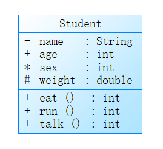

在UML类图中，类一般由3部分组成。

1. 第一部分是类名，每个类必须有一个名字，类名是一个字符串，且首字母要大写，例如上面的类图的名字就是Student。

2. 第二部分是类的属性（Attributes），属性是类的性质，即类的成员变量。UML规定属性的表示方法如下：[可见性] 名称:类型 [=默认值]

   其中可见性表示该属性对于类之外的元素而言是否是可见的，其中public用+ 表示、private 用- 表示、protected用#表示。包范围可见的的用*表示。

3. 第三部分是类的操作（Operations）：操作即类的行为。


## 3、类与类之间的关系

### 	3.1、关联关系

​		关联（Association）是类与类之间最常见的一种关系，用于表示一类对象和另一类对象之间有联系。**通常将一个类的对象作为另一个类的成员变量**，在使用类图表示关联关系时，可以在关联线上标注角色名，一般使用一个表示两者之间关系的动词或名词表示角色名，关系的两端代表两种不同的角色，因此在一个关联关系中可以包含两个角色名，角色名不是必须的，可以根据需增加，其目的是让类之间的关系更加明确。

​	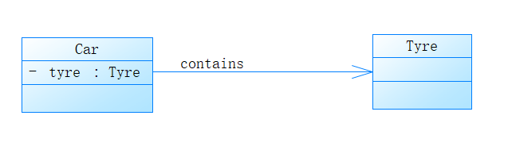

​	如汽车和轮胎的关系。箭头指向被关联对象。

#### 	3.3.1、双向关联

​	在默认情况下关联是双向的，例如顾客（Customer）购买商品（Product）并拥有商品。反之，卖出去的商品总会有个顾客与之关联，因此，商品和顾客之间具有双向关联的关系，类图如下：

​	 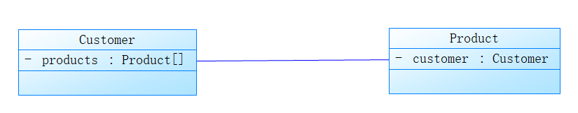

对应的Java代码如下：

```java
public class Customer {

    private Product[] products;
    ...

}

public class Product {

    private Customer customer;
    ...

}


```


#### 3.3.2、单向关联

​	类与类的关系也可以是单向的，如顾客（Customer）和地址（Address）的关系。

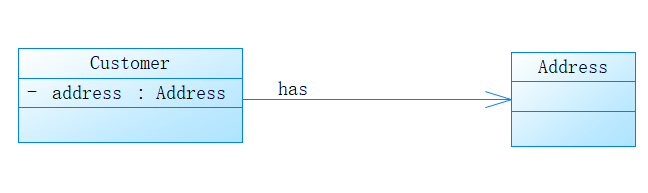

#### 3.3.3、自关联

​	在系统中可能存在一些类的属性对象的类型是该类本身，这种关联又称之为自关联。

​	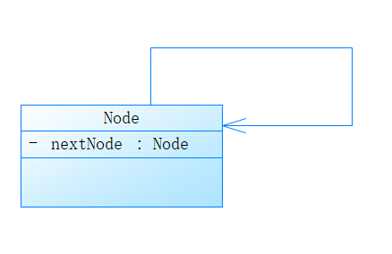

#### 3.3.4、多重性关联

​		多重性关联表示两个关联的对象在数量上的对应关系。在UML类图中，对象之间的多重性可以直接在关联线上用一个数字或一个数字范围表示。多重性表示方式如下所示。

​																							**多重性表示方式表**

| 表示方式 |                         解释说明                         |
| :------: | :------------------------------------------------------: |
|   1..1   |       另一个类的一个对象与只与该类的一个对象有关系       |
|   0..*   |      另一个类的一个对象与该类的0个或多个对象有关系       |
|   1..*   |      另一个类的一个对象与该类的一个或多个对象有关系      |
|   0..1   | 另一个类的一个对象与该类没有关系或与该类的一个对象有关系 |
|   m..n   |  另一个类的一个对象与该类最少m个对象，最多n个对象有关系  |

​	

例如一个轿车（Car）有4个轮胎（Tyre），但一个轮胎只属于一辆轿车。

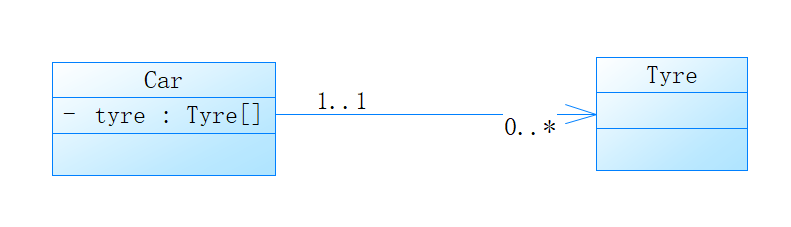

即一个轮胎只与一辆轿车有关系，一辆车可与0个或多个轮胎有关系。

#### 3.3.5、聚合关系

​		聚合关系（Aggregation）关系是表示整体与部分的关系。在聚合关系中，成员对象是整体对象的一部分，但是成员对象可以脱离整体对象而独立存在，就是是说成员对象的生命周期是独立的，并不会随着整体对象的消失而消失，在给成员属性赋值时，通常通过Setter方法或业务方法的参数注入到对象中。

​	  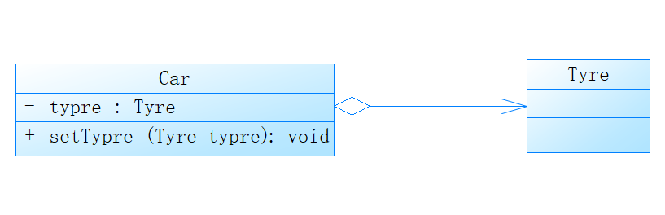

这样的话，轮胎对象是外部传入的，并不会随着汽车对象的消失而消失。


#### 3.3.6、组合关系

​		组合（Composition）关系也表示类之间的整体和部分的关系，但是在组合关系中，整体对象可以控制成员对象的生命周期，一旦整体对象不存在，成员对象也将不存在，成员对象和整体对象存在着依存关系。通常成员对象的赋值是直接在成员属性使用new关键字或者通过构造方法赋值。例如树和叶子的关系。

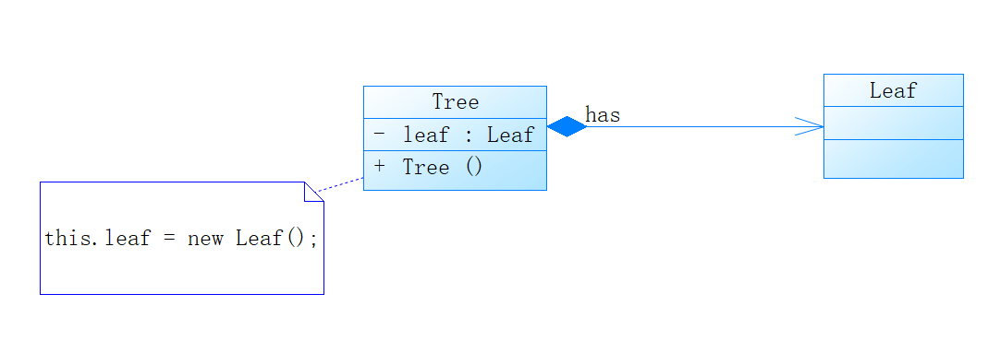

​		

### 3.2、依赖关系

​		依赖（Dependency）关系是一种使用关系，在需要表示一个事务使用另一个事务时使用依赖关系。**在大多数情况下，依赖关系体现在某个类的方法中使用到了另一个类的对象作为参数**。在UML中，依赖关系用带箭头的虚线表示，由依赖的一方指向另一方。例如驾驶员开车，在Driver类中的drive方法中将Car类型的对象car作为一个参数进行传递。因此，Driver类依赖于Car类。

​		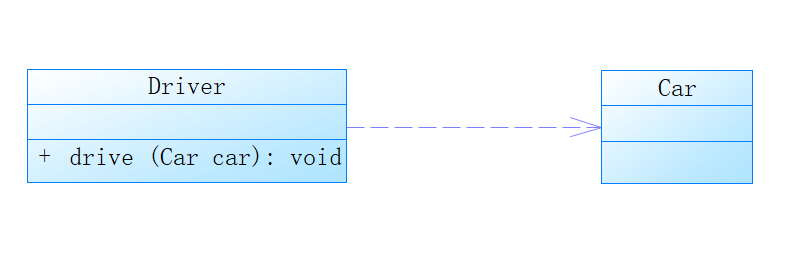

### 3.3、泛化关系

​	泛化（Generalization）关系也就是继承关系，用于描述父类和子类之间的关系，父类又称之为基类或超类，子类又称之为派生类。在UML中，泛化关系用带空心三角形的直线来表示。例如Student类和Teacher类的父类都是People的子类。

​	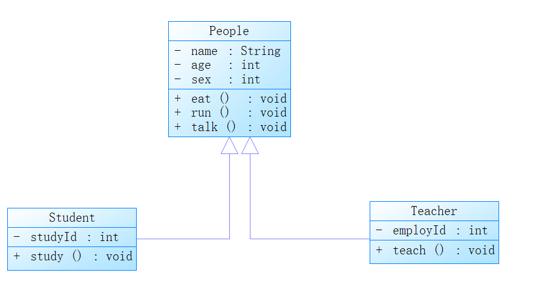

### 3.4、实现关系

​	在很多面向对象的编程语言中都引入了接口的概念，例如Java和C#,在接口中，通常没有属性，而且所有的操作都是抽象的，只有操纵的声明，没有具体的实现，具体的实现由其实现类来完成。在UML中，实现（Realization）关系用空心三角形加虚线来表示。

​	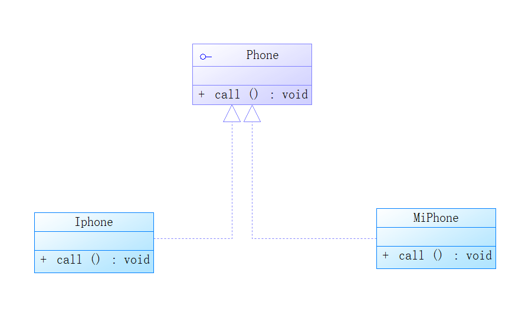


# 二、设计模式概述

## 	1、定义

​	**设计模式**是在特定的环境下为了解决某一个通用软件设计问题而提供的一套定制的解决方案，该方案详细描述了对象和类之间的相互作用。

## 	2、设计模式的优点

​	设计模式的使用可以降低分析、设计、实现的难度，也可以使系统具有更好的维护性和复用性

## 	3、设计模式的分类

### 		3.1、根据目的分类

​	设计模式根据使用目的可以分为创建型（Creational）、结构型（Structural）和行为型（Behavioral）3类。

1. 创建型模式主要用于创建对象，GoF提供了5中创建型设计模式，分别是**工厂方法模式(Factory Method)、抽象工厂模式(Abstract Factory)、单例模式(Singleton)、原型模式(Prototype)、建造者模式(Builder)**。
2. 结构型模式主要用于处理类或对象之间的组合，GoF提供了7种结构型模式，分别是**适配器模式(Adapter)、桥接模式(Bridge)、组合模式(Composite)、装饰模式(Decorator)、外观模式(Facade)、享元模式(Flyweight)和代理模式(Proxy)**。
3. 行为型模式主要用于描述类或对象之间如何交互和怎样分配职责。GoF提供了11种行为模式。分别是**职责链模式(Chain of Responsibility)、命令模式(Command)、解释器模式(Interpreter)、迭代器模式(Iterator)、中介者模式(Mediator)、备忘录模式(Memento)、观察者模式(Observer)、状态模式(State)、策略模式(Strategy)、模板方法模式(Template Method)和访问者模式(Visitor)。**


### 	3.2、根据范围分类

​	设计模式根据模式主要用来处理类之间的关系还是处理对象之间的关系可以分为类模式和对象模式。

1. 类模式处理类与子类之间的关系，这些关系通过继承建立，在编译时就被确定下来，是一种静态关系。
2. 对象模式处理对象之间的关系，这些关系在运行时变化、更具有动态性。


# 三、面向对象的设计原则

## 	1、单一职责原则

### 	1.1、定义

​	**单一职责原则**：一个对象应该只包含单一的职责，并且该职责被完整的封装在一个类中。

### 	 1.2、解释

​	一个类承担的职责越多，它被复用的可能性越小，而且一个类承担的职责越多，相当于将这些职责耦合在一起，当其中一个职责变化时可能影响其他职责的运作，因此要将这些职责进行分离。单一职责的目的是将各种职责独立开来，实现松耦合。

​		

## 	2、开闭原则

### 	2.1、定义

​	**开闭原则**：软件实体应当对扩展开放、对修改关闭。

### 	2.2、解释

​		开闭原则就是要求软件实体应当尽量在不修改原有代码的情况下进行扩展，这样会减少由于修改代码导致的其他功能不可用，或者修改后的代码有问题需要回滚的情况。为了满足开闭原则，需要对系统进行抽象化设计，抽象化是开闭原则的关键。


## 	3、里氏替换原则

### 	3.1、定义

​	**里氏替换原则**：所有引用基类的地方必须能够透明的使用其子类的对象。

### 	3.2、解释

​	里氏替换原则要求，在软件中将一个基类对象替换成它的子类对象，程序将不会产生任何的错误和异常，反过来则不成立。在运用里氏替换原则时应该将父类设计为抽象类或者接口，让子类继承父类或实现父类接口，并实现父类中的方法，在运行时子类实例替换父类实例，可以很方便地扩展系统的功能。无需修改原有的子类代码，增加一个新的功能可以通过增加一个新的子类来实现。

## 	4、依赖倒转原则

### 	4.1、定义

​	**依赖倒转原则**：高层模块不应该依赖于低层模块，它们都应该依赖抽象，抽象不应该依赖于细节，细节应该依赖于抽象。

### 	4.2、解释

​	高层模块应该依赖于低层模块的抽象，而不应该依赖于其实现。依赖倒转原则要求针对接口编程，不要针对实现编程，所谓高层次模块就是程序的调用者，或者客户端。


## 5、接口隔离原则

### 	5.1、定义

​	**接口隔离原则**：客户端不应该依赖于那些它不需要的接口。

### 	5.2、解释

​	客户端不应该依赖于那些它不需要的接口，对于不需要的功能应该将其拆分出来，组成独立的接口。因此，当一个接口太大时需要将它分割成一些更小的接口，使用该接口的客户端仅需要知道与之相关的方法即可，每一个接口应该承担相对独立的职责，不干不该干的事情。这也是单一职责的要求。

​	

## 6、合成复用原则

### 	6.1、定义

​		**合成复用原则**：合成复用原则有称之为组合/聚合复用原则，含义是优先使用对象组合，而不是通过继承来达到复用的目的。	

### 	6.2、解释

​		在面向对象设计中可以通过两种在不同的环境中复用已有的设计和实现，即通过组合/聚合关系或者继承，但首先应该考虑使用组合/聚合，组合/聚合可以使得系统更加的灵活，降低类与类之间的耦合度，一个类的变化对其他类造成的影响相对较小。

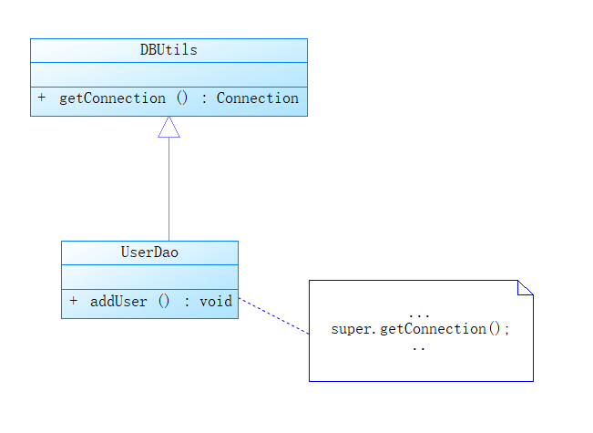


如图，DBUtils里有获取MySQL数据库连接的方法，UserDao通过继承复用了该方法，当需要将MySQL替换成Oracle的时候，就需要修改UserDao的源代码了，将继承的类替换成OracleDBUtils，这就违反了开闭原则。如何进行修改呢？
	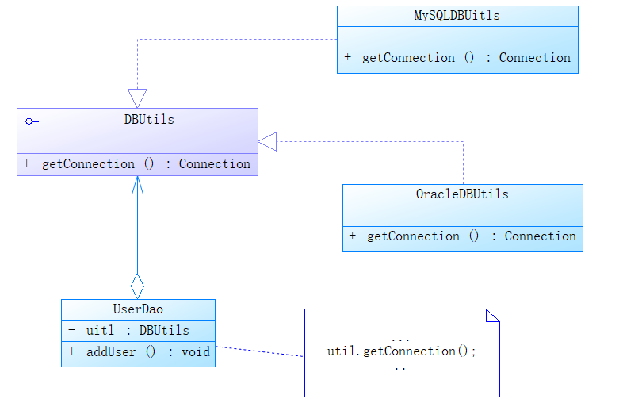


这样，如果需要更换数据库连接，只需要在初始化DBUtils的时候传入不同的实现类就行了，无需修改UserDao的源代码，符合开闭原则。


## 3.7、迪米特法则

### 	3.7.1、定义

​	**迪米特法则**：每一个软件单位对其他单位都只有最少的知识，而且局限于那些与本单位密切相关的软件单位。

### 	3.7.2、解释

​		迪米特法则要求一个软件实体应当尽可能地与其他实体发生相互作用，如果是一个系统符合迪米特法则，那么当其中一个模块发生变化时，就会尽量小的减少对其他模块的影响。扩展会相对容易，迪米特法则可以降低系统的耦合度，是类与类之间保持松散的耦合关系。

​		迪米特法则还有几种定义形式，包括不要和“陌生人”说话，只与你的直接朋友通信等。一个对象的朋友包括：

1. 当前对象本身(this)
2. 作为当前对象中方法的形参
3. 当前对象的成员属性
4. 如果当前对象的成员属性是数组或集合，那么集合中的对象也都是朋友 

任何一个对象如果满足上面的条件之一，就是当前对象的朋友，否则就是陌生人，在应用迪米特法则时。一个对象只能与直接朋友发生交互，不要和陌生人发生交互，这样做可以降低系统的耦合度，一个对象的改变不会对其他对象造成什么影响。


# 四、简单工厂模式

## 	1、概述

​	简单工厂模式是最简单的设计模式之一，它虽然不属于GoF的23种设计模式，但应用也较为频繁。**简单工厂模式**：定义一个工厂类，它可以根据参数的不同返回不同类的实例，被创建的实例通常都具有共同的父类。

## 	2、类图

​	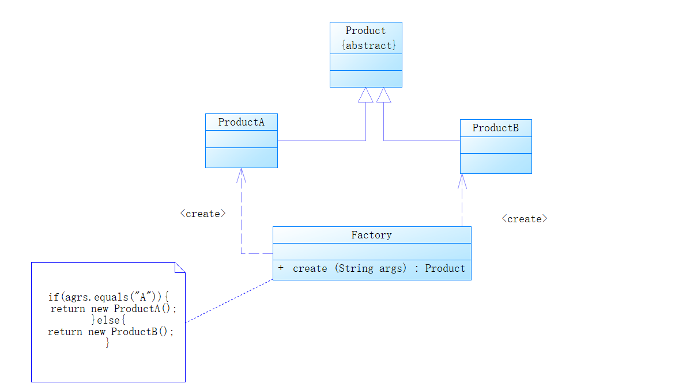

​	


## 3、实现

​	在使用简单工厂模式时，首先需要对其产品进行重构，不能设计一个包罗万象的产品类，而需要根据实际情况设计一个产品层次结构，将所有的产品类公共代码移动至抽象产品类中，并在抽象产品类中设计一些抽象方法，以提供不同的具体产品类来实现。

​	

```java
public abstract class Product {

    public void  methodSame(){
        System.out.println("产品公有方法");
    }

    public abstract void methodDiff();
}

public class ProductA extends Product {
    public void methodDiff() {
        System.out.println("A的抽象方法");
    }
}

public class ProductB extends Product {
    public void methodDiff() {
        System.out.println("抽象方法B");
    }
}

public class SimpleFactory {

    public static Product create(String args){
      if(args.equals("A")){
          return new ProductA();
      }else{
          return new ProductB();
      }
    }

}

```


# 五、工厂方法模式

## 	1、概述

​	**工厂方法模式：**定义一个用于创建对象的的接口，但是让子类决定将哪一个类实例化，工厂方法模式让一个类的实例化延迟到其子类。工厂方法模式相较于简单工厂，将创建对象的逻辑延迟到子类中去实现，当需要增加一个产品时，只需要继承抽象产品类，然后新增一个抽象工厂的子类，无需修改源代码，符合开闭原则。

## 	2、类图

​	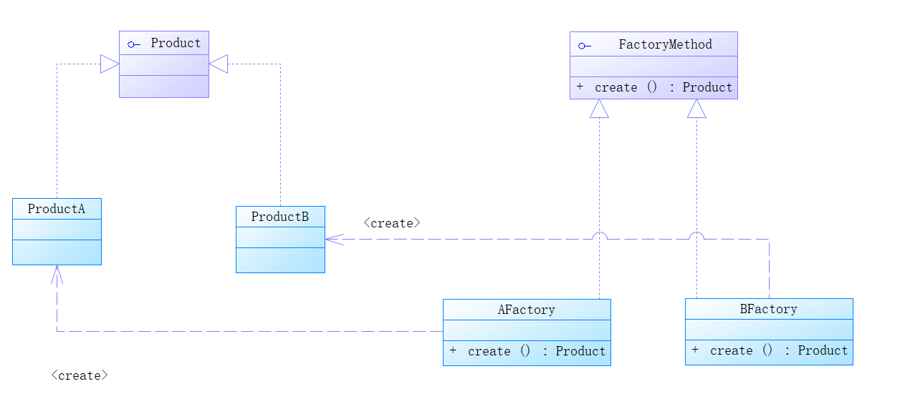


## 3、实现

​	

```java
public abstract class Product {

    public void  methodSame(){
        System.out.println("产品公有方法");
    }

    public abstract void methodDiff();
}

public class ProductA extends Product {
    public void methodDiff() {
        System.out.println("A的抽象方法");
    }
}

public class ProductB extends Product {
    public void methodDiff() {
        System.out.println("抽象方法B");
    }
}

public interface Factory {

    public Product create();

}

public class FactoryA implements Factory{


    public Product create() {
        return new ProductA();
    }
}

public class FactoryB implements Factory {


    public Product create() {
        return new ProductB();
    }
}

```


# 六、抽象工厂模式

## 1、概述

​		抽象工厂模式是常用的创建型设计模式之一，它比工厂方法模式的抽象度更高，在工厂方法模式中，每一个具体工厂只需要生产一种具体的产品，但是在抽象工厂模式中，一个具体的工厂可以生产一组相关的产品。这样的产品成为产品族。

> 产品等级结构：即产品的继承结构，例如一个抽象类是电视机，其子类有TCL电视机，小米电视、海尔电视等等。抽象电视机与具体品牌的电视机之间就构成了一个产品等级结构。

> 产品族：在抽象工厂模式中，产品族指的是由同一个工厂生产的位于不同产品等级结构的中的一组产品。如由小米品牌生产的小米电视、小米手机、小米耳机等属于一个产品族。

所以，一个具体的工厂生产的是一个产品族中的一系列产品。

**抽象工厂的定义：**

> 提供一个创建一系列相关或相互依赖对象的接口，而无需指定它们的实现。

## 2、类图

​	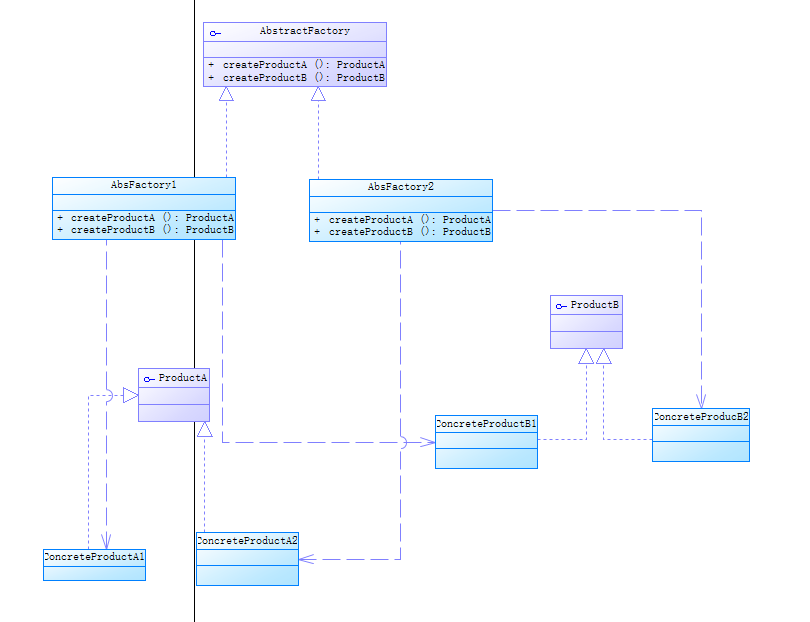

## 3、实现

​	在抽象工厂中声明了多个工厂方法，用于创建不同类型的产品，抽象工厂可以是接口也可以是抽象类。

​	

```java
public interface ProductA {
}


public class ConcreteProductA1 implements ProductA {
}


public class ConcreteProductA2 implements ProductA {
}


public interface ProductB {
}

public class ConcreteProductB1 implements ProductB {
}

public class ConcreteProductB2 implements ProductB {
}


public interface AbstractFactory {

    ProductA createProductA();

    ProductB createProductB();

}


public class AbsFactory1 implements AbstractFactory {
    public ProductA createProductA() {
        return new ConcreteProductA1();
    }

    public ProductB createProductB() {
        return new ConcreteProductB1();
    }
}


public class AbsFactory2 implements AbstractFactory {
    public ProductA createProductA() {
        return new ConcreteProductA2();
    }

    public ProductB createProductB() {
        return new ConcreteProductB2();
    }
}


```

ProductB和ProductA就属于同一个产品族，对于抽象工厂模式，增加一个产品族很方便，只需要增加一个具体的工厂，实现其中的方法即可。一个产品族对应一个产品等级结构，对应着每一个具体的工厂都要增加一个生产该类产品的方法，违背了开闭原则。


# 七、建造者模式

## 	1、概述

​	工厂方法和抽象工厂是将创建对象的过程完全隐藏，适合创建不复杂的对象，而建造者模式关注如何一步一步创建一个复杂的对象。

> ​	将一个复杂对象的构建与它的表示分离，使得同样的构建过程可以创建不同的表示。

建造者模式是一种对象创建型模式，它将客户端与包含多个部件的复杂对象的创建过程分离，客户端无需知道复杂对象的内部组成部分与装配方式，只需要知道所需建造者的类型即可。建造者模式关注如何一步一步创建一个复杂的对象，不同的建造者定义了不同的创建过程。

​	

## 	2、类图

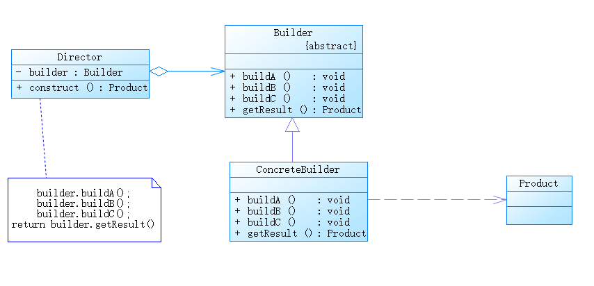

在建造者模式中引入了一个指挥者类Director，该类主要有两个作用，一方面他隔离了客户端和对象的创建过程，另一方面他控制着产品对象的创建过程。包括buildX()方法是否被调用以及多个buildX()方法的调用顺序。

## 3、实现

​	

```java
package com.builder;

public class Product {

    private String A;

    private String B;

    private String C;

    public String getA() {
        return A;
    }

    public void setA(String a) {
        A = a;
    }

    public String getB() {
        return B;
    }

    public void setB(String b) {
        B = b;
    }

    public String getC() {
        return C;
    }

    public void setC(String c) {
        C = c;
    }
}


package com.builder;

public abstract class Builder {

    protected Product product = new Product();

    public abstract void buildA();

    public abstract void buildC();

    public abstract void buildB();

    public Product getResult(){
        return product;
    }


}


package com.builder;

public class ConcreteBuilder extends Builder {
    public void buildA() {
        product.setA("A");
    }

    public void buildC() {
        product.setC("c");
    }

    public void buildB() {
        product.setB("b");
    }
}


package com.builder;

public class Director {

    private Builder builder;

    public void setBuilder(Builder builder) {
        this.builder = builder;
    }

    public Product construct(){
        builder.buildA();
        builder.buildC();
        builder.buildB();
        return builder.getResult();
    }


}


```


省略指挥者Director的写法

```java
package com.builder;

public class Product {

    private String A;

    private String B;

    private String C;

    public Product(Builder builder) {
        A = builder.getA();
        B = builder.getB();
        C = builder.getC();
    }

    public static class Builder{
        private String A;

        private String B;

        private String C;

        public String getA() {
            return A;
        }

        public Builder setA(String a) {
            A = a;
            return this;
        }

        public String getB() {
            return B;
        }

        public Builder setB(String b) {
            B = b;
            return this;
        }

        public String getC() {
            return C;
        }

        public Builder setC(String c) {
            C = c;
            return this;
        }

        public Product build(){
            return new Product(this);
        }


    }


}

```


# 八、原型模式

## 1、概述

​	 原型设计模式是一种特殊的创建型设计模式，它通过复制一个已有的对象来获取更多相同或者相似的对象。原型设计模式可以提高相同类型对象的创建效率，简化创建过程。

> **原型模式：**使用原型实例指定待创建对象的类型，并且通过复制这个原型来创建新的对象。

原型设计模式的工作原理是将一个原型对象传递给要创建对象的客户端对象，客户端对象通过请求原型对象复制自己来实现对象的创建。


## 2、类图

​	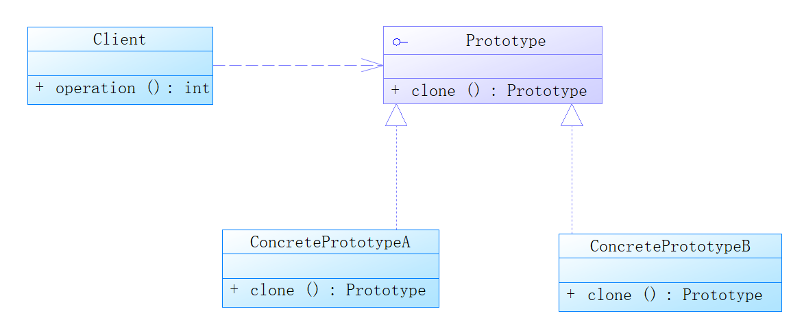

## 3、实现

**Prototype:**是抽象原型类，声明了克隆方法的接口，是所有具体原型类的公共父类，它可以是抽象类，也可以是接口，

**ConcretePrototype:**具体的原型类，它实现在抽象原型类中定义的抽象克隆方法，在克隆方法中返回一个自己的克隆对象。


### 3.1、浅克隆和深克隆

​		根据复制原型对象的同时是否复制包含在原型对象中的引用类型的成员变量，原型模式的克隆机制分为两种：浅克隆和深克隆。

> **浅克隆：**如果原型对象的成员变量是值类型（如int,double,byte,boolean,char等基本数据类型），将复制一份给克隆对象，如果原型对象的成员对象是引用数据类型（如类，接口，数组等），则将地址值复制一份给克隆对象，也就是说原型对象和克隆对象的成员变量指向相同的地址值。

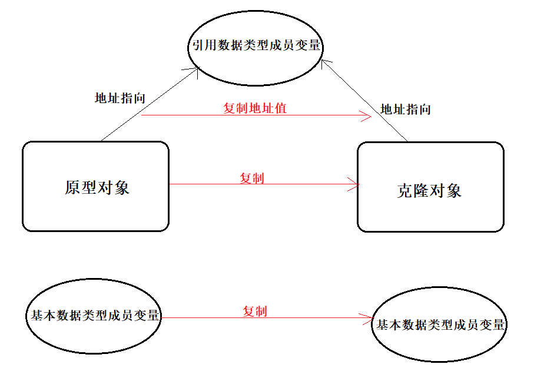

> **深克隆：**无论原型对象的成员变量是基本数据类型还是引用数据类，都将复制一份给克隆对象，它会将原型对象的所有引用类型的对象也复制一份给克隆对象。


### 3.2、浅克隆实现方案

​	 方案1

```java
package com.prototype;

public class ConcretePrototype {

    private Integer num;

    private User user;

    public Integer getNum() {
        return num;
    }

    public void setNum(Integer num) {
        this.num = num;
    }

    public User getUser() {
        return user;
    }

    public void setUser(User user) {
        this.user = user;
    }

    public ConcretePrototype clone() {
        ConcretePrototype prototype = new ConcretePrototype();

        prototype.setNum(this.getNum());

        prototype.setUser(this.getUser());


        return prototype;
    }
}

```


方案2：

在Java语言中，所有的Java类均继承自java.lang.Object类，Object类提供了一个clone方法，可以将一个Java对象复制一份，需要注意的是，这个Java类需要实现一个标识接口Cloneable，表示这个Java类支持被复制。

```java
package com.prototype;

public class ConcretePrototype implements Cloneable{

    private Integer num;

    private User user;

    public Integer getNum() {
        return num;
    }

    public void setNum(Integer num) {
        this.num = num;
    }

    public User getUser() {
        return user;
    }

    public void setUser(User user) {
        this.user = user;
    }

    public ConcretePrototype clone(){
        Object object = null;
        try {
            object =  super.clone();
        } catch (CloneNotSupportedException e) {
            e.printStackTrace();
        }
        return (ConcretePrototype)object;
    }

    @Override
    public String toString() {
        return "ConcretePrototype{" +
                "num=" + num +
                ", user=" + user +
                '}';
    }
}

```


Java语言中的clone方法满足以下几点：

1. 对任何对象x，都有x.clone()!=x，即克隆对象与原型对象不是同一个对象。
2. 对任何对象x,都有x.clone().getClass()==x.getClass()，即克隆对象与原型对象类型一样
3. 如果对象x的equals方法定义恰当，那么x.clone().equals(x)成立。
4. 通过这种方式的克隆属于浅克隆


### 3.3、深克隆实现方案

​	方案1：手动将原型对象的成员属性赋值到克隆对象中，如果是引用类型的成员属性，重新创建一个对象，将成员对象的值赋值到创建的对象中去。

 方案2：使用序列化技术实现深克隆

​	

```java
package com.prototype;

import java.io.Serializable;

public class User implements Serializable {
}


package com.prototype;

import java.io.*;

public class ConcretePrototype implements Serializable {

    private Integer num;

    private User user;

    public Integer getNum() {
        return num;
    }

    public void setNum(Integer num) {
        this.num = num;
    }

    public User getUser() {
        return user;
    }

    public void setUser(User user) {
        this.user = user;
    }

    public ConcretePrototype clone() {
        ByteArrayOutputStream bao = new ByteArrayOutputStream();
        ObjectOutputStream oos = null;
        try {
            oos = new ObjectOutputStream(bao);

            oos.writeObject(this);

            ByteArrayInputStream bis = new ByteArrayInputStream(bao.toByteArray());
            ObjectInputStream ois = new ObjectInputStream(bis);
            return (ConcretePrototype) ois.readObject();

        } catch (IOException e) {
            e.printStackTrace();
        } catch (ClassNotFoundException e) {
            e.printStackTrace();
        }

        return null;

    }

    @Override
    public String toString() {
        return "ConcretePrototype{" +
                "num=" + num +
                ", user=" + user +
                '}';
    }
}

```

注意：使用序列化流实现克隆，被克隆对象及其引用类型的成员属性都要实现Serializable接口


# 九、单例模式

## 1、概述

​	单例设计模式是为了保证一个类只有一个实例并且这个实例易于被访问。

> **单例设计模式：**确保一个类只有一个实例，并提供一个全局访问点来访问这个实例。


## 2、类图

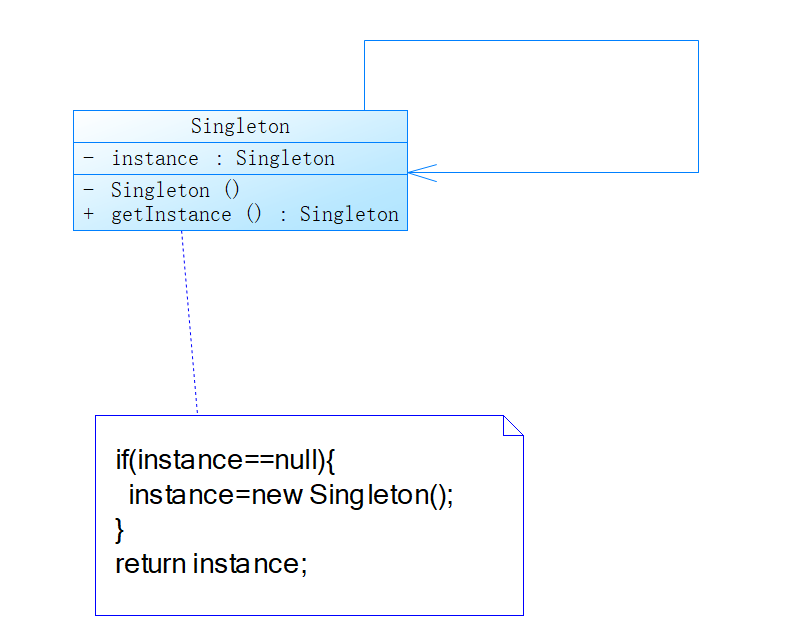

## 	3、实现

### 	3.1、饿汉式

​	饿汉式单例类是实现起来最简单的单例类，饿汉式单例类结构如图

​	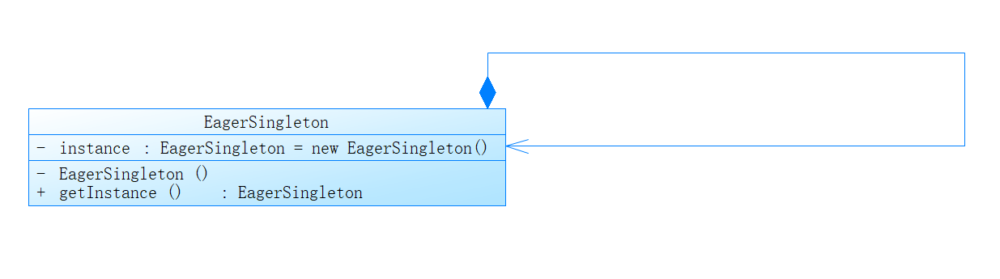

实现代码如下：

```java
package com.singleton;

public class EagerSingleton {

    private static EagerSingleton instance = new EagerSingleton();

    private EagerSingleton() {

    }


    public static EagerSingleton getInstance() {
        return instance;
    }
}

```


当类被加载时，静态变量instance会被初始化，此时类的私有构造函数会被调用，单例类的唯一实例将被创建。


### 3.2、懒汉式单例与双重检查

懒汉式单例的构造函数也是私有的，与饿汉式单例不同的是，懒汉式单例在第一次被引用时就自己实例化，而不是类被加载后进行初始化。

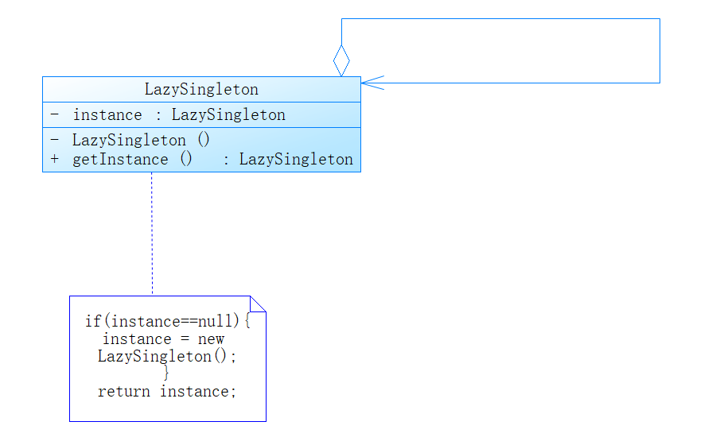


代码实现：

```java
package com.singleton;

public class LazySingleton {

    private static LazySingleton instance;

    private LazySingleton() {

    }

    public  static  LazySingleton getInstance(){
        if(instance==null){
            instance = new LazySingleton();
        }
        return instance;
    }


}

```


​			这种懒汉式的单例只能在单线程下使用，因为在多线程下该懒汉式单例模式是线程不安全的，因为当一个线程判断instance为null，进入if语句中后，还没来得及创建LazySingleton对象。这时CPU执行权切换到了另一个线程上，另一个线程发现instance还是为null，于是创建了一个LazySingleton实例，当CPU重新切换到第一个线程后，将不会再次判断instance是否为null，而是直接创建一个LazySingleton实例，这样，单例模式就无法保证单例了。


改进版1.0：

给getInstance方法加上synchronized锁，同时只允许一个线程访问该方法。

```java
package com.singleton;

public class LazySingleton {

    private static LazySingleton instance;

    private LazySingleton() {

    }

    public  static synchronized  LazySingleton getInstance(){
        if(instance==null){
            instance = new LazySingleton();
        }
        return instance;
    }


}

```


这样代码虽然解决了线程安全问题，但是每次调用getInstance()时都需要进行线程锁定判断，在多线程高并发访问环境中将会导致系统性能降低。因此，需要对懒汉式单例模式继续改进。

改进版2.0：双重检查锁定

```java
package com.singleton;

public class LazySingleton {

    private volatile static LazySingleton instance;

    private LazySingleton() {

    }

    public  static   LazySingleton getInstance(){
        if(instance==null){
            synchronized（LazySingleton.class）{
                if(instance==null){
                     instance = new LazySingleton();
                }
                
            }
           
        }
        return instance;
    }


}
```

需要注意的是，如果使用双重检查锁定来实现懒汉式单例，需要静态成员变量instance之前增加修饰符volatile，被volatile修饰的成员变量可以确保多个线程都能够正确处理，由于volatile关键字会屏蔽Java虚拟机所做的一些代码优化，可能会导致系统的运行效率变低，因此，即使是使用双重锁定来实现单例模式也不是一种完美的实现方式


改进版3.0：使用静态内部类实现单例模式

```Java
package com.singleton;

public class LazySingleton {


    private LazySingleton() {

    }

    private static class InnerClass {
        private final static LazySingleton INSTANCE = new LazySingleton();
    }


    public static LazySingleton getInstance() {

        return InnerClass.INSTANCE;
    }


}

```


由于静态单例对象没有作为Singleton的成员变量直接实例化，因此，类加载时不会直接实例化Singleton，第一次调用getInstance时，将加载内部类InnerClass，在该类内部中定义了一个static类型的变量INSTANCE，此时会首先初始化这个成员变量，由Java虚拟机来保证其线程安全，确保该成员变量只能初始化一次。由于getInstance()方法没有任何线程锁定，因此其性能不会造成任何影响。


改进版4.0：使用枚举也可实现单例模式


# 十、适配器模式

## 1、概述

​		结构型设计模式关注如何将现有的类或对象组织在一起形成更加强大的结构，它们适用于不同的环境，使用不同的方式组合类与对象，使之可以协同工作。

​		在软件开发中，存在接口之间不兼容的情况，可以引入一个类似于电源适配器那样的适配器角色来协调这些不兼容的接口，这种设计方案即为适配器模式。

> **适配器模式：**将一个类的接口转换成客户需要的另一个接口，适配器模式让那些接口不兼容的类可以一起工作。	


## 2.、类图

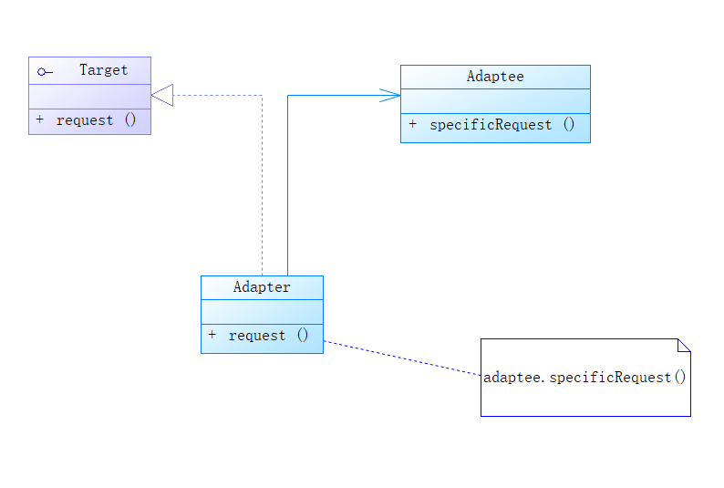

​																				**对象适配器模式**


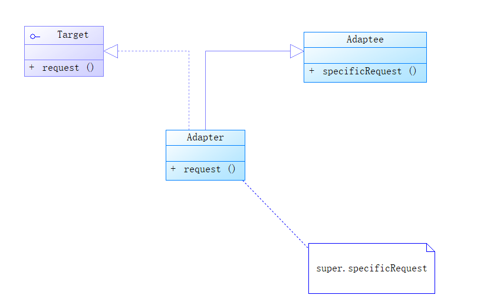

​																							**类适配器模式**


类适配器模式通过继承实现了功能的复用，而对象适配器通过关联实现了功能的复用，对象适配器模式更加符合合成复用原则，功能扩展起来更加方便。


## 3、实现

### 	3.1、类适配器

​	

```java
package com.adapter;

public interface Target {

    void request();

}


package com.adapter;

public class Adaptee {

    public void specificRequest(){
        System.out.println("待适配对象");
    }

}


package com.adapter;

public class Adapter extends Adaptee implements Target {
    public void request() {
        super.specificRequest();
        System.out.println("适配");
    }
}

```


### 3.2、对象适配器

```java

public interface Target {

    void request();

}


public class Adaptee {
    public void specificRequest(){
        System.out.println("待适配对象");
    }

}


public class Adapter  implements Target {

    private Adaptee adaptee = new Adaptee();

    public void request() {
        adaptee.specificRequest();
        System.out.println("适配");
    }
}

```


## 4、缺省适配器模式

​		缺省适配器模式：当不需要实现一个接口中提供的所有方法时，可先设计一个抽象类实现该接口，并为该接口中每一个方法提供一个默认实现的空方法，那么该抽象类的子类就可以选择性的覆盖父类的某些方法来实现需求，它适用于不想使用一个接口中的所有方法的情况，又称之为单接口适配器模式。

​		缺省适配器模式是对违背接口隔离原则代码的一种解决方法


## 5、双向适配器模式

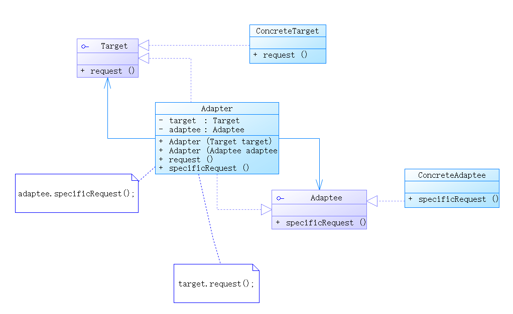


实现：

```java
package com.adapter;

public class Adapter  implements Target,Adaptee {

    private Target target;

    private Adaptee adaptee;

    public Adapter(Target target) {
        this.target = target;
    }

    public Adapter(Adaptee adaptee) {
        this.adaptee = adaptee;
    }

    public void specificRequest() {
        target.request();
    }

    public void request() {
        adaptee.specificRequest();
    }
}

```


# 十一、桥接模式

## 1、概述

​	如果系统中的某个类存在两个独立变化的维度，通过桥接模式可以将者两个维度分离出来，桥架模式用一种巧妙的方式处理多层继承存在的问题，用抽象关联来取代多层继承。

> ​	**桥接模式：**将抽象部分与它的实现部分解耦，使得两者之间都能够独立变化。

小案例：

> 毛笔和蜡笔是两种很常见的文具，它们都归属于画笔。假如需要大、中、小3中型号的画笔，能够绘制出12种不同的颜色。如果使用蜡笔，需要准备3*12=36支，但如果使用毛笔，只需要提供3中型号的毛笔和12中颜料即可，涉及到的对象数为15个远远小于36。如果新增一种型号的笔，比如超大号，蜡笔需要增12支，而毛笔只需要增加一支。


## 2、类图


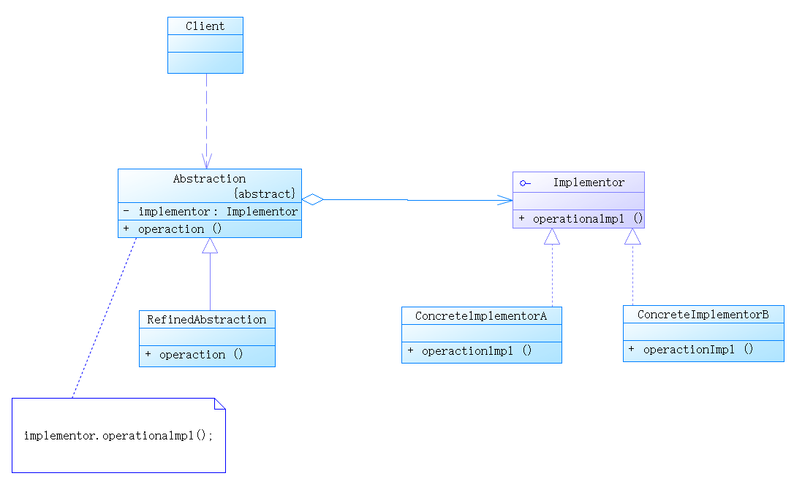

角色：

**Abstraction(抽象类)**：它用于定义抽象类的接口，通常是抽象类而不是接口，聚合了一个Implementor接口。

**RefinedAbstraction（扩充抽象类）：**它扩充了由Abstraction类定义的接口，是一个具体的实现类，实现了operaction方法。

**Implementor(实现类接口)**：它是定义实现类的接口，这个接口不一定要和Abstraction的接口完全一致，甚至可以完全不同，一般而言，Implementor接口仅提供基本的操作，而Abstraction定义的接口可能会做更多更复杂的操作。

**ConcreteImplemenor(具体的实现类)**：它具体实现了Implementor接口，在不同的ConcreteImplementor中提供不同的基本操作。


## 3、实现

​	在使用桥接模式时首先应该识别出一个类所具有的两个独立变化的维度，将它们设计成两个独立的继承结构等级结构，为两个维度都提供抽象层，建立抽象的耦合。在通常情况下，将具有两个独立变化的维度的类的一些普通业务方法和与之关系最为密切的维度设计为“抽象类”层次结构。而将另一个维度设计为“实现类”层次结构。**例如，对于毛笔而言，型号是其固有维度，可以设计为一个抽象的毛笔类，在该类中声明并都实现毛笔的业务方法，而将各种型号的毛笔作为其子类；颜色是毛笔的另一个维度，由于它与毛笔之间存在一种设置的关系，故将其设计为实现类层次，设计一个接口，将具体的颜色作为该实现类的子类。**

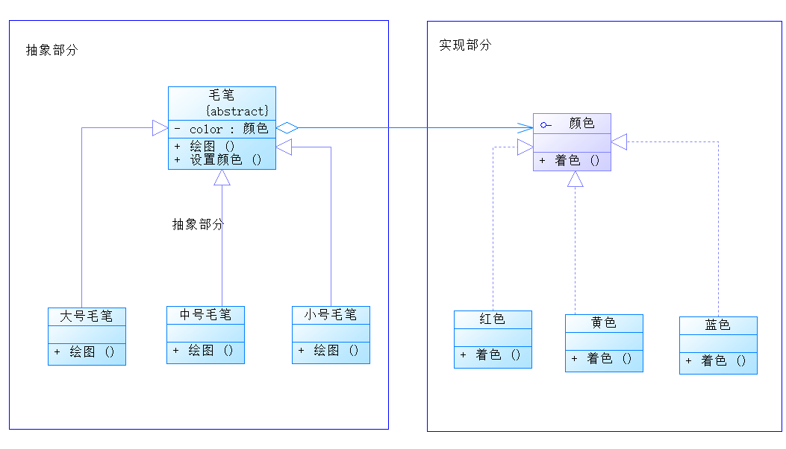


# 十二、组合模式

## 1、概述

组合模式是指使用面向对象的方式来处理树形结构，它的定义如下：

> **组合模式：**组合多个对象形成树形结构以表示具有部分-整体关系的层次结构，组合模式让客户端可以统一对待单个对象和组合对象。


## 2、类图

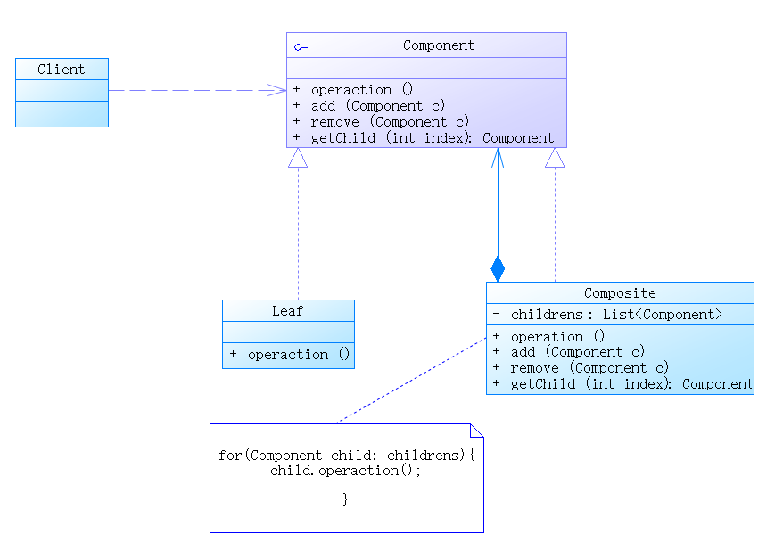

**Component(抽象构件)**：它可以是接口或抽象类，为叶子构件和容器构件提供接口的声明，在该角色中可以包含所有子类公有的声明。

**Leaf(叶子构件)**：它在组合模式中表示叶子节点对象，叶子节点没有子节点，它实现了在抽象构件中定义的行为。对于那些管理子构件的方法，可以通过抛出异常、提示错误等方式进行处理。

**Composite(容器构件)：**在组合模式中表示容器几点对象，容器节点包含叶子节点和容器构件。定义了访问及管理子构件的方法和递归调用其子节点的业务方法。


## 3、实现

```java


public interface Component {

    void operation();

    void add(Component c);

    void remove(Component c);

    Component getChild(int index);

}


public class Composite implements Component {

   private  List<Component> children = new ArrayList<Component>();

    public void operation() {
        for (Component c:children) {
            c.operation();
        }
    }

    public void add(Component c) {
        children.add(c);
    }

    public void remove(Component c) {
        children.remove(c);
    }

    public Component getChild(int index) {
        return children.get(index);
    }
}


public class Leaf implements Component {
    public void operation() {
        System.out.println("operation");
    }

    public void add(Component c) {
        System.out.println("叶子节点无法增加");
    }

    public void remove(Component c) {
        System.out.println("叶子节点无法删除");
    }

    public Component getChild(int index) {
        return null;
    }
}

```


# 十三、装饰模式

## 1、概述

​	装饰模式是一种用于替代继承的技术，它通过一种无须定义子类的方式来给对象动态的增加职责，使用对象之间的关联关系取代类之间的继承关系，降低了系统的耦合度。

> **装饰模式：**动态的给对象增加一些额外的职责，就扩展功能而言，装饰模式提供了一种比使用子类更加灵活的替代方案。


## 2、类图

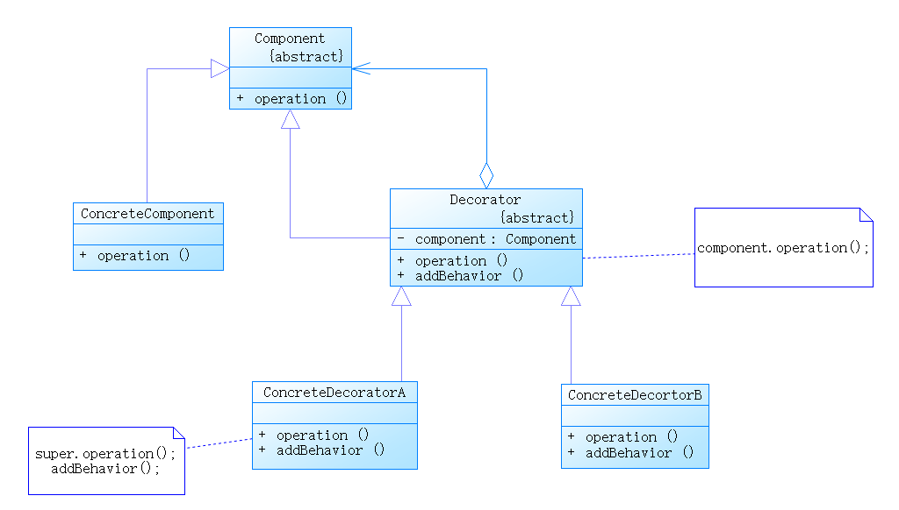

**Component(抽象构件)**：用于定义具体构件和抽象装饰类的共同父类，声明了在具体构件中要实现的业务方法。

**ConcreteComponent（具体构件）：**它是抽象构件的子类，实现了抽象构件类的抽象业务方法，也是需要装饰的类。

**Decorator（装饰类）**：它也是抽象构件类的子类，用于给具体的构件增加职责，但是具体的职责在其子类中实现。它维护一个指向抽象构件的引用，通过该引用可以调用需要装饰的具体方法。

**ConcreteDecorator(具体的装饰类)**：它是抽象装饰类的子类，负责向构件添加新的职责，每一个具体装饰类都定义了一些新的职责。


## 3、实现

​	 

```java
package com.decorator;

public  abstract class Component {

   public abstract void operation();

}


package com.decorator;

public class ConcreteComponent extends Component {
    public void operation() {
        System.out.println("普通业务操作");
    }
}


package com.decorator;

public abstract class Decorator extends Component{

    private Component component;

    public Decorator(Component component) {
        this.component = component;
    }

    public void operation() {
        this.component.operation();
    }

    public abstract void addBehavior();
}


package com.decorator;

public class ConcreateDecoratorA extends Decorator {

    public ConcreateDecoratorA(Component component) {
        super(component);
    }

    public void operation() {
        super.operation();
        addBehavior();
    }

    public void addBehavior() {
        System.out.println("增加的业务方法A");
    }
}


package com.decorator;

public class ConcreteDecoratorB extends Decorator {

    public ConcreteDecoratorB(Component component) {
        super(component);
    }

    public void operation() {
        super.operation();
        addBehavior();
    }

    public void addBehavior() {
        System.out.println("增加的业务方法B");
    }
}


package com.decorator;

public class Client {

    public static void main(String[] args) {
        Component component, decoratorA,decoratorB;
        component = new ConcreteComponent();
        component.operation();

        decoratorA = new ConcreateDecoratorA(component);
        decoratorA.operation();

        decoratorB = new ConcreteDecoratorB(decoratorA);
        decoratorB.operation();

    }

}


```

​                 

装饰模式可以实现连续装饰


​                